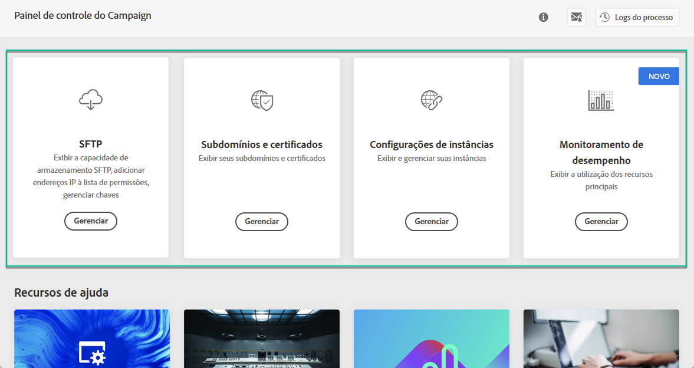
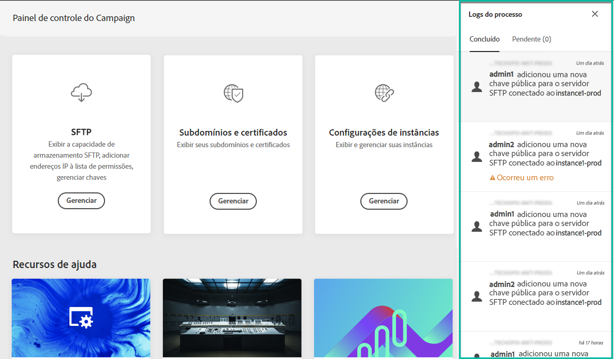
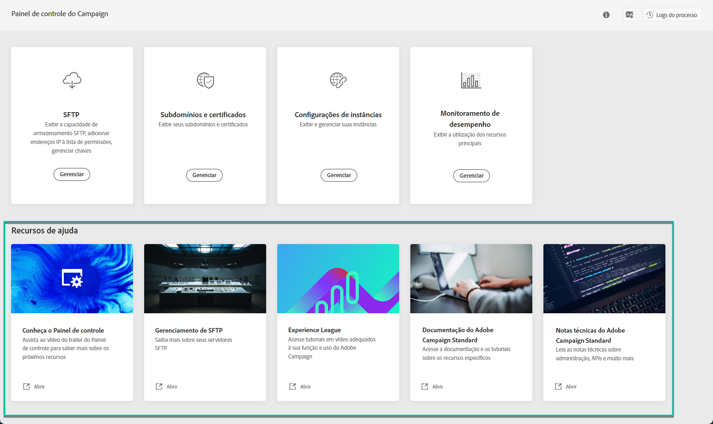

# Apresentação à interface do Painel de controle do Campaign {#discovering-interface}

A home page do Painel de controle do Campaign fornece acesso a todas as ações que podem ser executadas nas instâncias do Campaign.

São representados por cartões organizados em tópicos, por exemplo **Monitoramento de desempenho**.

<!--With upcoming Campaign releases, more topics and cards will be made available.-->

## Logs de processo {#job-logs}

O **[!UICONTROL Job Logs]** no canto superior direito permite auditar todas as alterações feitas pelos usuários da organização.

Clique em um elemento da lista para obter mais detalhes.

O **[!UICONTROL Open]** permite acessar diretamente a guia Painel de controle, onde a alteração foi feita.

## Recursos de ajuda {#help-resources}

O **[!UICONTROL Help Resources]** A seção fornece documentação útil para ajudá-lo a usar o Painel de controle do Campaign e os produtos do Campaign. Não hesite em explorá-las.

