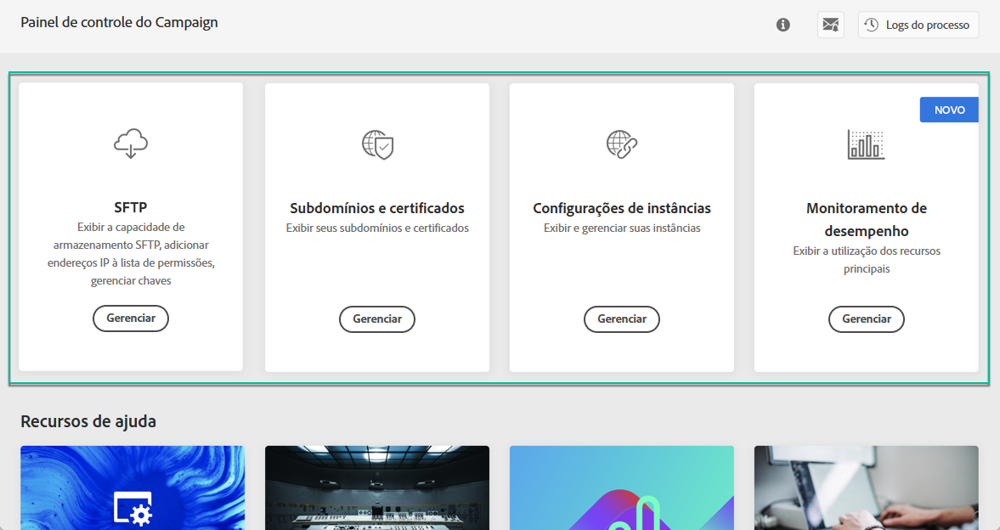
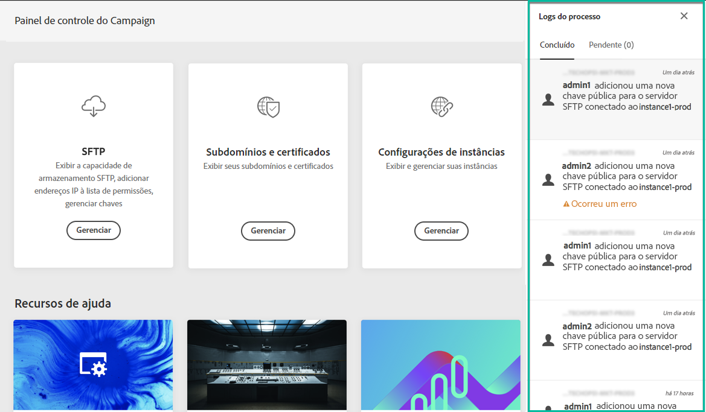
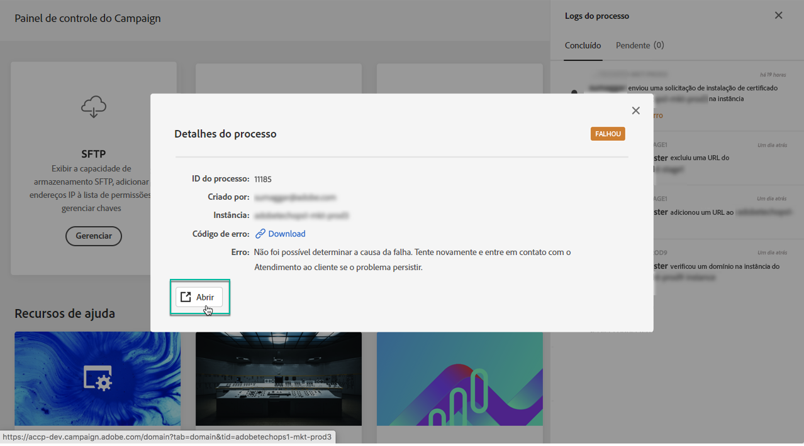
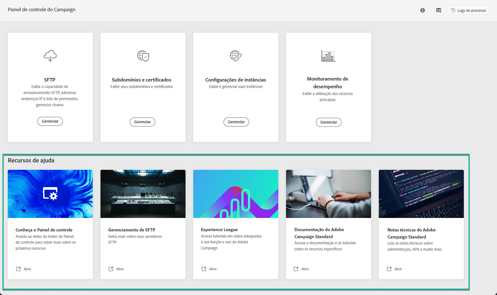

# Introdução à interface do Painel de controle {#discovering-interface}

A página inicial do Painel de controle fornece acesso a todas as ações que podem ser executadas nas instâncias do Campaign.

São representados por cartões organizados em tópicos, por exemplo, **Monitoramento de desempenho**.

<!--With upcoming Campaign releases, more topics and cards will be made available.-->

## Logs de processo {#job-logs}

O botão **[!UICONTROL Logs de processos]** no canto superior direito permite auditar todas as alterações feitas por usuários da organização.

Clique em um elemento da lista para obter mais detalhes.

O botão **[!UICONTROL Abrir]** permite acessar diretamente a guia Painel de controle, onde a alteração foi feita.

## Recursos de ajuda {#help-resources}

A seção **[!UICONTROL Recursos de ajuda]** fornece documentos úteis para ajudar a usar os produtos do Painel de controle e do Campaign. Não hesite em explorá-los.

## Idiomas compatíveis {#languages}

A interface do Painel de controle foi projetada para ser exibida no idioma correspondente à configuração do navegador.

Se o navegador estiver configurado com um idioma não compatível, o Painel de controle verificará os três primeiros idiomas na lista de idiomas do navegador até encontrar um compatível. Se nenhum dos três primeiros idiomas for compatível com o Painel de controle, Ele usará o padrão, inglês (Estados Unidos).

Veja abaixo uma lista dos idiomas atualmente compatíveis com o Painel de controle:

* Inglês (Estados Unidos)
* Alemão
* Francês
* Japonês
* Italiano (Itália)
* Espanhol (Espanha)
* Coreano
* Português (Brasil)
* Chinês (simplificado)
* Chinês (tradicional)
