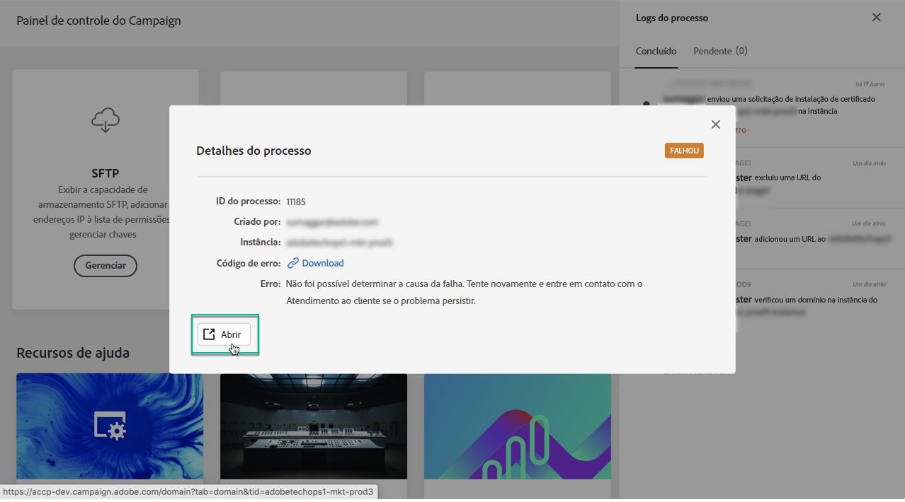

# Descobrindo a interface do Painel de controle do Campaign {#discovering-interface}

A home page do Painel de controle do Campaign fornece acesso a todas as ações que podem ser executadas nas instâncias do Campaign.

Eles são representados por cartões organizados em tópicos, por exemplo **Gerenciamento de Armazenamentos e bancos de dados**.

Com as próximas versões de Campanhas, mais tópicos e cartões serão disponibilizados.

## Logs de trabalho {#job-logs}

O botão **[!UICONTROL Job Logs]** no canto superior direito permite auditar todas as alterações feitas pelos usuários de sua organização.

Clique em um elemento da lista para obter mais detalhes.

O botão **[!UICONTROL Open]** permite que você acesse diretamente a guia Painel de controle do Campaign, onde a alteração foi feita.

## Recursos de ajuda {#help-resources}

A seção **[!UICONTROL Help Resources]** fornece documentação útil para ajudá-lo a usar os produtos de Painel de controle do Campaign e Campanha. Não hesite em explorá-los.

