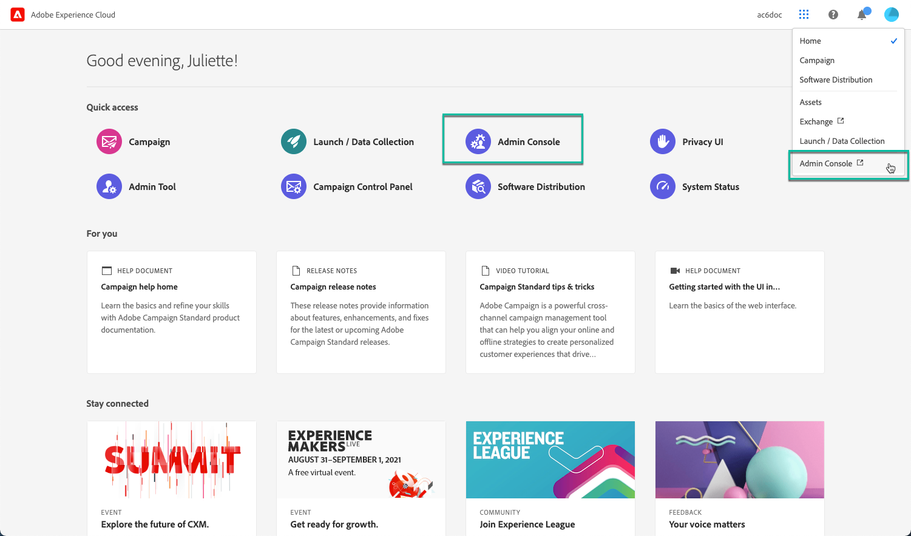
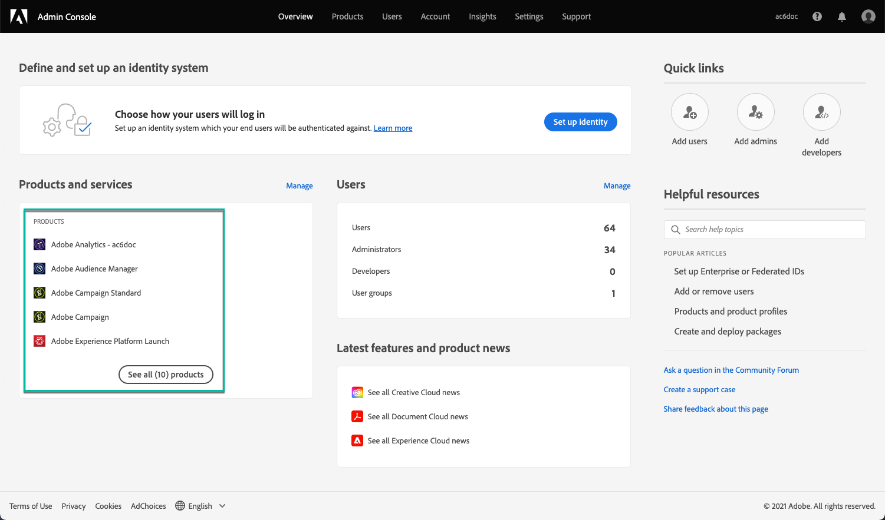
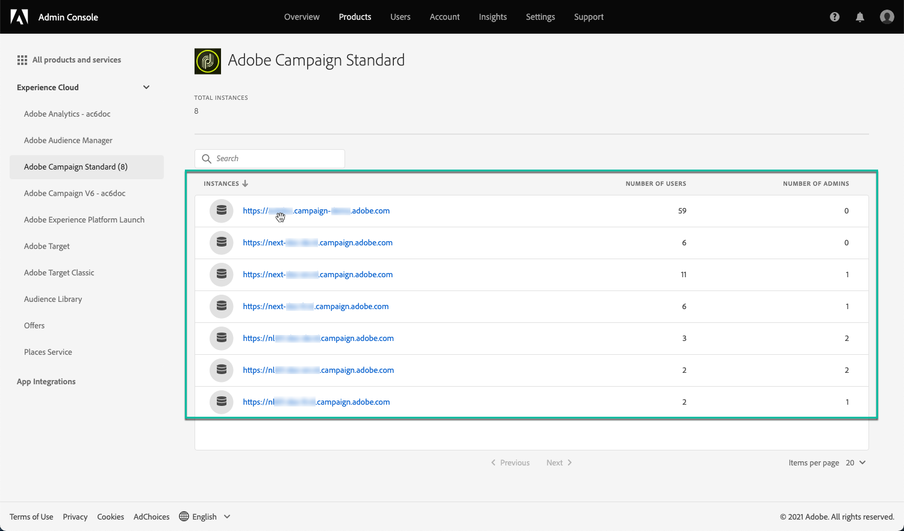
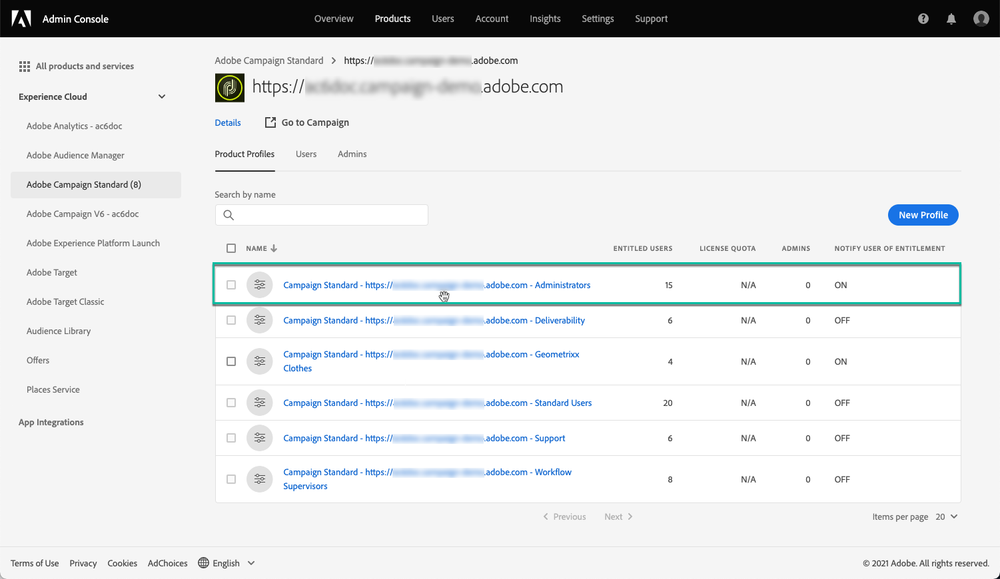
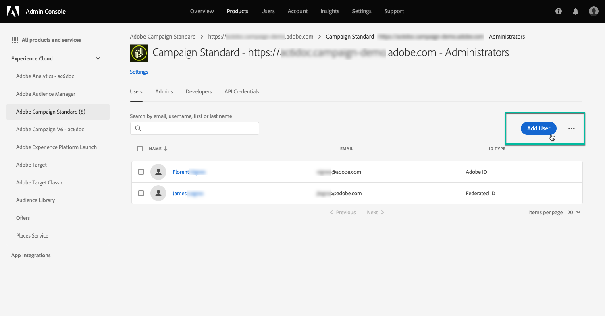

# Gerenciamento de permissões para o Painel de controle {#managing-permissions-control-panel}

O Painel de controle está disponível para todos os usuários administradores de uma instância do Campaign. Siga as etapas abaixo para atribuir usuários(as) ao grupo de administradores e conceder-lhes acesso ao Painel de controle.

[ Conheça este recurso no vídeo](../../discover/using/managing-permissions.md#video)

1. Navegue até a [página inicial da Adobe Experience Cloud](https://experiencecloud.adobe.com/){target="_blank"}.

1. Abra o **Admin Console**, clicando no link disponível na seção **Acesso rápido** ou no menu superior direito.

   

   >[!NOTE]
   >
   >Se o link para o **Admin Console** não estiver visível, isso significa que você não tem direitos de administrador na sua organização. Entre em contato com a administração da organização para executar as etapas.

1. No **Admin Console**, selecione o produto do Campaign desejado na lista **[!UICONTROL Produtos e serviços]**.

   

   >[!NOTE]
   >
   >Caso não veja o seu produto, entre em contato com a administração da organização, para que possam lhe conceder acesso a ele.

1. A lista de instâncias do seu produto do Campaign será exibida. Selecione a instância à qual deseja adicionar um usuário administrador.

   

   >[!NOTE]
   >
   >É possível adicionar diferentes usuários administradores para cada instância do Campaign. Usuários administradores acessarão somente o Painel de controle da instância à qual pertencem.

1. A lista de **[!UICONTROL Perfis de produto]** da instância selecionada será exibida. Clique no perfil de produto **[!UICONTROL Administradores]** para acessar a lista de usuários administradores.

   

   >[!IMPORTANT]
   >
   >Por padrão, o Painel de controle do Campaign é acessível aos usuários administradores que pertencem ao Perfil de produto “Administradores”. De acordo com a configuração da sua organização, o Perfil de produto pode ter um nome diferente (“admin”, “admins”, “administrador de aprovação” etc.). **Qualquer Perfil de produto que contenha a palavra “administrador” em seu nome concederá acesso automaticamente ao Painel de controle do Campaign.**
   >
   >Analise cuidadosamente suas convenções de nomenclatura do perfil de produto no Admin Console para garantir que somente usuários autorizados tenham acesso ao Painel de controle do Campaign, pois o acesso permite fazer alterações significativas nas instâncias do Campaign.

1. A lista de usuários administradores será exibida. Clique no botão **[!UICONTROL Adicionar usuário]** para adicionar o(a) usuário(a) desejado(a).

   

>[!NOTE]
>
>Depois que o acesso for configurado, a pessoa terá que sair da Adobe Experience Cloud e fazer logon novamente para acessar o Painel de controle.

## Tutorial em vídeo {#video}

>[!VIDEO](https://video.tv.adobe.com/v/27147?quality=12)
