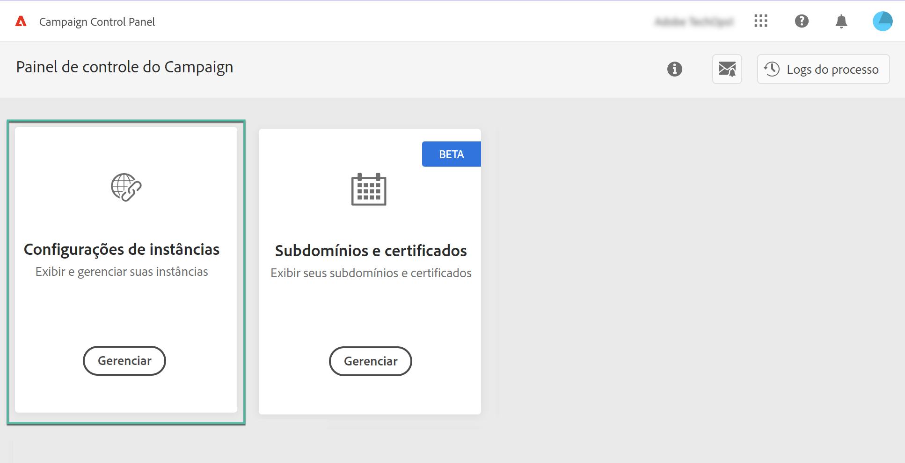
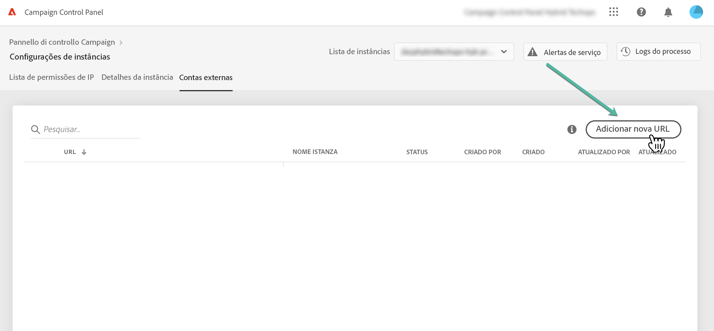
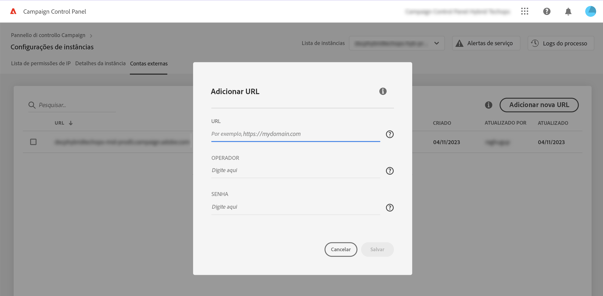
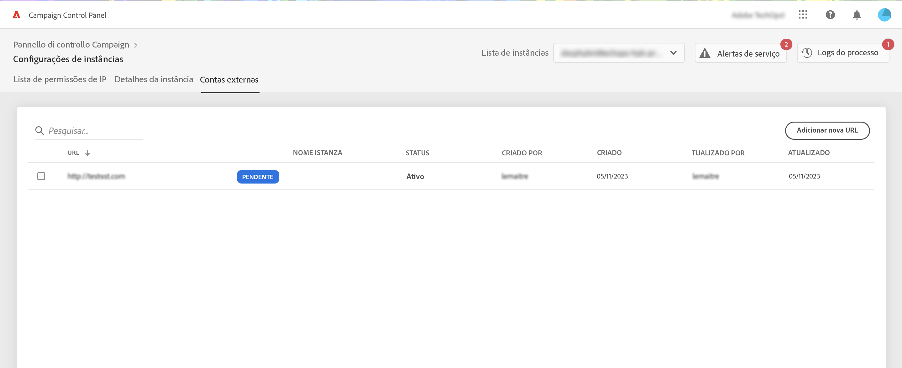
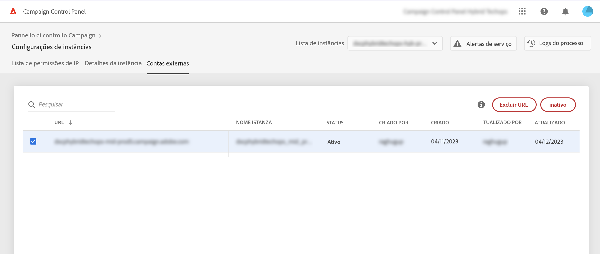
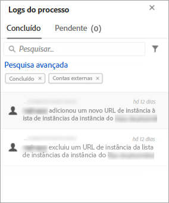

# Adicionar instâncias MID/RT (modelo híbrido)

>[!CONTEXTUALHELP]
>id="cp_externalaccounts"
>title="Contas externas"
>abstract="Nesta tela, os clientes com modelo de hospedagem híbrida podem fornecer o URL da instância MID/RT configurado na instância de marketing do Painel de controle do Campaign para aproveitar seus recursos."

O Painel de controle do Campaign permite que clientes com o modelo de hospedagem híbrida aproveitem seus recursos específicos. Para fazer isso, é necessário fornecer o URL da instância MID/RT configurado em sua instância de marketing do Painel de controle do Campaign.

Para obter mais informações sobre modelos de hospedagem, consulte a [Documentação do Campaign Classic](https://experienceleague.adobe.com/docs/campaign-classic/using/installing-campaign-classic/architecture-and-hosting-models/hosting-models-lp/hosting-models.html?lang=pt-BR).

## Adicionar uma instância MID/RT {#add}

>[!CONTEXTUALHELP]
>id="cp_externalaccounts_url"
>title="URL"
>abstract="O URL da instância, que pode ser encontrado no Console do cliente do Campaign, no menu Administração > Plataforma > Contas externas."

>[!CONTEXTUALHELP]
>id="cp_externalaccounts_operator"
>title="Operador"
>abstract="ID do operador fornecida após o provisionamento inicial pelo administrador da Adobe."

>[!CONTEXTUALHELP]
>id="cp_externalaccounts_password"
>title="Senha"
>abstract="Senha do operador fornecida após o provisionamento inicial pelo administrador da Adobe."

Os clientes híbridos devem se conectar ao Painel de controle do Campaign por meio da Experience Cloud. Ao acessar o Painel de controle do Campaign pela primeira vez, somente dois cartões serão exibidos na página inicial.

>[!NOTE]
>
>Caso tenha problemas para acessar o Painel de controle do Campaign, é provável que sua instância de marketing ainda não esteja mapeada com a ID da organização. Entre em contato com o Atendimento ao cliente para concluir a configuração e prosseguir. Após uma conexão bem-sucedida, você verá a página inicial do Painel de controle do Campaign.

Para acessar os recursos do Painel de controle do Campaign, é preciso inserir as informações da instância MID/RT no cartão **[!UICONTROL Instances Settings]**. Para fazer isso, siga as etapas abaixo.

1. No cartão **[!UICONTROL Instances Settings]**, selecione a guia **[!UICONTROL External Accounts]**. 

1. Selecione a instância de marketing desejada na lista suspensa e clique em **[!UICONTROL Add new URL]**.

   

1. Forneça informações sobre a instância MID/RT que será adicionada.

   

   * **[!UICONTROL URL]**: o URL da instância, que pode ser encontrado no Console do cliente do Campaign, no menu **[!UICONTROL Administration]** > **[!UICONTROL Platform]** > **[!UICONTROL External Accounts]**.

      

   * **[!UICONTROL Operator]** / **[!UICONTROL Password]**: credenciais do operador fornecidas após o provisionamento inicial pelo administrador da Adobe.

      >[!NOTE]
      >
      >Se esses detalhes não estiverem disponíveis, entre em contato com o Atendimento ao cliente.

1. Clique em **[!UICONTROL Save]** para confirmar.

Ao adicionar o URL de MID/RT, um processo assíncrono é acionado para validar a exatidão dos URLs. Esse processo pode levar alguns minutos. Até que o URL da instância MID/RT seja validado, o trabalho permanecerá pendente. Somente após a conclusão da validação será possível acessar os principais recursos do Painel de controle do Campaign.

Você pode remover ou desativar um URL de instância MID/RT a qualquer momento, selecionando-o na lista.

Observe que é possível monitorar qualquer ação executada na guia **[!UICONTROL External Accounts]** em um URL de instância MID/RT a partir do **[!UICONTROL Job Logs]**:

## Recursos disponíveis para clientes híbridos {#capabilities}

Depois que uma instância MID/RT for adicionada ao Painel de controle do Campaign, você poderá aproveitar os recursos listados abaixo:

* [Monitorar contatos importantes e eventos](../../service-events/service-events.md)
* [Exibir detalhes da instância](../../instances-settings/using/instance-details.md),
* [Adicionar endereços IP à lista de permissões](../../instances-settings/using/ip-allow-listing-instance-access.md) (para instâncias RT),
* [Exibir informações sobre subdomínios delegados](../../subdomains-certificates/using/monitoring-subdomains.md),
* [Renovar certificados SSL de subdomínios](../../subdomains-certificates/using/renewing-subdomain-certificate.md).
