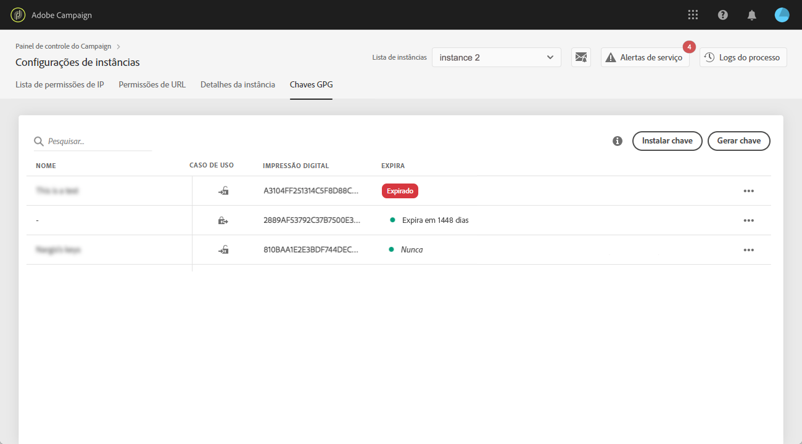

# Gerenciamento de chaves GPG {#gpg-keys-management}

>[!CONTEXTUALHELP]
>id="cp_instancesettings_gpg_management"
>title="Sobre chaves GPG"
>abstract="Nessa guia, você pode instalar e/ou gerar chaves GPG em uma instância de marketing para criptografar dados enviados do Campaign e descriptografar dados recebidos."
>additional-url="https://experienceleague.adobe.com/docs/control-panel/using/performance-monitoring/about-performance-monitoring.html?lang=pt-BR" text="Sobre o monitoramento de desempenho"

## Sobre a criptografia GPG {#about-gpg-encryption}

A criptografia GPG permite proteger seus dados usando um sistema de pares de chaves públicas e privadas que seguem o [OpenPGP](https://www.openpgp.org/about/standard/) especificação.

Depois de implementado, os dados de entrada e saída podem ser descriptografados antes da transferência, para garantir que não sejam acessados por ninguém sem um par de chaves correspondente válido.

Para implementar a criptografia GPG com o Campaign, as chaves GPG devem ser instaladas e/ou geradas em uma instância de marketing por um usuário administrador no Painel de controle.

Depois será possível:

* **Criptografar dados enviados**: o Adobe Campaign envia dados após criptografá-los com a chave pública instalada.

* **Descriptografar dados recebidos**: o Adobe Campaign recebe dados que foram criptografados de um sistema externo usando uma chave pública baixada do Painel de controle do Campaign. O Adobe Campaign descriptografa os dados usando uma chave privada gerada pelo Painel de controle do Campaign.

## Criptografar dados {#encrypting-data}

O Painel de controle permite criptografar dados originários de sua instância do Adobe Campaign.

Para fazer isso, você precisa gerar um par de chaves GPG de uma ferramenta de criptografia PGP e, em seguida, instalar a chave pública no Painel de controle do Campaign. Você poderá criptografar dados antes de enviá-los da sua instância. Para fazer isso, siga as etapas abaixo.

>[!NOTE]
>
>É possível instalar até 60 chaves GPG no Painel de controle do Campaign.

[ Descubra este recurso no vídeo](#video)

1. Gere um par de chaves públicas/privadas usando uma ferramenta de criptografia PGP seguindo o [Especificação do OpenPGP](https://www.openpgp.org/about/standard/). Para fazer isso, instale um utilitário GPG ou software GNuGP.

   >[!NOTE]
   >
   >Software livre de código aberto para gerar chaves está disponível. No entanto, siga as diretrizes de sua organização e use o utilitário GPG recomendado por sua organização de TI/Segurança.

1. Depois que o utilitário estiver instalado, execute o comando abaixo, no Terminal Mac ou no comando do Windows.

   `gpg --full-generate-key`

1. Quando solicitado, especifique os parâmetros desejados para sua chave. Os parâmetros obrigatórios são:

   * **tipo de chave**: RSA
   * **comprimento da chave**: 3072 - 4096 bits
   * **nome verdadeiro** e **endereço de email**: permite rastrear quem criou o par de chaves. Insira um nome e endereço de email vinculados à sua organização ou departamento.
   * **comentário**: adicionar um rótulo ao campo de comentário ajudará você a identificar facilmente a chave a ser usada para criptografar seus dados.
     >[!IMPORTANT]
     >
     >Verifique se esse campo não está vazio e se um comentário foi preenchido.

   * **expiração**: data ou &quot;0&quot; para nenhuma data de expiração.
   * **senha**

   

1. Depois de confirmado, o script gerará uma chave com sua impressão digital associada, que você poderá exportar para um arquivo ou colar diretamente no Painel de controle do Campaign. Para exportar o arquivo, execute este comando seguido da impressão digital da chave gerada.

   `gpg -a --export <fingerprint>`

1. Para instalar a chave pública no Painel de controle do Campaign, abra o **[!UICONTROL Configurações de instância]** e selecione a variável **[!UICONTROL Chaves GPG]** e a instância desejada.

1. Clique em **[!UICONTROL Instalar chave]** botão.

   

1. Cole a chave pública que foi gerada a partir da sua ferramenta de criptografia PGP. Você também pode arrastar e soltar diretamente o arquivo de chave pública exportado.

   >[!NOTE]
   >
   >A chave pública deve estar no formato OpenPGP.

   

1. Clique em **[!UICONTROL Instalar chave]** botão.

Uma vez instalada, a chave pública é exibida na lista. Você pode usar o **..** botão para baixá-lo ou copiar sua impressão digital.

A chave fica disponível para uso em workflows do Adobe Campaign. Você pode usá-los para criptografar dados ao usar atividades de extração de dados.

[ Descubra este recurso no vídeo](#video)

Para obter mais informações sobre esse tópico, consulte a documentação do Adobe Campaign:

**Campaign v7/v8:**

* [Compactação ou criptografia de um arquivo](https://experienceleague.adobe.com/docs/campaign-classic/using/getting-started/importing-and-exporting-data/managing-data-encryption-compression/zip-encrypt.html)
* [Caso de uso: criptografar e exportar dados usando uma chave instalada no Painel de controle](https://experienceleague.adobe.com/docs/campaign-standard/using/managing-processes-and-data/importing-and-exporting-data/managing-encrypted-data.html#use-case-gpg-encrypt)

**Campaign Standard:**

* [Gerenciamento de dados criptografados](https://experienceleague.adobe.com/docs/campaign-standard/using/managing-processes-and-data/importing-and-exporting-data/managing-encrypted-data.html)
* [Caso de uso: criptografar e exportar dados usando uma chave instalada no Painel de controle](https://experienceleague.adobe.com/docs/campaign-classic/using/getting-started/importing-and-exporting-data/managing-data-encryption-compression/zip-encrypt.html#use-case-gpg-encrypt)

## Descriptografar dados {#decrypting-data}

O Painel de controle do Campaign permite descriptografar dados externos que entram em suas instâncias do Adobe Campaign.

Para fazer isso, você precisa gerar um par de chaves GPG diretamente do Painel de controle do Campaign.

* A variável **chave pública** serão compartilhados com o sistema externo, que os usará para criptografar os dados que serão enviados para o Campaign.
* A variável **chave privada** será usado pelo Campaign para descriptografar os dados criptografados recebidos.

[ Descubra este recurso no vídeo](#video)

Para gerar um par de chaves no Painel de controle do Campaign, siga estas etapas:

1. Abra o **[!UICONTROL Configurações de instância]** e selecione a variável **[!UICONTROL Chaves GPG]** e a instância desejada do Adobe Campaign.

1. Clique em **[!UICONTROL Gerar chave]** botão.

   

1. Especifique o nome da chave e clique em **[!UICONTROL Gerar chave]**. Esse nome ajudará você a identificar a chave a ser usada para descriptografar em workflows do Campaign

   

Depois que o par de chaves é gerado, a chave pública é exibida na lista. Observe que os pares de chaves de descriptografia são gerados sem data de expiração.

Você pode usar o **..** botão para baixar a chave pública ou copiar sua impressão digital.

A chave pública fica disponível para ser compartilhada com qualquer sistema externo. O Adobe Campaign poderá usar a chave privada nas atividades de carregamento de dados para descriptografar dados que foram criptografados com a chave pública.

Para obter mais informações, consulte a documentação do Adobe Campaign:

**Campaign v7 e v8:**

* [Descompactação ou descriptografia de um arquivo antes do processamento](https://experienceleague.adobe.com/docs/campaign-classic/using/getting-started/importing-and-exporting-data/managing-data-encryption-compression/unzip-decrypt.html)
* [Caso de uso: importação de dados criptografados usando uma chave gerada pelo Painel de controle](https://experienceleague.adobe.com/docs/campaign-classic/using/getting-started/importing-and-exporting-data/managing-data-encryption-compression/unzip-decrypt.html#use-case-gpg-decrypt)

**Campaign Standard:**

* [Gerenciamento de dados criptografados](https://experienceleague.adobe.com/docs/campaign-standard/using/managing-processes-and-data/importing-and-exporting-data/managing-encrypted-data.html)
* [Caso de uso: importação de dados criptografados usando uma chave gerada pelo Painel de controle](https://experienceleague.adobe.com/docs/campaign-standard/using/managing-processes-and-data/importing-and-exporting-data/managing-encrypted-data.html#use-case-gpg-decrypt)

## Monitoramento de chaves GPG

Para acessar chaves GPG instaladas e geradas para suas instâncias, abra o **[!UICONTROL Configurações de instância]** e selecione a variável **[!UICONTROL Chaves GPG]** guia.

A lista exibe todas as chaves GPG de criptografia e descriptografia que foram instaladas e geradas para suas instâncias com informações detalhadas sobre cada chave:

* **[!UICONTROL Nome]**: O nome que foi definido ao instalar ou gerar a chave.
* **[!UICONTROL Caso de uso]**: essa coluna especifica o caso de uso da chave:

  : A chave foi instalada para criptografia de dados.

  : a chave foi gerada para permitir a descriptografia de dados.

* **[!UICONTROL Impressão digital]**: a impressão digital da chave.
* **[!UICONTROL Expira]**: a data de expiração da chave. Observe que o Painel de controle do Campaign fornecerá indicações visuais conforme a chave se aproximar da data de expiração:

   * O Urgente (vermelho) é mostrado 30 dias antes.
   * O aviso (amarelo) é exibido 60 dias antes.
   * Um banner vermelho &quot;Expirado&quot; será exibido assim que uma chave expirar.

  >[!NOTE]
  >
  >Observe que nenhuma notificação por email será enviada pelo Painel de controle do Campaign.

Como prática recomendada, remova qualquer chave que não seja mais necessária. Para fazer isso, clique no link **..** e selecione **[!UICONTROL Excluir chave].**.

>[!IMPORTANT]
>
>Antes de remover uma chave, verifique se ela não está sendo usada em nenhum fluxo de trabalho do Adobe Campaign para evitar falhas.

## Tutorial em vídeo {#video}

O vídeo abaixo mostra como gerar e instalar chaves GPG para criptografia de dados.

Vídeos explicativos adicionais relacionados ao gerenciamento de chaves GPG estão disponíveis em  [Campaign v7/v8](https://experienceleague.adobe.com/docs/campaign-standard-learn/control-panel/instance-settings/gpg-key-management/gpg-key-management-overview.html#instance-settings) e [Campaign Standard](https://experienceleague.adobe.com/docs/campaign-classic-learn/control-panel/instance-settings/gpg-key-management/gpg-key-management-overview.html#instance-settings) páginas de tutoriais.

>[!VIDEO](https://video.tv.adobe.com/v/36386?quality=12)
