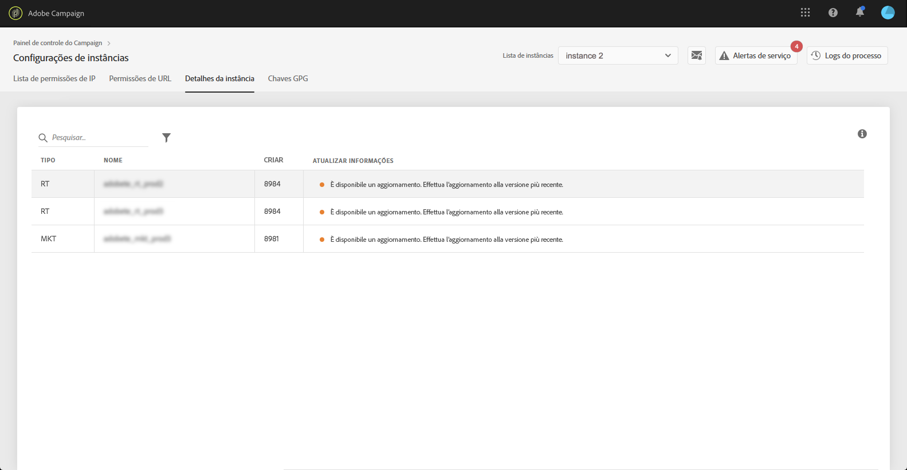

# Detalhes da instância {#instance-details}

>[!CONTEXTUALHELP]
>id="cp_instancesettings_instancedetails"
>title="Sobre detalhes da instância"
>abstract="Exiba os detalhes das instâncias do Adobe Campaign: tipos, nomes, informações de criação e possíveis recomendações de atualização."

## Sobre detalhes da instância {#about-instance-details}

>[!IMPORTANT]
>
>Este recurso está disponível somente para instâncias do Campaign v7/v8.

A arquitetura de instâncias do Adobe Campaign pode conter vários servidores para permitir a flexibilidade das atividades de marketing. Por exemplo, você pode ter servidores de Marketing, Tempo real (ou Centro de mensagens) e Mid Sourcing para dar suporte à sua instância.

A funcionalidade Detalhes da instância permite a visualização de uma arquitetura simples da instância. Além das informações do servidor, ela também permite saber se a build da instância está ou não atualizada, além de recomendar atualizações quando necessário.

>[!NOTE]
>
>Recomendamos atualizar as suas instâncias pelo menos uma vez por ano para evitar a degradação do desempenho e aproveitar os recursos e as correções mais recentes que o Adobe Campaign v7/v8 tem a oferecer.

**Tópicos relacionados:**

* [Atualização de uma build](https://experienceleague.adobe.com/docs/campaign-classic/using/monitoring-campaign-classic/updating-adobe-campaign/build-upgrade.html?lang=pt-BR)
* [Atualização do Adobe Campaign](https://experienceleague.adobe.com/docs/campaign-classic/using/monitoring-campaign-classic/updating-adobe-campaign/introduction.html?lang=pt-BR)

## Recuperação de informações sobre instâncias {#retrieving-information-about-instances}

Para obter informações sobre os servidores conectados às suas instâncias, siga estas etapas:

1. Abra o cartão **[!UICONTROL Configurações de instâncias]** para acessar a guia **[!UICONTROL Detalhes da instância]**.

   >[!NOTE]
   >
   >Se o cartão de configurações de instâncias não estiver visível na página inicial do Painel de controle, isso significa que a ID da organização não está associada a nenhuma instância do Adobe Campaign v7/v8.

1. Selecione no painel esquerdo a instância desejada do Campaign 

   >[!NOTE]
   >
   >Todas as instâncias do Campaign são exibidas na lista do painel esquerdo. Como o recurso de detalhes da instância é dedicado somente às instâncias do Campaign v7/v8, a mensagem “Instância não aplicável” é exibida ao selecionar uma instância do Campaign Standard.

1. Os servidores conectados à instância são exibidos.

   

As informações disponíveis são:

* **[!UICONTROL Tipo]**: o tipo de servidor. Os valores possíveis são MKT (Marketing), MID (Mid-sourcing) e RT (Centro de mensagens/Mensagens em tempo real).
* **[!UICONTROL Nome]**: o nome do servidor.
* **[!UICONTROL Build:]** a versão da build instalada no servidor.
* **[!UICONTROL Informações sobre atualizações]**: esta coluna informa se alguma atualização é necessária para o servidor.
   * Verde: o servidor está atualizado, nenhuma atualização é necessária.
   * Amarelo: você deve pensar em atualizar. Faltam os recursos e as correções mais recentes.
   * Vermelho: atualize assim que possível. Faltam novos recursos e o desempenho do servidor pode não ser o ideal.

Se um dos seus servidores precisar ser atualizado, consulte [esta documentação](https://experienceleague.adobe.com/docs/campaign-classic/using/monitoring-campaign-classic/updating-adobe-campaign/build-upgrade.html?lang=pt-BR) para obter mais detalhes sobre como proceder.

## Perguntas comuns {#common-questions}

**Não vejo o servidor MID na arquitetura da minha instância. Isso significa que minhas instâncias não estão funcionando corretamente? Preciso da instância de RT para algo que não posso fazer hoje?**

Sua própria instância pode parecer muito diferente, e pode não ter todos os tipos de servidores, ou pode ter vários do mesmo servidor. Não ter um ou outro tipo de servidor não significa que você não possa enviar uma mensagem em tempo real ou executar outros tipos de atividades. Você pode solicitar capacidade adicional do servidor; taxas adicionais serão aplicadas.

Entre em contato com o Atendimento ao cliente se você achar que alguns servidores não estão sendo exibidos na página &quot;Detalhes da instância&quot;. Anote o URL da instância específica em sua mensagem.
