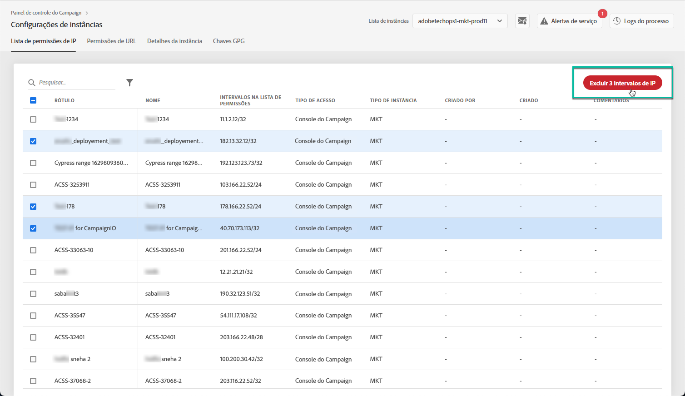

# Lista de permissões de IP {#ip-allow-listing}

>[!CONTEXTUALHELP]
>id="cp_instancesettings_iprange"
>title="Sobre a lista de permissões de IP"
>abstract="Adicione endereços IP à lista de permissões para acessar suas instâncias."
>additional-url="https://images-tv.adobe.com/mpcv3/045cac99-f948-478e-ae04-f8c161dcb9e2_1568132508.1920x1080at3000_h264.mp4" text="Assista ao vídeo de demonstração"

## Sobre a lista de permissões de IP {#about-ip-allow-listing}

>[!IMPORTANT]
>
>Este recurso está disponível somente para instâncias do Campaign v7/v8.

Por padrão, a instância do Adobe Campaign não pode ser acessada de vários endereços IP.

Se seu endereço IP não tiver sido incluído na lista de permissões, você não poderá fazer logon na instância com esse endereço. Da mesma forma, talvez você não consiga conectar uma API ao seu Centro de mensagens ou à sua instância de marketing se o endereço IP não tiver sido explicitamente incluído na lista de permissões com a instância.

O Painel de controle permite configurar novas conexões às suas instâncias ao adicionar intervalos de endereços IP à lista de permissões. Para fazer isso, siga as etapas descritas abaixo.

Depois que os endereços IP forem exibido na lista de permissões, você poderá criar e vincular operadores do Campaign a eles para que os usuários possam acessar a instância.

 [Conheça este recurso no vídeo](https://experienceleague.adobe.com/docs/campaign-classic-learn/control-panel/instance-settings/ip-allow-listing.html?lang=pt-BR#instance-settings)

## Práticas recomendadas {#best-practices}

Siga as recomendações e limitações abaixo ao adicionar endereços IP à lista de permissões no Painel de controle.

* **Não ative o acesso IP a todos os tipos de acesso** se você não quiser que o endereço IP se conecte aos servidores RT ou à zona de segurança do AEM.
* **Se você ativou temporariamente o acesso à sua instância para um endereço IP**, remova os endereços IP da lista de permissões depois que não precisar mais se conectar à sua instância.
* **Não recomendamos adicionar endereços IP de locais públicos à lista de permissões** (aeroportos, hotéis, etc.). Use o endereço VPN da sua empresa para manter a instância sempre segura.

## Adicionando endereços IP à lista de permissões para acesso à instância {#adding-ip-addresses-allow-list}

>[!CONTEXTUALHELP]
>id="cp_instancesettings_iprange_add"
>title="Configuração do intervalo IP"
>abstract="Defina o intervalo de IP que deseja adicionar à lista de permissões para se conectar à sua instância."

>[!NOTE]
>
>Se o cartão **[!UICONTROL Configurações de instância]** não estiver visível na página inicial do Painel de controle, significa que a [ID da organização](https://experienceleague.adobe.com/docs/core-services/interface/administration/organizations.html?lang=pt-BR) não está associada a nenhuma instância do Adobe Campaign v7/v8.

Para adicionar endereços IP à lista de permissões, siga estas etapas:

1. Abra o **[!UICONTROL cartão Configurações de instâncias]** para acessar a guia Lista de permissões de IP e clique em **[!UICONTROL Adicionar novo intervalo de IP]**.

   

1. Preencha as informações para o Intervalo de IP que deseja incluir na lista de permissões, conforme descrito abaixo.

   

   * **[!UICONTROL Instância(s)]**: instâncias às quais os endereços IP poderão se conectar. Várias instâncias podem ser manipuladas ao mesmo tempo. Por exemplo, a lista de permissões de IP pode ser executada pela mesma etapa em instâncias de Produção e de Estágio.
   * **[!UICONTROL Intervalo de IP]**: o intervalo de IP que você deseja adicionar à lista de permissões, no formato CIDR. Observe que um intervalo IP não pode sobrepor um intervalo existente na lista de permissões. Nesse caso, primeiro exclua o intervalo que contém o IP sobreposto.

   >[!NOTE]
   >
   >CIDR (Roteamento interdomínio sem classe) é o formato aceito ao adicionar intervalos IP com a interface do Painel de controle. A sintaxe consiste em um endereço IP seguido por um caractere &#39;/&#39; e um número decimal. O formato e sua sintaxe são detalhados por completo [neste artigo](https://whatismyipaddress.com/cidr).
   >
   >É possível procurar na internet ferramentas online gratuitas que ajudarão a converter o intervalo de IP para o formato CIDR.

   * **[!UICONTROL Rótulo]**: o rótulo que será exibido na lista de permissões.
   * **[!UICONTROL Nome]**: o nome deve ser único para o tipo de acesso, instância (no caso de conexão de API externa) e endereço IP.

1. Especifique o tipo de acesso que deseja conceder aos endereços IP:

   * **[!UICONTROL Acesso ao console do Campaign]**: os endereços IP terão permissão para se conectar ao Console do cliente do Campaign. Observe que o acesso ao Console é ativado apenas para instâncias de marketing. O acesso à instância MID e RT não é permitido e, portanto, não está habilitado.
   * **[!UICONTROL Conexão com o AEM]**: os endereços IP do AEM especificados terão permissão para se conectar à instância de marketing.
   * **[!UICONTROL Conexão de API externa]**: as APIs externas com os endereços IP especificados terão permissão para se conectar à instância de marketing e/ou do Centro de mensagens (RT). Observe que a conexão com o console de instâncias do RT não está habilitada.

   >[!NOTE]
   >
   >Se estiver usando uma instância com um modelo de hospedagem híbrido, só será possível adicionar endereços IP na “Conexão de API externa” para instâncias de MID e RT.

   

1. Clique no botão **[!UICONTROL Save]**. O Intervalo de IP é adicionado à lista de permissões.

   <!---->

Por padrão, a instância do Adobe Campaign não pode ser acessada de vários endereços IP.

Para excluir um ou mais intervalos de IP da lista de permissões, selecione-os e clique no botão **[!UICONTROL Excluir intervalo de IP]**.

**Tópicos relacionados:**

* [Vinculação de uma zona de segurança a um operador](https://experienceleague.adobe.com/docs/campaign-classic/using/installing-campaign-classic/additional-configurations/security-zones.html?lang=pt-BR#linking-a-security-zone-to-an-operator)
