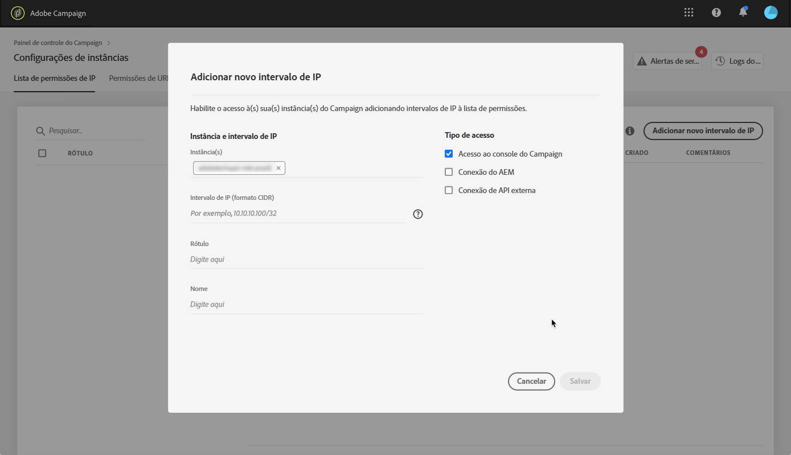

# Lista de permissões de IP {#ip-allow-listing}

>[!CONTEXTUALHELP]
>id="cp_instancesettings_iprange"
>title="Sobre a listagem de permissões de IP"
>abstract="Adicione endereços IP à lista de permissões para acessar suas instâncias."
>additional-url="https://images-tv.adobe.com/mpcv3/045cac99-f948-478e-ae04-f8c161dcb9e2_1568132508.1920x1080at3000_h264.mp4" text="Assista ao vídeo de demonstração"

>[!IMPORTANT]
>
>Esse recurso está disponível apenas para instâncias do Campaign Classic.

## Sobre a listagem de permissões de IP {#about-ip-allow-listing}

Por padrão, a instância do Adobe Campaign Classic não pode ser acessada de vários endereços IP.

Se seu endereço IP não tiver sido adicionado à lista de permissões, você não poderá fazer logon na instância a partir desse endereço. Da mesma forma, talvez você não consiga conectar uma API ao seu Centro de mensagens ou à sua instância de Marketing se o endereço IP não tiver sido adicionado à lista de permissões com a instância explicitamente.

O Painel de controle permite que você configure novas conexões para suas instâncias adicionando intervalos de endereços IP à lista de permissões. Para fazer isso, siga as etapas descritas abaixo.

Quando os endereços IP estiverem na lista de permissões, você poderá criar e vincular operadores de Campanha a eles para que os usuários possam acessar a instância.

## Práticas recomendadas {#best-practices}

Certifique-se de seguir as recomendações e limitações abaixo ao adicionar endereços IP à lista de permissões no Painel de controle.

* **Não ative o acesso IP a todos os tipos de acesso** se você não pretende que o endereço IP se conecte aos servidores RT ou à zona de segurança do AEM.
* **Se você ativou temporariamente o acesso à sua instância para um endereço** IP, certifique-se de remover os endereços IP da lista de permissão depois que não precisar mais se conectar à sua instância.
* **Não recomendamos adicionar endereços IP de locais públicos à lista** de permissão (aeroportos, hotéis, etc.). Use o endereço VPN da sua empresa para manter a instância sempre segura.

## Adicionar endereços IP à lista de permissões para acesso à Instância {#adding-ip-addresses-allow-list}

>[!CONTEXTUALHELP]
>id="cp_instancesettings_iprange_add"
>title="Adicione um novo intervalo IP"
>abstract="Defina o intervalo IP que deseja adicionar à lista de permissões para se conectar à sua instância."

Para adicionar endereços IP à lista de permissões, siga estas etapas:

1. Open the **[!UICONTROL Instances Settings card]** to access the IP allow listing tab, then click **[!UICONTROL Add new IP Range]**.

   >[!NOTE]
   >
   >Se o cartão Configurações de instância não estiver visível na página inicial do Painel de controle do Campaign, significa que a ID ORG IMS não está associada a nenhuma instância do Adobe Campaign Classic.

   

1. Preencha as informações do Intervalo de IP que deseja adicionar à lista de permissões conforme descrito abaixo.

   

   * **[!UICONTROL Instance(s)]**: as instâncias às quais os endereços IP poderão se conectar. Várias instâncias podem ser manipuladas ao mesmo tempo. Por exemplo, a listagem de permissão de IP pode ser executada em instâncias de Produção e de Estágio por meio da mesma etapa.
   * **[!UICONTROL IP Range]**: O intervalo IP que você deseja adicionar à lista de permissões, no formato CIDR. Observe que um intervalo IP não pode sobrepor um intervalo existente na lista de permissões. Nesse caso, primeiro exclua o intervalo que contém o IP sobreposto.
   >[!NOTE]
   >
   >CIDR (Roteamento interdomínio sem classe) é o formato aceito ao adicionar intervalos IP com a interface do Painel de controle do Campaign. A sintaxe consiste em um endereço IP seguido por um caractere &#39;/&#39; e um número decimal. O formato e sua sintaxe são detalhados por completo [neste artigo](https://whatismyipaddress.com/cidr).
   >
   >Você pode procurar na Internet ferramentas online gratuitas que ajudarão você a converter o intervalo IP disponível para o formato CIDR.

   * **[!UICONTROL Label]**: O rótulo que será exibido na lista de permissões.
   * **[!UICONTROL Name]**: o nome deve ser exclusivo para o Tipo de acesso, Instância (no caso de conexão de API externa) e Endereço IP.

1. Especifique o tipo de acesso que deseja conceder aos endereços IP:

   * **[!UICONTROL Campaign Console Access]**: os endereços IP poderão se conectar ao Console do Campaign Classic. Observe que o acesso ao Console é ativado apenas para instâncias de marketing. O acesso à instância MID e RT não é permitido e, portanto, não está habilitado.
   * **[!UICONTROL AEM connection]**: os endereços IP AEM especificados poderão se conectar à instância de marketing.
   * **[!UICONTROL External API connection]**: as APIs externas com os endereços IP especificados poderão se conectar à instância do Centro de mensagens e/ou Marketing (RT). Observe que a conexão com o console de instâncias de RT não está habilitada.
   

1. Clique no botão **[!UICONTROL Save]**. O Intervalo IP é adicionado à lista de permissões.

   

Para excluir intervalos IP da lista de permissões, selecione-os e clique no **[!UICONTROL Delete IP range]** botão.

**Tópicos relacionados:**
* [Lista de permissões de IP (vídeo tutorial)](https://docs.adobe.com/content/help/en/campaign-learn/campaign-classic-tutorials/administrating/control-panel-acc/ip-allow-listing.html)
* [Vincular uma zona de segurança a um operador](https://docs.campaign.adobe.com/doc/AC/en/INS_Additional_configurations_Configuring_Campaign_server.html#Linking_a_security_zone_to_an_operator)
