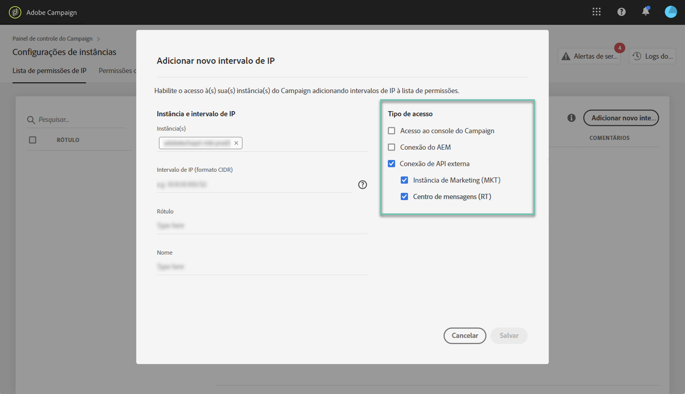

# Lista de permissões de IP {#ip-whitelisting}

>[!CAUTION]
>
>Esse recurso está disponível somente para instâncias do Campaign Classic.

## Sobre a lista de permissões de IP {#about-ip-whitelisting}

Por padrão, sua instância do Adobe Campaign Classic não está acessível de vários endereços IP.

Se seu endereço IP não tiver sido incluído na lista de permissões, você não poderá fazer logon na instância a partir desse endereço. Da mesma forma, talvez você não consiga conectar uma API ao seu Centro de mensagens ou à sua instância de Marketing se o endereço IP não tiver sido incluído explicitamente na lista de permissões com a instância.

O Painel de controle permite que você configure novas conexões para suas instâncias ao adicionar intervalos de endereços IP à lista de permissões. Para fazer isso, siga as etapas descritas abaixo.

Depois que o endereço IP for exibido na lista de permissões, você poderá criar e vincular operadores do Campaign a eles para que os usuários possam acessar a instância.

## Práticas recomendadas {#best-practices}

Certifique-se de seguir as recomendações e limitações abaixo ao adicionar endereços IP à lista de permissões no Painel de controle.

* **Não ative o acesso IP a todos os tipos** de acesso se você não pretende que o endereço IP se conecte aos servidores RT ou à zona de segurança do AEM.
* **Se você ativou temporariamente o acesso à sua instância para um endereço** IP, certifique-se de remover os endereços IP dos endereços IP da lista de permissões depois que não precisar mais se conectar à sua instância.
* **Não recomendamos os endereços IP da lista de permissões de locais** públicos (aeroportos, hotéis, etc.). Use o endereço VPN da sua empresa para manter a instância sempre segura.

## Endereços IP da lista de permissões para acesso à Instância {#whistelisting-ip-addresses}

Para adicionar endereços IP à lista de permissões, siga estas etapas:

1. Abra a guia **[!UICONTROL Instances Settings card]** para acessar a lista de permissões IP e clique em **[!UICONTROL Add new IP Range]**.

   >[!NOTE]
   >
   >Se o cartão Configurações da instância não estiver visível na página inicial do Painel de controle, isso significa que a ID ORG IMS não está associada a nenhuma instância do Adobe Campaign Classic

   

1. Preencha as informações para o Intervalo de IP que deseja incluir na lista de permissões conforme descrito abaixo.

   

   * **[!UICONTROL Instance(s)]**: As instâncias às quais os endereços IP poderão se conectar. Vários exemplos podem ser manipulados ao mesmo tempo. Por exemplo, a listagem de IP pode ser executada em instâncias de Produção e de Estágio pela mesma etapa.
   * **[!UICONTROL IP Range]**: O intervalo IP que você deseja incluir na lista de permissões, no formato CIDR. Observe que um intervalo IP não pode sobrepor um intervalo existente na lista de permissões. Nesse caso, primeiro exclua o intervalo que contém o IP sobreposto.
   >[!NOTE]
   >
   >O CIDR (Classless Inter-Domain Routing) é o formato suportado ao adicionar intervalos IP com a interface do Painel de controle. A sintaxe consiste em um endereço IP, seguido por um caractere '/' e um número decimal. O formato e sua sintaxe são detalhados por completo [neste artigo](https://whatismyipaddress.com/cidr).
   >
   >Você pode procurar na Internet ferramentas online gratuitas que o ajudarão a converter o intervalo de IP disponível no formato CIDR.

   * **!UICONTROL Label]**: O rótulo que será exibido na lista de endereços IP da lista de permissões.
   * **[!UICONTROL Name]**: O nome deve ser exclusivo para o Tipo de acesso, Instância (no caso de conexão de API externa) e endereço IP.

1. Especifique o tipo de acesso que deseja conceder aos endereços IP:

   * **[!UICONTROL Campaign Console Access]**: Os endereços IP poderão se conectar ao console do Campaign Classic. Observe que o acesso ao Console é ativado apenas para instâncias de Marketing. O acesso à instância MID e RT não é permitido e, portanto, não está habilitado.
   * **[!UICONTROL AEM connection]**: Os endereços IP AEM especificados poderão se conectar à instância de Marketing.
   * **[!UICONTROL External API connection]**: As APIs externas com os endereços IP especificados poderão se conectar à instância do Centro de mensagens e/ou Marketing (RT). Observe que a conexão com o console de instâncias de RT não está ativada.
   

1. Clique no botão **.[!UICONTROL Save]** O Intervalo IP é adicionado à lista de endereços IP da lista de permissões.

   

Para excluir intervalos IP da lista de permissões, selecione-os e clique no **[!UICONTROL Delete IP range]** botão.

**Tópicos relacionados:**
* [Lista de permissões de IP (vídeo tutorial)](https://docs.adobe.com/content/help/en/campaign-learn/campaign-classic-tutorials/administrating/control-panel-acc/ip-whitelisting.html)
* [Vincular uma zona de segurança a um operador](https://docs.campaign.adobe.com/doc/AC/en/INS_Additional_configurations_Configuring_Campaign_server.html#Linking_a_security_zone_to_an_operator)
