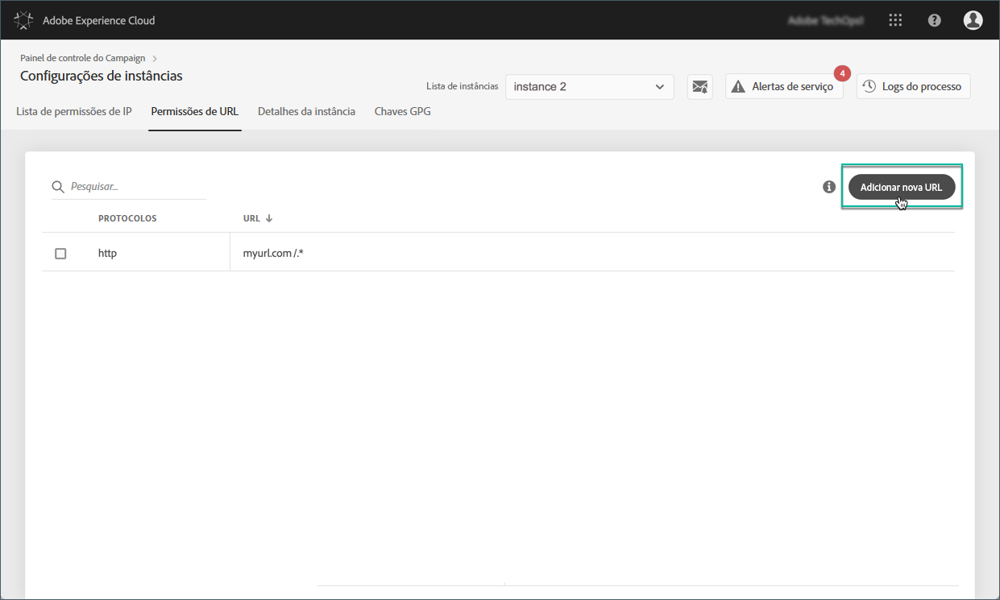
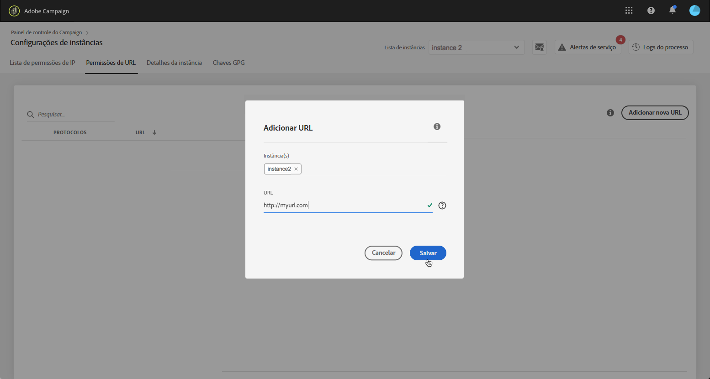
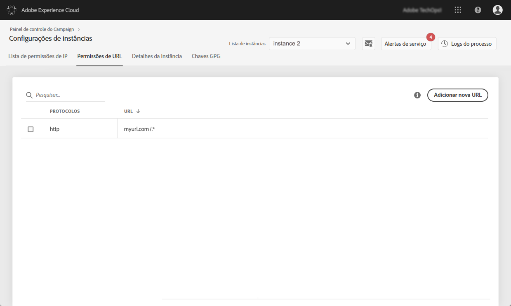

# Permissões de URL {#url-permissions}

>[!CONTEXTUALHELP]
>id="cp_instancesettings_urlpermissions"
>title="Sobre permissões de URL"
>abstract="Gerencie os URLs aos quais as instâncias do Adobe Campaign podem se conectar."
>additional-url="https://images-tv.adobe.com/mpcv3/91206a19-d9af-4b6a-8197-0d2810a78941_1563488165.1920x1080at3000_h264.mp4" text="Assista ao vídeo de demonstração"

## Sobre permissões de URL {#about-url-permissions}

>[!IMPORTANT]
>
>Esse recurso está disponível somente para instâncias do Campaign v8 e Campaign Classic v7, a partir da build 8850. Se você estiver usando uma build com versão anterior, será necessário uma atualização para usar esse recurso.

A lista padrão de URLs que podem ser chamados por códigos JavaScript (workflows, etc.) pelas instâncias do Campaign é limitada. Esses são os URLs que permitem que as instâncias funcionem corretamente.

Por padrão, as instâncias não têm permissão para se conectar a URLs externos. O Painel de controle do Campaign permite adicionar URLs externos à lista de URLs autorizados para que sua instância possa se conectar a eles. Dessa forma, você pode conectar as instâncias do Campaign a sistemas externos, como servidores ou sites SFTP para habilitar a transferência de arquivos e/ou dados.

Depois de adicionado, o URL é referenciado no arquivo de configuração da instância (serverConf.xml).

 [Descubra este recurso no vídeo](https://experienceleague.adobe.com/docs/campaign-classic-learn/control-panel/instance-settings/adding-url-permissions.html?lang=en#instance-settings)

**Tópicos relacionados:**

* [Configuração do servidor do Campaign](https://docs.campaign.adobe.com/doc/AC/en/INS_Additional_configurations_Configuring_Campaign_server.html)
* [Proteção de conexão de saída](https://experienceleague.adobe.com/docs/campaign-classic/using/installing-campaign-classic/security-privacy/server-configuration.html#outgoing-connection-protection)

## Práticas recomendadas {#best-practices}

* Não conecte a instância do Campaign a sites/servidores aos quais você não pretende se conectar.
* Exclua URLs com os quais você não está mais trabalhando. No entanto, lembre-se de que, se outra seção da sua empresa ainda estiver se conectando ao URL excluído, ninguém poderá usá-lo novamente.
* O Painel de controle do Campaign oferece suporte aos protocolos **http**, **https** e **sftp**. A inserção de URLs ou protocolos inválidos resultará em erros.

## Gerenciamento de permissões de URL {#managing-url-permissions}

>[!CONTEXTUALHELP]
>id="cp_instancesettings_url_add"
>title="Adicionar um novo URL"
>abstract="Adicione URLs para permitir conexões com sua instância do Campaign."

Para adicionar um URL ao qual sua instância pode se conectar, siga estas etapas:

1. Abra o cartão **[!UICONTROL Instances Settings]** para acessar a guia **[!UICONTROL URL Permissions]**.

   >[!NOTE]
   >
   >Se o cartão Configurações de instância não estiver visível na página inicial do Painel de controle do Campaign, significa que a ID da organização IMS não está associada a nenhuma instância do Adobe Campaign
   >
   >A guia de <b>permissões de URL</b> lista todos os URLs externos aos quais sua instância pode se conectar. Essa lista não inclui URLs necessários para que o Campaign funcione (por exemplo, conexões entre peças de infraestrutura).

1. Selecione no painel esquerdo a instância desejada e clique no botão **[!UICONTROL Add new URL]**.

   

   >[!NOTE]
   >
   >Todas as instâncias do Campaign são exibidas na lista do painel esquerdo.
   >
   >Como o gerenciamento de permissões de URL é dedicado apenas a instâncias Campaign Classic, a mensagem &quot;Instância não aplicável&quot; é exibida se você selecionar uma instância do Campaign Standard.

1. Digite o URL a ser autorizado com seu protocolo associado (http, https ou sftp).

   >[!NOTE]
   >
   >É possível autorizar várias instâncias para se conectar ao URL. Para fazer isso, adicione-os diretamente no campo Instâncias digitando sua primeira letra.

   

1. O URL é adicionado à lista; agora você pode se conectar a ele.

   >[!NOTE]
   >
   >Os &quot;/.*&quot; caracteres são adicionados automaticamente ao final do URL inserido após a validação para abranger todas as subpáginas da página inserida.

   

Você pode excluir um URL a qualquer momento selecionando-o e clicando no botão **[!UICONTROL Delete URL]**.

Lembre-se de que se você excluir um URL, sua instância não poderá chamá-lo novamente.

## Perguntas comuns {#common-questions}

**Adicionei um novo URL, mas minha instância ainda não consegue se conectar a esse URL. Por que isso ocorre?**

Em alguns casos, os URLs que você tenta conectar exigem uma lista de permissão, uma senha ou outra forma de autenticação. O Painel de controle do Campaign não gerencia autenticação adicional.
