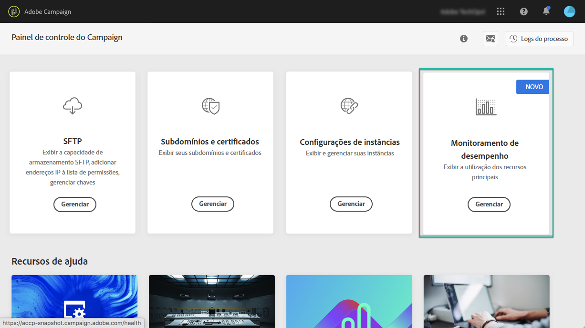

# Sobre o monitoramento de desempenho {#about-performance-monitoring}

>[!IMPORTANT]
>
>O monitoramento de desempenho do Painel de controle estará disponível no final de abril.

O Painel de controle fornece várias funcionalidades para ajudá-lo a monitorar suas instâncias e garantir o desempenho ideal.

A **[!UICONTROL Performance monitoring]** placa no home page do Painel de controle permite monitorar o uso de instâncias de Campanha como, por exemplo, a capacidade do banco de dados. Para obter mais informações, consulte [esta seção](../../performance-monitoring/using/database-monitoring.md).

>[!NOTE]
>
>Com as próximas versões do Painel de controle, outras funcionalidades de monitoramento serão disponibilizadas nesta placa.

Além disso, o Painel de controle permite que você se inscreva para receber notificações por email toda vez que um problema for detectado em uma de suas instâncias de Campanha. Para obter mais informações, consulte [esta seção](../../performance-monitoring/using/email-alerting.md).
