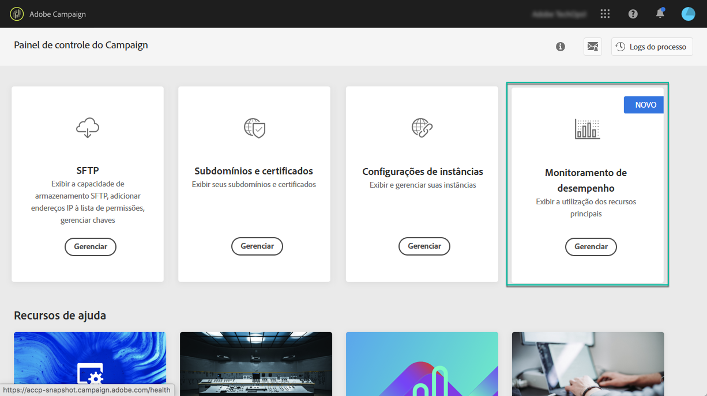

# Sobre o monitoramento de desempenho {#about-performance-monitoring}

O Painel de controle oferece várias funcionalidades para ajudar a monitorar suas instâncias e garantir um ótimo desempenho.

O cartão **[!UICONTROL Monitoramento do desempenho]** na página inicial do Painel de controle permite monitorar o uso das suas instâncias do Campaign, como, por exemplo, a capacidade do banco de dados. Para obter mais informações, consulte [esta seção](../../performance-monitoring/using/database-monitoring.md).

>[!NOTE]
>
>Com as próximas versões do Painel de controle, funcionalidades de monitoramento adicionais serão disponibilizadas nesse cartão.

