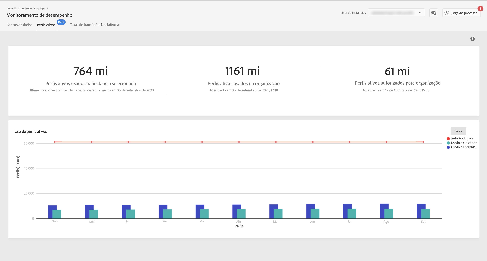

# Monitoramento de perfis ativos {#active-profiles-monitoring}

## Sobre perfis ativos {#about-active-profiles}

>[!IMPORTANT]
>
>O monitoramento de perfis ativos pelo Painel de controle está disponível em beta e está sujeito a atualizações e modificações frequentes sem aviso prévio. Ele está disponível na build Campaign Standard 10368.

De acordo com seu contrato, cada uma das instâncias do Campaign é provisionada com uma quantidade específica de perfis ativos que são contados para fins de faturamento. Consulte seu contrato mais recente para obter uma referência sobre o número de perfis ativos adquiridos.

“Perfil” significa um registro de informações (por exemplo: um registro na tabela nmsRecipient ou uma tabela externa contendo um cookie de identificação, uma identificação do cliente, um identificador para dispositivos móveis ou outras informações relevantes para um canal específico) representando um cliente final, um prospecto ou um cliente potencial.

Os perfis são considerados ativos se tiverem sido direcionados ou comunicados nos últimos 12 meses por meio de qualquer canal.

>[!NOTE]
>
>Os canais Facebook e Twitter não são considerados.

Para obter mais informações sobre perfis ativos, consulte [Campaign Standard](https://experienceleague.adobe.com/docs/campaign-standard/using/profiles-and-audiences/managing-profiles/active-profiles.html) e [Campaign v7/v8](https://experienceleague.adobe.com/docs/campaign-classic/using/getting-started/profile-management/about-profiles.html#active-profiles) documentações.

## Monitoramento de perfis ativos {#monitoring-active-profiles}

>[!CONTEXTUALHELP]
>id="cp_performancemonitoring_active_profile"
>title="Sobre o monitoramento de perfis ativos"
>abstract="Nessa guia, você pode obter informações em tempo real sobre a utilização e evolução mais recente e histórica de perfis ativos para cada uma das instâncias do Campaign."
>additional-url="https://experienceleague.adobe.com/docs/control-panel/using/performance-monitoring/about-performance-monitoring.html?lang=pt-BR" text="Sobre o monitoramento de desempenho"

O Painel de controle permite monitorar a utilização de perfis ativos para cada uma das instâncias do Campaign.

Para fazer isso, siga estes passos:

1. Abra o **[!UICONTROL Performance Monitoring]** cartão e selecione a **[!UICONTROL Active Profiles]** guia.

1. Selecione a instância desejada em **[!UICONTROL Instance List]**.

1. O número de perfis ativos usados pela instância é exibido, bem como a última vez que o workflow de cobrança foi executado em sua instância.

>[!NOTE]
>
>Os perfis ativos são contados com base em workflows técnicos dedicados que são executados diariamente em suas instâncias:
>
>* O workflow [&quot;Faturamento&quot;](https://experienceleague.adobe.com/docs/campaign-standard/using/administrating/application-settings/technical-workflows.html?lang=pt-BR) para o Campaign Standard,
>* O [&quot;Número de perfis de faturamento ativos&quot;](https://experienceleague.adobe.com/docs/campaign-classic/using/automating-with-workflows/advanced-management/about-technical-workflows.html?lang=pt-BR) workflow para Campaign v7/v8.

A área inferior fornece uma representação gráfica do uso de perfis ativos nos últimos 30 dias. Você pode alterar o período exibido para 1 ano usando os filtros disponíveis no canto superior direito.

Você pode obter o número exato de perfis ativos usados no período selecionado, passando o mouse sobre uma das barras de gráfico.
