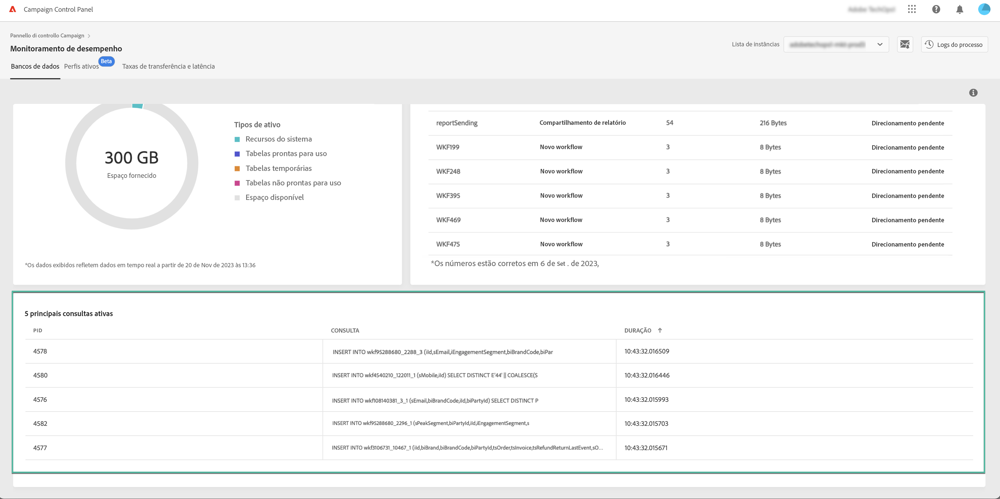

# Monitoramento de consultas ativas {#long-running-queries}

Á área **[!UICONTROL Active queries]**, da guia **[!UICONTROL Databases]**, lista as cinco consultas sendo executadas há mais tempo na instância selecionada.

As colunas **[!UICONTROL Duration]** especificam há quanto tempo uma consulta está sendo executada na instância. A duração é exibida neste formato: `hh:mm:ss.ms`.

>[!IMPORTANT]
>
>Se uma das consultas estiver ativa há mais de 24 horas, entre em contato com o Atendimento ao cliente para que eles identifiquem e resolvam o problema. Nesse caso, será necessário fornecer a eles o valor da coluna **[!UICONTROL PID]**, que é um identificador exclusivo para a consulta.
