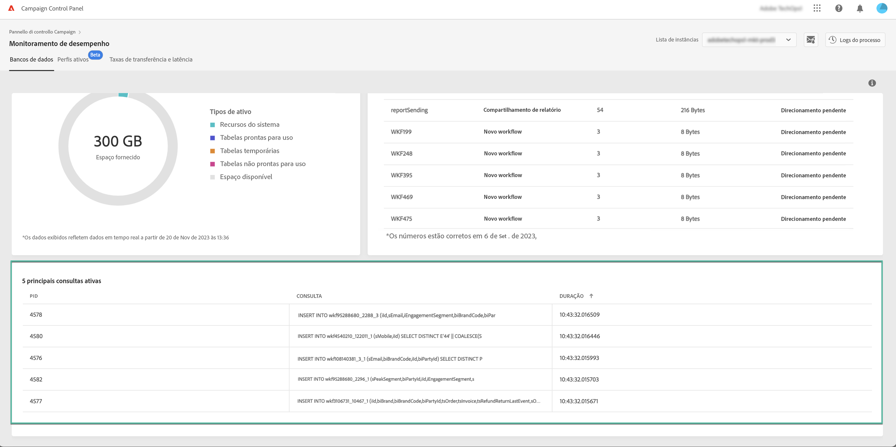

# Monitoramento de consultas ativas {#long-running-queries}

Á área **[!UICONTROL Consultas ativas]** da guia **[!UICONTROL Bancos de dados]** lista as cinco consultas em execução há mais tempo na instância selecionada.

As colunas **[!UICONTROL Duração]** especificam há quanto tempo uma consulta está em execução na instância. A duração é exibida neste formato: `hh:mm:ss.ms`.

>[!IMPORTANT]
>
>Se uma das consultas estiver ativa há mais de 24 horas, entre em contato com o Atendimento ao cliente para que eles identifiquem e resolvam o problema. Será necessário informar o valor da coluna **[!UICONTROL PID]**, que é um identificador exclusivo da consulta.
