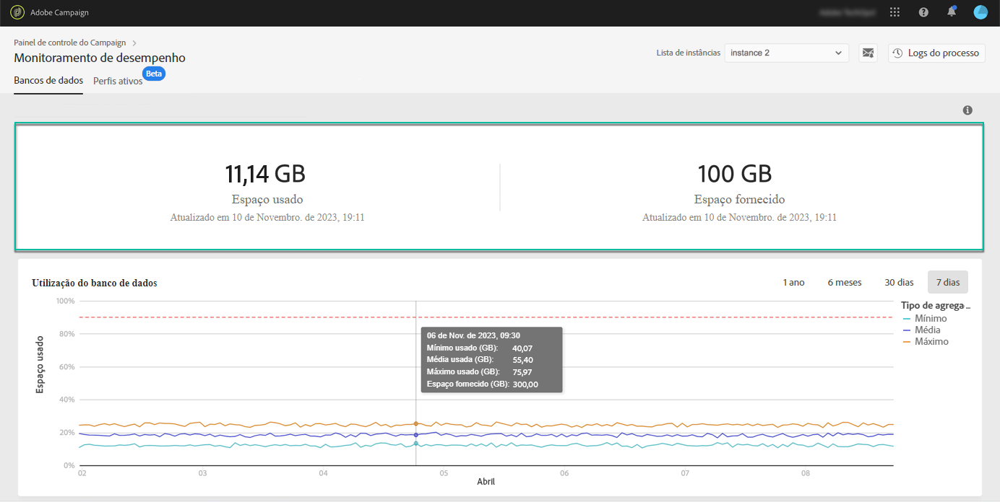
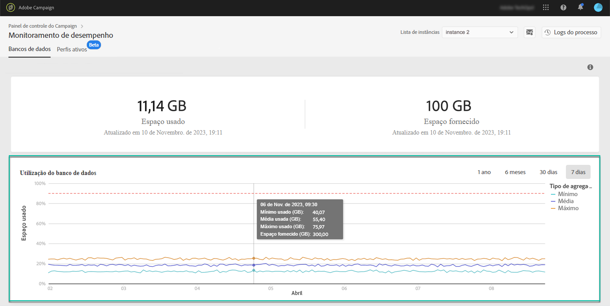
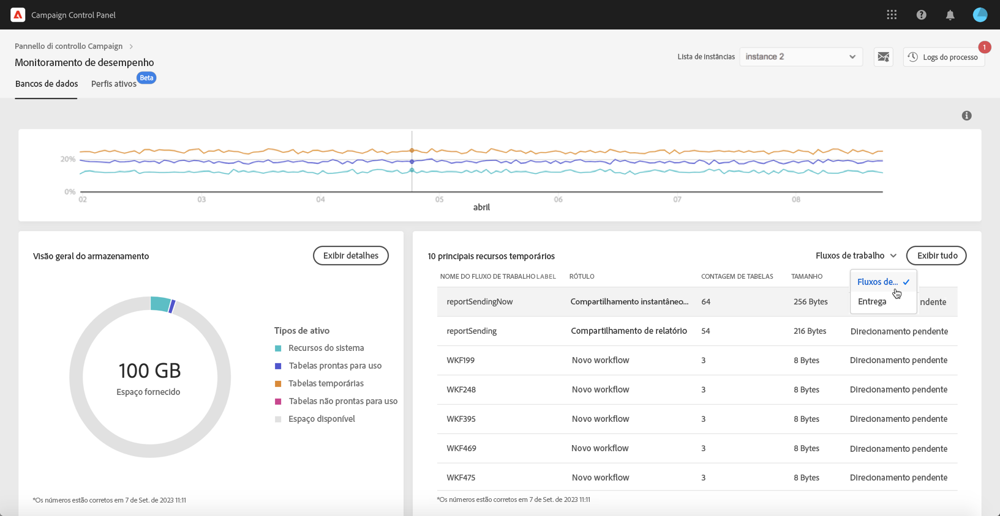

# Monitoramento de banco de dados {#database-monitoring}

## Sobre bancos de dados de instâncias {#about-instances-databases}

De acordo com seu contrato, cada uma das instâncias do Campaign é provisionada com uma quantidade específica de espaço no banco de dados.

Os bancos de dados incluem todos os **assets**, **workflows** e **dados** que estão armazenados no Adobe Campaign.

Com o tempo, os bancos de dados podem atingir sua capacidade máxima, especialmente se os recursos armazenados nunca forem excluídos da instância ou se houver muitos workflows em um estado pausado.

O excesso de um banco de dados de instância pode levar a vários problemas (incapacidade de fazer logon, enviar emails etc.). Portanto, o monitoramento dos bancos de dados das instâncias é essencial para garantir o desempenho ideal.

>[!NOTE]
>
>Se a quantidade de espaço de banco de dados fornecido, conforme mostrado no Painel de controle do Campaign, não refletir a quantidade especificada em seu contrato, entre em contato com o Atendimento ao cliente.

## Monitorando o uso do banco de dados {#monitoring-instances-database}

 Descubra este recurso no vídeo usando o  [Campaign ](https://experienceleague.adobe.com/docs/campaign-classic-learn/control-panel/performance-monitoring/monitoring-databases.html?lang=en#performance-monitoring) Classic ou o  [Campaign Standard](https://experienceleague.adobe.com/docs/campaign-standard-learn/control-panel/performance-monitoring/monitoring-databases.html?lang=en#performance-monitoring)

O Painel de controle do Campaign permite monitorar o uso do banco de dados para cada uma das instâncias do Campaign. Para fazer isso, abra o cartão **[!UICONTROL Performance Monitoring]** e selecione a guia **[!UICONTROL Databases]**.

Selecione a instância desejada em **[!UICONTROL Instance List]** para exibir informações sobre a capacidade do banco de dados da instância e o espaço usado.

>[!NOTE]
>
>Observe que os dados desse painel são atualizados com base no **[!UICONTROL Database cleanup technical workflow]** que é executado na instância do Campaign (consulte a documentação [Campaign Standard](https://docs.adobe.com/help/en/campaign-standard/using/administrating/application-settings/technical-workflows.html#list-of-technical-workflows) e [Campaign Classic](https://docs.adobe.com/help/en/campaign-classic/using/monitoring-campaign-classic/data-processing/database-cleanup-workflow.html) ).
>
>Você pode verificar a última vez que o workflow foi executado abaixo das métricas **[!UICONTROL Used Space]** e **[!UICONTROL Provided Space]**. Observe que, se o fluxo de trabalho não estiver em execução há mais de 3 dias, recomendamos entrar em contato com o Atendimento ao cliente do Adobe para que ele investigue por que o fluxo de trabalho não está em execução.

Métricas adicionais, descritas abaixo, estão disponíveis neste painel para ajudar você a analisar o uso do banco de dados da instância:

* [Utilização do Banco de Dados](../../performance-monitoring/using/database-monitoring.md#database-utilization)
* [Visão geral do armazenamento](../../performance-monitoring/using/database-monitoring.md#storage-overview)
* [Os 10 principais recursos temporários](../../performance-monitoring/using/database-monitoring.md#top-10)

### Utilização do banco de dados {#database-utilization}

A área **[!UICONTROL Database utilization]** fornece uma representação gráfica da utilização mínima, média e máxima do banco de dados nos últimos 7 dias, bem como o limite de utilização do banco de dados de 90% representado por uma curva pontilhada vermelha.

Para alterar o período de tempo, use os filtros disponíveis no canto superior direito do gráfico.

Para melhorar a legibilidade, também é possível destacar uma ou várias curvas no gráfico. Para fazer isso, selecione-os na legenda **[!UICONTROL Aggregation Type]**.

Para obter mais detalhes sobre um período específico, passe o mouse sobre o gráfico para exibir as informações sobre o uso do banco de dados que foi feito no momento.

### Visão geral do armazenamento {#storage-overview}

A área **[!UICONTROL Storage overview]** fornece uma representação gráfica do espaço ocupado por:

* **[!UICONTROL System resources]**

   Observe que, se os recursos do sistema estiverem consumindo uma grande parte do espaço do banco de dados, recomendamos entrar em contato com o Atendimento ao cliente.

* **[!UICONTROL Out-of-the-box tables]** fornecido por padrão com as instâncias do Campaign,
* **[!UICONTROL Temporary tables]** criado por workflows e deliveries,
* **[!UICONTROL Non-out of the box tables]** gerado após a criação de recursos personalizados.

Clique no botão **[!UICONTROL View details]** para obter mais detalhes sobre os diferentes ativos que estão consumindo espaço no banco de dados.

Use o filtro para refinar suas tabelas de pesquisa e exibição somente de um tipo de ativo específico.

### Os 10 principais recursos temporários {#top-10}

A área **[!UICONTROL Top 10 temporary resources]** lista os 10 maiores recursos temporários gerados por workflows e deliveries.

Monitorar workflows e deliveries que estão criando grandes recursos temporários é uma etapa essencial para monitorar seu banco de dados. Se qualquer recurso temporário estiver consumindo muito espaço no banco de dados, verifique se esse fluxo de trabalho ou delivery é necessário e navegue até sua instância para interrompê-lo.

>[!IMPORTANT]
>
>A recomendação geral é evitar ter **mais de 40 colunas** em recursos não prontos para uso.

>[!NOTE]
>
>Se um workflow tiver um grande número de contagens de tabela ou tamanho de banco de dados, recomendamos revisar o workflow para investigar por que está gerando tantos dados.
>
>Os recursos do Campaign Standard e do Classic também estão disponíveis no final desta página para ajudar você a evitar sobrecarga do banco de dados.

O botão **[!UICONTROL View all]** permite acessar informações detalhadas sobre esses recursos temporários.

>[!NOTE]
>
>O valor na coluna **[!UICONTROL Keep interim results]** indica se a opção está habilitada (&quot;1&quot;) ou desativada (&quot;0&quot;) no Campaign. A opção **[!UICONTROL Keep interim results]** é acessível nas propriedades dos fluxos de trabalho. Ele permite salvar os resultados das transições entre as várias atividades de um workflow (consulte a documentação [Campaign Standard](https://docs.adobe.com/content/help/en/campaign-standard/using/managing-processes-and-data/executing-a-workflow/managing-execution-options.html) e [Campaign Classic](https://docs.adobe.com/content/help/en/campaign-classic/using/automating-with-workflows/general-operation/workflow-best-practices.html#logs) ).
>
>Se a opção estiver habilitada para um de seus fluxos de trabalho, o fluxo de trabalho de limpeza do banco de dados não poderá recuperar o espaço consumido pelos resultados provisórios. Portanto, recomendamos revisar o workflow para verificar se a opção pode ser desativada.

## Impedindo sobrecarga de banco de dados {#preventing-database-overload}

O Campaign Standard e o Classic oferecem várias maneiras de evitar o consumo excessivo de espaço em disco do banco de dados.

A seção abaixo fornece recursos úteis das documentações do Campaign para ajudar você a otimizar o uso dos bancos de dados:

**Monitoramento de workflows**

* [Práticas recomendadas para workflows](https://docs.adobe.com/content/help/en/campaign-standard/using/managing-processes-and-data/workflow-general-operation/best-practices-workflows.html)  (Campaign Standard)
* [Monitoramento da execução](https://docs.adobe.com/help/en/campaign-classic/using/automating-with-workflows/monitoring-workflows/monitoring-workflow-execution.html)  do workflow (Campaign Classic)

**Manutenção do banco de dados**

* Workflow técnico de limpeza do banco de dados ([Campaign Standard](https://docs.adobe.com/help/en/campaign-standard/using/administrating/application-settings/technical-workflows.html#list-of-technical-workflows) / [Campaign Classic](https://docs.adobe.com/help/en/campaign-classic/using/monitoring-campaign-classic/data-processing/database-cleanup-workflow.html))
* [Guia](https://docs.adobe.com/content/help/en/campaign-classic/using/monitoring-campaign-classic/database-maintenance/recommendations.html)  de manutenção de banco de dados (Campaign Classic)
* [Solução de problemas de desempenho do banco de dados](https://docs.adobe.com/content/help/en/campaign-classic/using/monitoring-campaign-classic/troubleshooting/database-performances.html)  (Campaign Classic)
* [Opções](https://docs.adobe.com/help/en/campaign-classic/using/installing-campaign-classic/appendices/configuring-campaign-options.html#database)  relacionadas ao banco de dados (Campaign Classic)
* Retenção de dados ([Campaign Standard](https://docs.adobe.com/help/en/campaign-standard/using/administrating/application-settings/data-retention.html) / [Campaign Classic](https://docs.adobe.com/help/en/campaign-classic/using/configuring-campaign-classic/data-model/data-model-best-practices.html#data-retention))

>[!NOTE]
>
>Além disso, você pode receber notificações quando um de seus bancos de dados estiver atingindo sua capacidade. Para fazer isso, inscreva-se em [e-mail alert](../../performance-monitoring/using/email-alerting.md).
