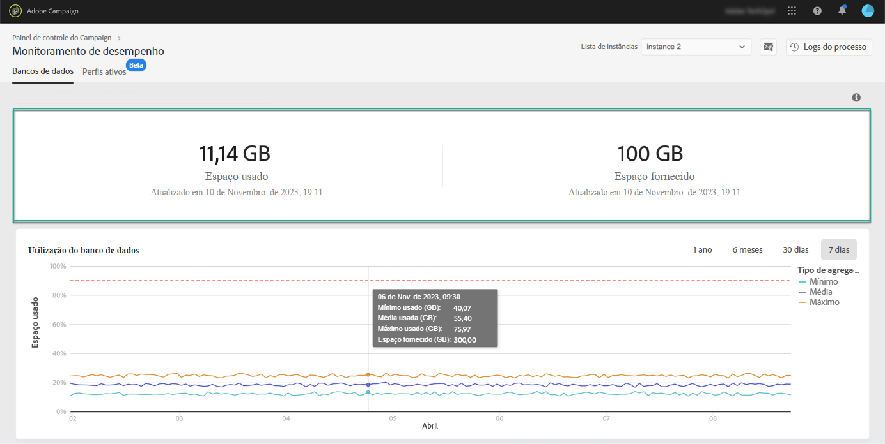

# Sobre o monitoramento de bancos de dados {#database-monitoring}

## Sobre bancos de dados de instâncias {#about-instances-databases}

De acordo com seu contrato, cada uma das instâncias do Campaign é provisionada com uma quantidade específica de espaço no banco de dados. Os bancos de dados incluem todos os **ativos**, **fluxos de trabalho** e **dados** que estão armazenados no Adobe Campaign.

Com o tempo, os bancos de dados podem atingir sua capacidade máxima, especialmente se os recursos armazenados nunca são excluídos da instância ou se há muitos fluxos de trabalho em um estado pausado.

A sobrecarga de um banco de dados de instância pode gerar vários problemas (incapacidade de fazer logon, enviar emails etc.). Portanto, o monitoramento dos bancos de dados das instâncias é essencial para garantir o desempenho ideal.

Se você se inscreveu para [alertas por email](../../performance-monitoring/using/email-alerting.md), você receberá notificações por email quando um dos bancos de dados de suas instâncias atingir 80% ou mais da capacidade.

## Monitoramento do uso do banco de dados{#monitoring-database-usage}

>[!CONTEXTUALHELP]
>id="cp_performancemonitoring_database"
>title="Sobre o monitoramento de banco de dados"
>abstract="Nesta guia, você pode obter informações em tempo real sobre a utilização e evolução mais recente e histórica do banco de dados para cada uma das instâncias do Campaign."
>additional-url="https://experienceleague.adobe.com/docs/control-panel/using/performance-monitoring/about-performance-monitoring.html?lang=pt-BR" text="Sobre o monitoramento de desempenho"

O Painel de controle permite monitorar a utilização do banco de dados para cada uma das instâncias do Campaign. Para fazer isso, abra o cartão **[!UICONTROL Monitoramento de desempenho]** e selecione a guia **[!UICONTROL Bancos de dados]**.

Selecione a instância desejada na **[!UICONTROL Lista de instâncias]** para exibir as informações sobre a capacidade do banco de dados da instância e o espaço utilizado.

>[!NOTE]
>
>Se o espaço de banco de dados fornecido, conforme mostrado no Painel de controle, não refletir o espaço especificado em seu contrato, entre em contato com o Atendimento ao cliente.

Os dados deste painel são atualizados com base no **[!UICONTROL Fluxo de trabalho técnico de limpeza de banco de dados]** que é executado na instância do Campaign (consulte a documentação do [Campaign Standard](https://experienceleague.adobe.com/docs/campaign-standard/using/administrating/application-settings/technical-workflows.html?lang=pt-BR#list-of-technical-workflows) e [Campaign v7/v8](https://experienceleague.adobe.com/docs/campaign-classic/using/monitoring-campaign-classic/data-processing/database-cleanup-workflow.html?lang=pt-BR)). É possível verificar a última vez que o fluxo de trabalho foi executado abaixo das métricas de **[!UICONTROL Espaço usado]** e **[!UICONTROL Espaço fornecido]**. Observe que, se o fluxo de trabalho não está em execução há mais de três dias, recomendamos entrar em contato com o Atendimento ao cliente da Adobe para investigar por que ele não está em execução.

Métricas adicionais estão disponíveis neste painel para ajudar a analisar o uso do banco de dados da instância. Elas estão detalhados nestas seções:

* [Utilização do banco de dados](../../performance-monitoring/using/database-utilization.md)
* [Visão geral de armazenamento](../../performance-monitoring/using/database-storage-overview.md)
* [Os 10 principais recursos temporários](../../performance-monitoring/using/database-top-ten-resources.md)
* [Consultas ativas](../../performance-monitoring/using/database-active-queries.md)

 Conheça este recurso no vídeo usando o [Campaign v7/v8](https://experienceleague.adobe.com/docs/campaign-classic-learn/control-panel/performance-monitoring/monitoring-databases.html?lang=pt-BR#performance-monitoring) ou o [Campaign Standard](https://experienceleague.adobe.com/docs/campaign-standard-learn/control-panel/performance-monitoring/monitoring-databases.html?lang=pt-BR#performance-monitoring)
