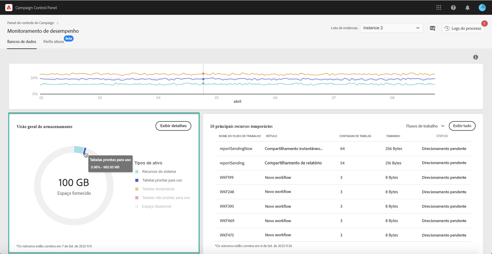
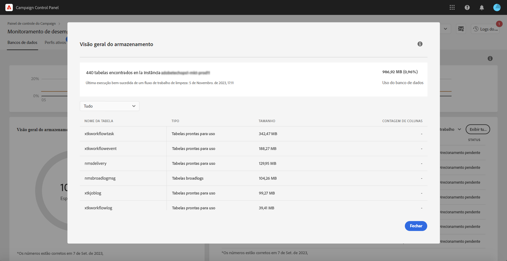

# Visão geral do armazenamento {#storage-overview}

>[!CONTEXTUALHELP]
>id="cp_dbdetails_storagedetails"
>title="Sobre a visão geral do armazenamento"
>abstract="Nesta guia, você pode obter informações detalhadas sobre os diferentes recursos do Campaign que estão consumindo espaço no banco de dados."

A área **[!UICONTROL Visão geral do armazenamento]** fornece uma representação gráfica do espaço ocupado por:

* **[!UICONTROL Recursos do sistema]**

  Observe que, se os recursos do sistema estiverem consumindo uma grande parte do espaço do banco de dados, recomendamos entrar em contato com o Atendimento ao cliente.

* **[!UICONTROL Tabelas prontas para uso]** fornecidas por padrão com as instâncias do Campaign,
* **[!UICONTROL Tabelas temporárias]** criadas por workflows e entregas,
* **[!UICONTROL Tabelas que não são prontas para uso]** geradas após a criação de recursos personalizados.

Clique no botão **[!UICONTROL Exibir detalhes]** para mais detalhes sobre os diferentes ativos que estão consumindo espaço no banco de dados.

É possível usar a lista suspensa para refinar a pesquisa e visualizar as tabelas com apenas um tipo de ativo específico (workflows, entregas, recipients).

Observe que essa tela também permite monitorar os parâmetros dos workflows que podem exigir atenção específica para evitar problemas nas suas instâncias. Saiba mais [nesta página](workflow-monitoring.md).
