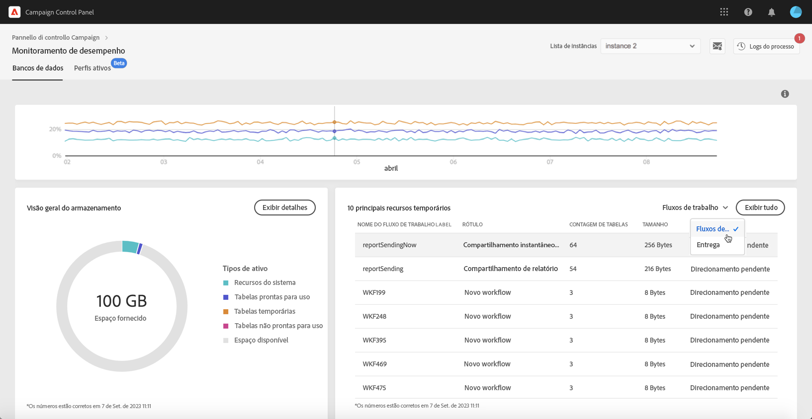

# Os 10 principais recursos temporários {#top-10}

A área **[!UICONTROL 10 principais recursos temporários]** lista os 10 maiores recursos temporários gerados por fluxos de trabalho e entregas.

Monitorar fluxos de trabalho e entregas que estão criando grandes recursos temporários é uma etapa essencial para monitorar seu banco de dados. Se qualquer recurso temporário estiver consumindo muito espaço no banco de dados, verifique se esse fluxo de trabalho ou entrega é necessário e navegue até sua instância para interrompê-lo.

>[!IMPORTANT]
>
>A recomendação geral é evitar ter **mais de 40 colunas** em recursos qua não já vêm prontos para uso. Se um fluxo de trabalho tiver muitas tabelas ou um banco de dados grande, recomendamos examinar o workflow para investigar por que ele está gerando tantos dados.
>
>As diretrizes do Campaign Standard e Classic também estão disponíveis [nesta página](database-preventing-overload.md) para ajudar a evitar a sobrecarga do banco de dados.

O botão **[!UICONTROL Exibir todos]** permite acessar os detalhes da **[!UICONTROL Visão geral do armazenamento]** para obter informações precisas sobre esses recursos temporários. Para obter mais informações, consulte [esta página](database-storage-overview.md).
