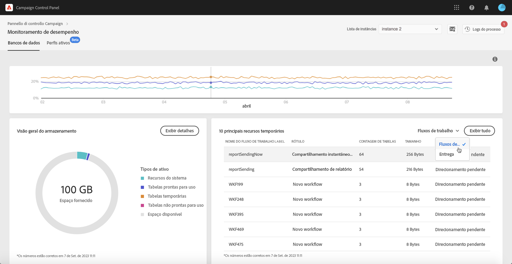

# Os 10 principais recursos temporários {#top-10}

A área **[!UICONTROL Top 10 temporary resources]** lista os 10 maiores recursos temporários gerados por workflows e deliveries.

Monitorar workflows e deliveries que estão criando grandes recursos temporários é uma etapa essencial para monitorar seu banco de dados. Se qualquer recurso temporário estiver consumindo muito espaço no banco de dados, verifique se esse fluxo de trabalho ou delivery é necessário e navegue até sua instância para interrompê-lo.

>[!IMPORTANT]
>
>A recomendação geral é evitar ter **mais de 40 colunas** em recursos não prontos para uso.

>[!NOTE]
>
>Se um fluxo de trabalho tiver muitas tabelas ou um banco de dados grande, recomendamos examinar o fluxo de tabalho para investigar por que ele está gerando tantos dados.
>
>Os recursos do Campaign Standard e do Classic também estão disponíveis no final desta página para ajudar você a evitar a sobrecarga do banco de dados.

O botão **[!UICONTROL View all]** permite acessar informações detalhadas sobre esses recursos temporários.

O valor na coluna **[!UICONTROL Keep interim results]** indica se a opção está ativada (&quot;1&quot;) ou desativada (&quot;0&quot;) no Campaign. Essa opção permite salvar os resultados das transições entre as várias atividades de um fluxo de trabalho (consulte a documentação do [Campaign Standard](https://experienceleague.adobe.com/docs/campaign-standard/using/managing-processes-and-data/executing-a-workflow/managing-execution-options.html?lang=pt-BR) e do [Campaign Classic](https://experienceleague.adobe.com/docs/campaign-classic/using/automating-with-workflows/introduction/workflow-best-practices.html?lang=pt-BR#logs)).

>[!IMPORTANT]
>
>Essa opção nunca deve ser verificada em um fluxo de trabalho de produção. Essa opção é usada para analisar os resultados e é projetada apenas para fins de teste e, portanto, deve ser usada apenas em ambientes de desenvolvimento ou de preparo.
>
>Se o valor no Painel de controle do Campaign indicar que a opção está habilitada para um de seus workflows, recomendamos desativar o Campaign.
