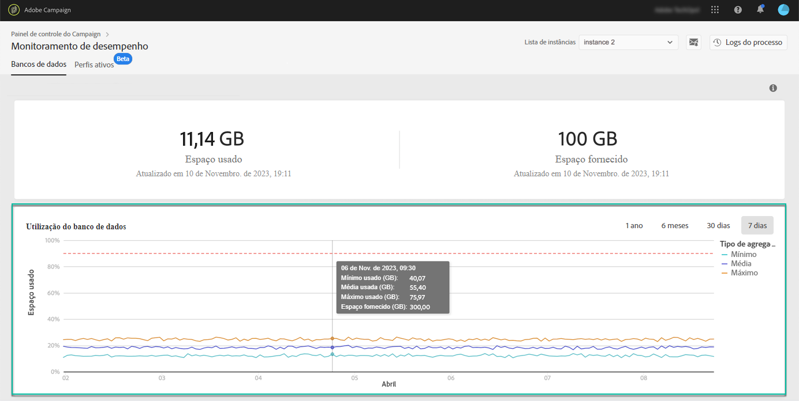

# Utilização do banco de dados {#database-utilization}

A área **[!UICONTROL Utilização do banco de dados]** fornece uma representação gráfica das utilizações mínima, média e máxima do banco de dados nos últimos sete dias, bem como o limite de utilização do banco de dados de 90%, representado por uma curva vermelha pontilhada.

Para alterar o período, use os filtros disponíveis no canto superior direito do gráfico.

Para melhorar a compreensão, também é possível destacar uma ou várias curvas no gráfico. Para isso, selecione-as na legenda **[!UICONTROL Tipo de agregação]**.

Para obter mais detalhes sobre um período específico, passe o mouse sobre o gráfico para exibir as informações sobre o uso do banco de dados que foi feito no momento.

