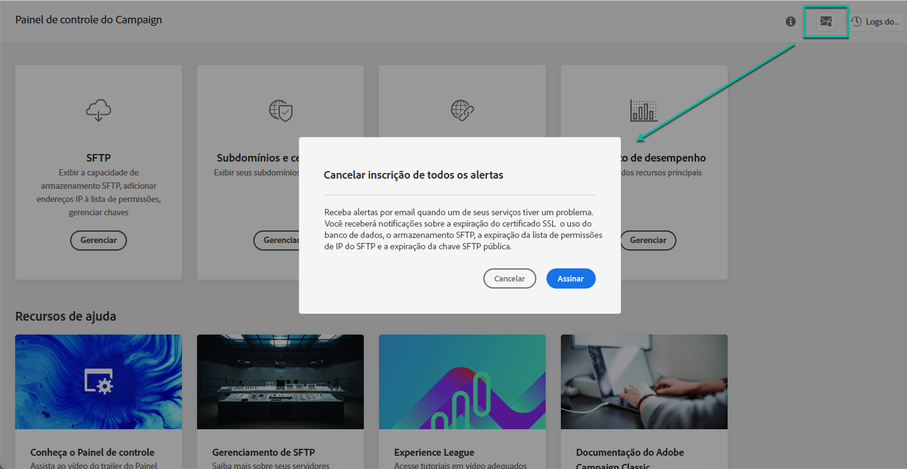
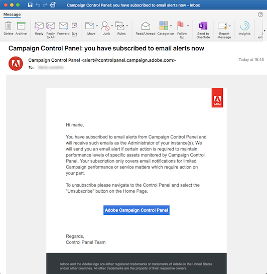
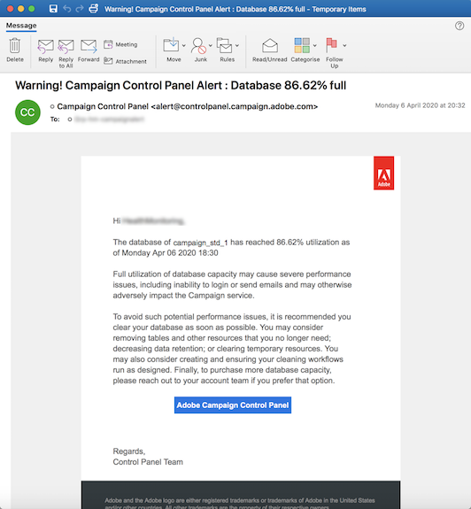

# Alerta por email {#email-alerting}

Para oferecer maior flexibilidade no seu trabalho, o Painel de controle conta com uma funcionalidade de alertas por email em tempo real.

## Lista de alertas {#list}

A lista de alertas é a seguinte:

* **Uso do armazenamento SFTP**: um dos servidores SFTP atingiu 80% ou mais de sua capacidade. Consulte [Gerenciamento de armazenamentos SFTP](../../sftp/using/sftp-storage-management.md).

* **Uso do banco de dados**: um dos banco de dados das suas instâncias atingiu 80% ou mais de sua capacidade. Consulte [Monitoramento de bancos de dados](../../performance-monitoring/using/database-monitoring.md).

* **Expiração da lista de permissões de IP SFTP**: um dos intervalos de IP definidos venceu ou vencerá em 10 dias ou menos. Consulte [Lista de permissões de intervalos de IP](../../sftp/using/ip-range-allow-listing.md).

* **Expiração de chave pública SFTP**: uma das chaves públicas definidas venceu ou vencerá em 10 dias ou menos. Consulte [Gerenciamento de chaves](../../sftp/using/key-management.md).

* **Expiração do certificado SSL**: um dos certificados SSL de um dos seus subdomínios venceu ou vencerá em 30 dias ou menos. Consulte [Monitoramento de certificados SSL de subdomínios](../../subdomains-certificates/using/monitoring-ssl-certificates.md).

<!--* **Long running Queries**: A query has been running for more than 24 hours on one of your instances. See [Monitoring active queries](database-active-queries.md).-->

>[!NOTE]
>
>Além disso, o Painel de controle permite **definir lembretes**, caso queira receber uma notificação por email antes que um evento ocorra nas suas instâncias (lançamentos e revisões de serviço).
>
>Para isso, é necessário assinar os alertas de email e definir um lembrete para os eventos futuros desejados. [Saiba como definir lembretes para eventos futuros](../../service-events/service-events.md#reminders)

## Assinatura de alertas {#subscribe}

Para assinar esses alertas, siga estas etapas:

1. Clique no botão **[!UICONTROL Notificações de alerta]**, disponível a partir de qualquer parte do Painel de controle, e clique em **[!UICONTROL Assinar]**.

   

1. Um email será enviado para confirmar a assinatura.

   

1. Após a assinatura, o Painel de controle notificará sobre problemas do sistema e recomendará as ações a serem realizadas. Os alertas por email serão enviados a todos que tiverem se inscrito em **todas as instâncias** que administrem.

   
