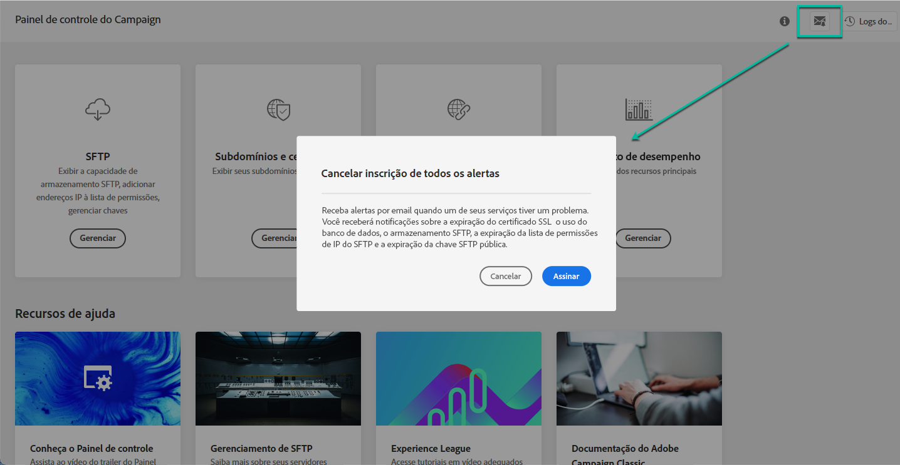

# Alerta por email {#email-alerting}

Para oferecer maior flexibilidade ao seu trabalho, o Painel de controle do Campaign está equipado com funcionalidade de alerta por email em tempo real.

Para se inscrever nesses alertas, siga estas etapas:

1. Clique no botão **[!UICONTROL Alerting notifications]** disponível em qualquer local no Painel de controle do Campaign e clique em **[!UICONTROL Subscribe]**.

   

1. Um email é enviado para confirmar a assinatura.

   

1. Após a assinatura, o Painel de controle do Campaign notificará sobre problemas do sistema e recomendará as ações a serem executadas. Os alertas de email são enviados a todos os que se inscreveram em **todas as instâncias** das quais são Administradores.

   

A lista de alertas é a seguinte:

* **Uso** do armazenamento SFTP: Um dos servidores SFTP atingiu 80% ou mais de sua capacidade. Consulte [Gerenciamento de armazenamento SFTP](../../sftp/using/sftp-storage-management.md).

* **Uso** do banco de dados: Um dos bancos de dados de suas instâncias atingiu 80% ou mais de sua capacidade. Consulte [Monitoramento de banco de dados](../../performance-monitoring/using/database-monitoring.md).

* **Expiração** do certificado SSL: Um dos certificados SSL de subdomínios expirou ou expirará em 60 dias ou menos. Consulte [Monitorar certificados SSL de subdomínios](../../subdomains-certificates/using/monitoring-ssl-certificates.md).

