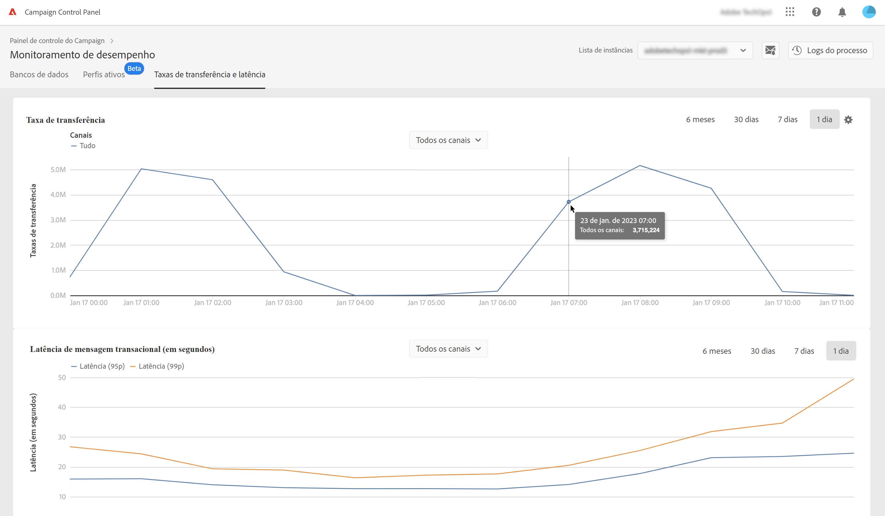
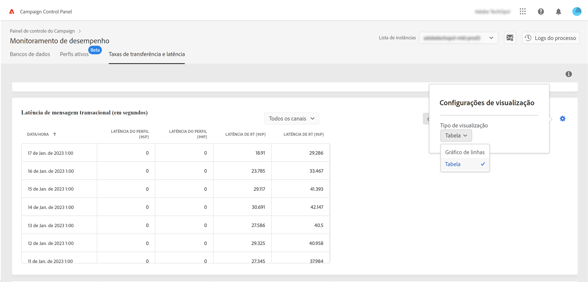

# Monitoramento de taxas de transferência e latência {#throughputs-latency-monitoring}

>[!CONTEXTUALHELP]
>id="cp_performancemonitoring_throughputslatencies"
>title="Sobre monitoramento de taxas de transferência e latência "
>abstract="Nesta guia, é possível monitorar a tendência das taxas de transferência e latência de entrega ao longo de um período em suas instâncias."

O Painel de controle do Campaign permite monitorar a taxa de transferência e a latência da entrega de cada uma de suas instâncias.

>[!IMPORTANT]
>
>Esse recurso está disponível para todos os clientes do Campaign Standard e v8, bem como para clientes do Campaign V7 com builds de número 9032, 9330, 9346 ou 9349 que têm implantações [autônomas](https://experienceleague.adobe.com/docs/campaign-classic/using/installing-campaign-classic/deployment-types-/standalone-deployment.html?lang=pt-BR) (sem qualquer instância mid).

Monitorar a tendência das taxas de transferência e da latência da entrega ao longo de um período é essencial para entender o uso de suas instâncias e garantir elas estejam apresentando um bom desempenho.

Essas informações são disponibilizadas no painel de controle para cada uma das instâncias do Campaign no cartão **[!UICONTROL Performance Monitoring]**, na guia **[!UICONTROL Throughputs & Latency]** (observe que o painel de controle pode levar até 1 hora para exibir os números).

* A área **[!UICONTROL Throughput]** fornece informações sobre o número de mensagens enviadas por hora desde a instância selecionada do Campaign para todos os canais de comunicação aos quais você está habilitado.

   >[!NOTE]
   >
   >Para o Campaign v7/v8, o número de taxa de transferência exibido é a taxa de transferência obtida das instâncias MID (mid-sourcing). Para implantações de marketing (MKT) autônomas (sem qualquer instância MID), a taxa de transferência da instância MKT é exibida.

* A área **[!UICONTROL Latency]** fornece informações sobre a latência encontrada na instância selecionada ao enviar comunicações transacionais em tempo real. As latências são capturadas e visualizadas nos percentis 95 e 99, o que significa que 95% e 99% das solicitações devem ser mais rápidas do que a latência fornecida.

>[!NOTE]
>
>Todos os valores apresentados nesta área são aproximados e meramente informativos.

Por padrão, os dados são exibidos para o dia atual. Você pode alterar o período exibido usando os botões **[!UICONTROL 6 months]**, **[!UICONTROL 30 days]** e **[!UICONTROL 7 days]**.

Também é possível visualizar essas informações em formato tabular com colunas classificáveis, em vez de em um gráfico. Para fazer isso, clique no botão **[!UICONTROL Visualization settings]** e selecione **[!UICONTROL Table]**.

