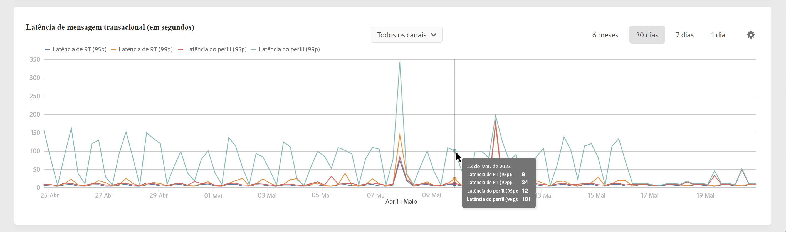

# Throughput e monitoramento de latência {#throughputs-latency-monitoring}

>[!CONTEXTUALHELP]
>id="cp_performancemonitoring_throughputslatencies"
>title="Sobre taxa de transferência e monitoramento de latência "
>abstract="Nesta guia, você pode monitorar a tendência das entregas e a latência ao longo de um período em suas instâncias."

Monitorar a tendência das taxas de transferência e da latência de entrega ao longo de um período é essencial para entender o uso das instâncias e garantir o bom desempenho.

Essas informações são disponibilizadas no Painel de controle do Campaign para cada uma das instâncias do Campaign na **[!UICONTROL Performance Monitoring]** cartão, **[!UICONTROL Throughputs & Latencies]** guia .

>[!NOTE]
>
>Todos os valores apresentados nesta área são aproximados e apenas para efeitos de informação.

Por padrão, os dados são exibidos para o dia atual. Você pode alterar o período exibido usando o **[!UICONTROL 6 months]**, **[!UICONTROL 30 days]** e **[!UICONTROL 7 days]** botões.

O **[!UICONTROL Throughput]** fornece informações sobre o número de mensagens enviadas por hora da instância do Campaign selecionada para todos os canais de comunicação aos quais você tem direito.

Também é possível visualizar essas informações em um formato tabular com colunas classificáveis em vez de um gráfico. Para fazer isso, clique no botão **[!UICONTROL Visualization settings]** botão e selecione **[!UICONTROL Table]**.

O **[!UICONTROL Latency]** fornece informações sobre a latência encontrada na instância selecionada ao enviar comunicações transacionais em tempo real. As latências são capturadas e visualizadas nos percentis 95 e 99, o que significa que 95% e 99% das solicitações devem ser mais rápidas que a latência fornecida.

