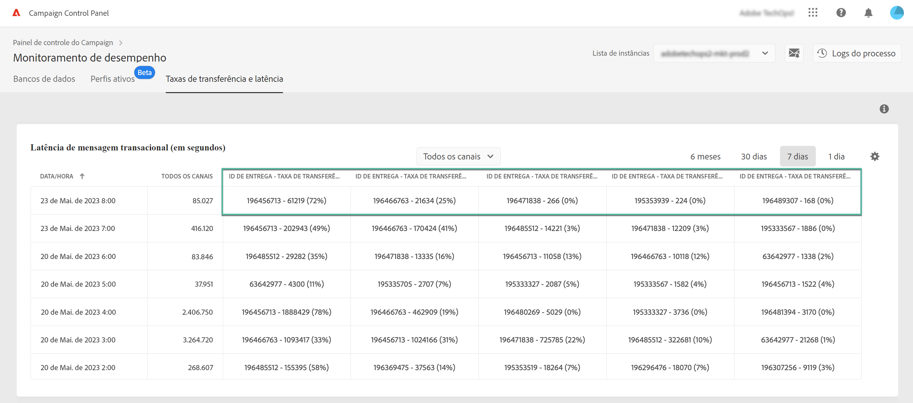
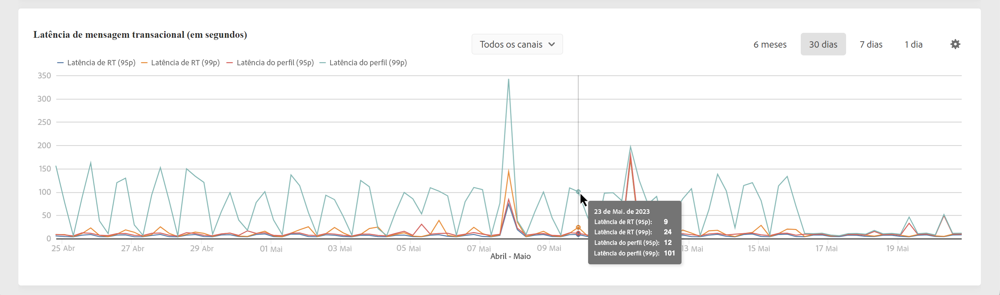
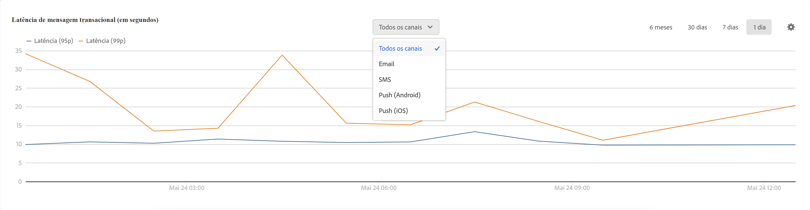

# Monitoramento de taxas de transferência e latência {#throughputs-latency-monitoring}

>[!CONTEXTUALHELP]
>id="cp_performancemonitoring_throughputslatencies"
>title="Sobre monitoramento de taxas de transferência e latência "
>abstract="Nesta guia, é possível monitorar a tendência das taxas de transferência e latência de entrega ao longo de um período em suas instâncias. Para obter informações sobre entregas que contribuem para a taxa de transferência, alterne para a exibição em tabelas."

O Painel de controle permite monitorar a taxa de transferência e a latência da entrega de cada uma de suas instâncias.

>[!IMPORTANT]
>
>Esse recurso está disponível para todos os clientes do Campaign Standard e v8, bem como para clientes do Campaign V7 com builds de número 9032 ou mais recentes, incluindo [implantações autônomas](https://experienceleague.adobe.com/docs/campaign-classic/using/installing-campaign-classic/deployment-types-/standalone-deployment.html?lang=pt-BR) (sem qualquer instância MID).

Monitorar a tendência da latência e das taxas de transferência de entrega ao longo de um período é essencial para entender o uso de suas instâncias e garantir que elas estejam apresentando um bom desempenho.

Essas informações são disponibilizadas no Painel de controle para cada uma das instâncias do Campaign no cartão **[!UICONTROL Monitoramento do desempenho]**, na guia **[!UICONTROL Taxas de transferência e latência]** (observe que o Painel de controle pode levar até uma hora para exibir os números).

>[!NOTE]
>
>Todos os valores apresentados nesta área são aproximados e meramente informativos.

Por padrão, os dados são exibidos para o dia atual. Você pode alterar o período exibido, usando os botões **[!UICONTROL 6 meses]**, **[!UICONTROL 30 dias]** e **[!UICONTROL 7 dias]**. Os dados serão apresentados:
* Por hora, para visualizações de 1 dia e 7 dias,
* A cada 6 horas, para uma visualização de 30 dias,
* Diariamente, para uma visualização de 6 meses.

Também é possível visualizar essas informações em um formato de tabela com colunas classificáveis, em vez de em um gráfico. Para isso, clique no botão **[!UICONTROL Configurações de visualização]** e selecione **[!UICONTROL Tabela]**.

## Monitoramento da taxa de transferência {#throughput}

A área **[!UICONTROL Taxas de transferência]** fornece informações sobre a quantidade de mensagens enviadas por hora a partir da instância do Campaign selecionada para todos os canais de comunicação aos quais você tem direito.

>[!NOTE]
>
>Para o Campaign v7/v8, o número de taxa de transferência exibido é a taxa de transferência obtida das instâncias MID (mid-sourcing). Para implantações de marketing (MKT) autônomas (sem qualquer instância MID), a taxa de transferência da instância MKT é exibida.

Além disso, o Painel de controle permite identificar as IDs das 5 principais entregas que estão contribuindo para a taxa de transferência do período selecionado. Essas informações estão disponíveis somente na exibição em tabelas:

## Monitorar latência {#latency}

A área **[!UICONTROL Latência]** fornece informações sobre a latência encontrada na instância selecionada ao enviar comunicações transacionais em tempo real.

>[!NOTE]
>
>Observe que as informações relacionadas à **Latência do perfil** também estão disponíveis somente para instâncias do [!DNL Campaign Standard].

As latências são capturadas e visualizadas nos percentis 95 e 99, o que significa que 95% e 99% das solicitações devem ser mais rápidas do que a latência fornecida.

Por padrão, a latência é mostrada para todos os canais. É possível visualizar a latência de um canal específico usando a lista suspensa.

>[!NOTE]
>
>O filtro de canal está disponível somente para instâncias do Campaign Classic v7/v8.
