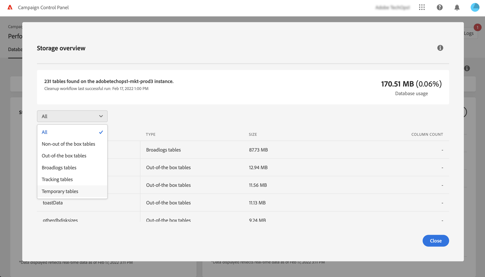
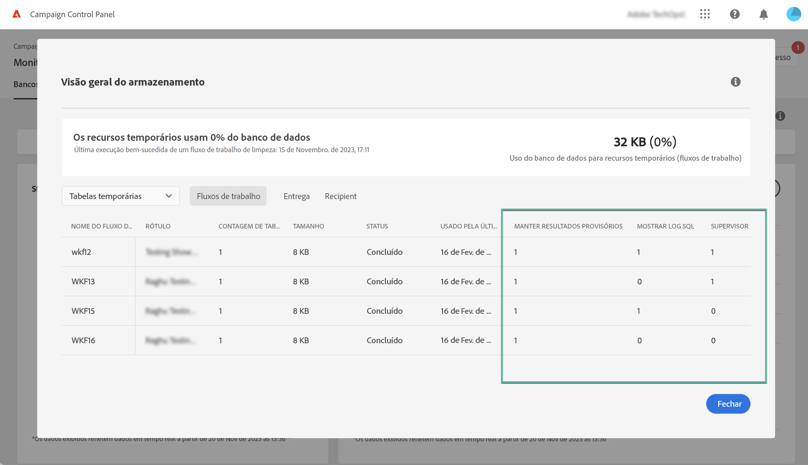

# Monitorar workflows {#monitor-workflows}

<!-- Clean paused and completed workflows

When [!DNL Adobe Campaign] workflows are paused or completed, they leave temporary tables on your instances database that consume space and can lead to performance issues.

Control Panel allows you to identify those workflows and clean the temporary resources generated on your instances.

>[!NOTE]
>
>Technically, this operation executes the **[!UICONTROL Database cleanup technical workflow]** that runs on your Campaign instance everyday (see [Campaign Standard](https://experienceleague.adobe.com/docs/campaign-standard/using/administrating/application-settings/technical-workflows.html#list-of-technical-workflows) and [Campaign Classic](https://experienceleague.adobe.com/docs/campaign-classic/using/monitoring-campaign-classic/data-processing/database-cleanup-workflow.html) documentation). 

To clean paused and completed workflows, follow these steps:

1. Navigate to the **[!UICONTROL Performance monitoring]** card.

1. In the **[!UICONTROL Databases]** tab, select the instance where you want to perform the operation.

1. Access the **[!UICONTROL Storage overview]** details, then filter the list on **[!UICONTROL Temporary tables]**. Learn more on **[!UICONTROL Storage overview]** in [this page](database-storage-overview.md).

    

1. All temporary tables generated on your instances by workflows and deliveries display. Click the **[!UICONTROL Clean now]** button to delete the resources generated by paused and completed workflows.

    

1. Once the operation is confirmed, you can track the estimated remaining time in the **[!UICONTROL Storage overview]** list.

    

Monitor workflow parameters -->

No Adobe Campaign, alguns parâmetros de fluxo de trabalho podem exigir atenção específica para evitar problemas em suas instâncias. Os detalhes **[!UICONTROL Storage overview]** do Painel de controle permitem verificar se alguma dessas opções está habilitada para os workflows.

## **[!UICONTROL Keep interim results]** {#keep-results}

Quando habilitada (valor &quot;1&quot;), essa opção salva os resultados das transições entre as várias atividades de um fuxo de trabalho. Saiba mais na documentação do [Campaign Standard](https://experienceleague.adobe.com/docs/campaign-standard/using/managing-processes-and-data/executing-a-workflow/managing-execution-options.html?lang=pt-BR) e do [Campaign Classic](https://experienceleague.adobe.com/docs/campaign-classic/using/automating-with-workflows/introduction/workflow-best-practices.html?lang=pt-BR#logs).

>[!IMPORTANT]
>
>Essa opção nunca deve ser marcada em um fluxo de trabalho de produção. Ela é usada para fins de análise e teste e, portanto, só deve ser usada em ambientes de desenvolvimento ou de preparo. É altamente recomendável desativá-la no Campaign.

## **[!UICONTROL Show SQL log]** {#sql}

Quando essa opção é habilitada, as consultas SQL enviadas ao banco de dados durante a execução do fluxo de trabalho são exibidas no Adobe Campaign. Saiba mais na documentação do [Campaign Standard](https://experienceleague.adobe.com/docs/campaign-standard/using/managing-processes-and-data/executing-a-workflow/managing-execution-options.html?lang=pt-BR) e do [Campaign Classic](https://experienceleague.adobe.com/docs/campaign-classic/using/automating-with-workflows/advanced-management/workflow-properties.html?lang=pt-BR#execution).

O valor &quot;1&quot; indica que o fluxo de trabalho tem o campo **Gravidade** definido como &quot;Produção&quot; e a opção de log de consultas SQL está habilitada.

>[!IMPORTANT]
>
>A ativação dessa opção pode afetar o desempenho e preencher os arquivos de log no servidor. Deve ser utilizada apenas para fins de análise e diagnóstico.

## **[!UICONTROL Supervisors]** {#supervisors}

Este campo permite atribuir um operador a um fluxo de trabalho. Se o fluxo de trabalho falhar, o operador associado será alertado. Saiba mais na documentação do [Campaign Standard](https://experienceleague.adobe.com/docs/campaign-standard/using/managing-processes-and-data/executing-a-workflow/monitoring-workflow-execution.html?lang=pt-BR#error-management) e do [Campaign Classic](https://experienceleague.adobe.com/docs/campaign-classic/using/automating-with-workflows/advanced-management/workflow-properties.html?lang=pt-BR#error-management).

O valor &quot;1&quot; indica que o fluxo de trabalho tem o campo **Gravidade** definido como &quot;Produção&quot; e que nenhum grupo supervisor foi atribuído ao fluxo de trabalho.

