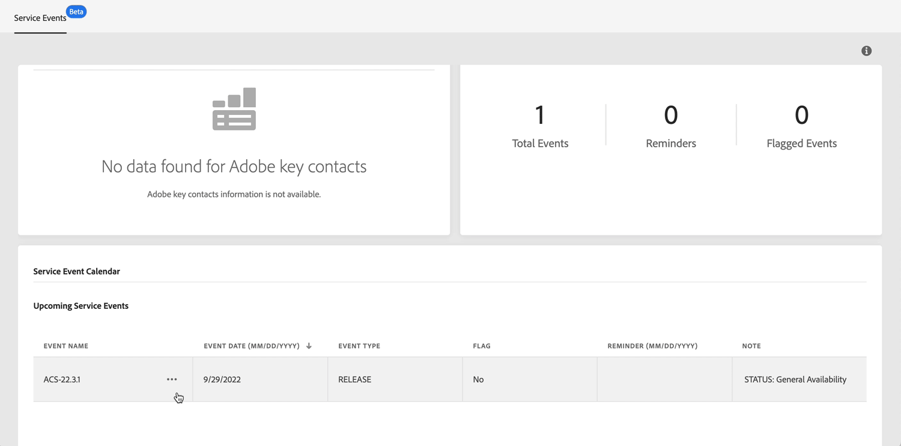

# Versão mais recente {#control-panel-releases}

Esta página lista os novos recursos e melhorias do Painel de controle do Campaign.

## Junho de 2022 {#june-2022}

### Novidades?

<table>
<thead>
<tr>
<th><strong>Os 10 arquivos principais consomem espaço em servidores SFTP</strong> </th>
</tr>
</thead>
<tbody>
<tr>
<td>

Agora é possível identificar os 10 arquivos principais que estão consumindo mais espaço em um servidor SFTP. <a href="../sftp/using/sftp-storage-management.md">Saiba mais</a>

</td>
</tr>
</tbody>
</table>

<table>
<thead>
<tr>
<th><strong>Lembretes do Calendário de Serviço</strong> </th>
</tr>
</thead>
<tbody>
<tr>
<td>

O Calendário de serviço agora permite que você defina lembretes para ser notificado por email antes que um evento ocorra em suas instâncias. <a href="../service-events/service-events.md">Saiba mais</a>

</td>
</tr>
</tbody>
</table>

<table>
<thead>
<tr>
<th><strong>Aprimoramentos na geração de CSR de subdomínios</strong> </th>
</tr>
</thead>
<tbody>
<tr>
<td>

Foram feitos vários aprimoramentos no processo de geração de RSE. <a href="../subdomains-certificates/using/renewing-subdomain-certificate.md">Saiba mais</a>
<ul><li>Ao gerar uma CSR, agora você pode selecionar um dos subdomínios incluídos como o Nome comum.</li><li>Agora você pode copiar o resumo do CSR antes de gerar o CSR.</li><li>Depois que uma CSR é gerada, você pode baixá-la novamente nos logs de trabalho. Esse recurso não se aplica a certificados gerados antes desta versão.</li></ul>

</td>
</tr>
</tbody>
</table>

### Aprimoramentos

**Configurações de instâncias**

* O número máximo de chaves GPG no Painel de controle do Campaign foi aumentado para 60 chaves. [Saiba mais](../instances-settings/using/gpg-keys-management.md)

