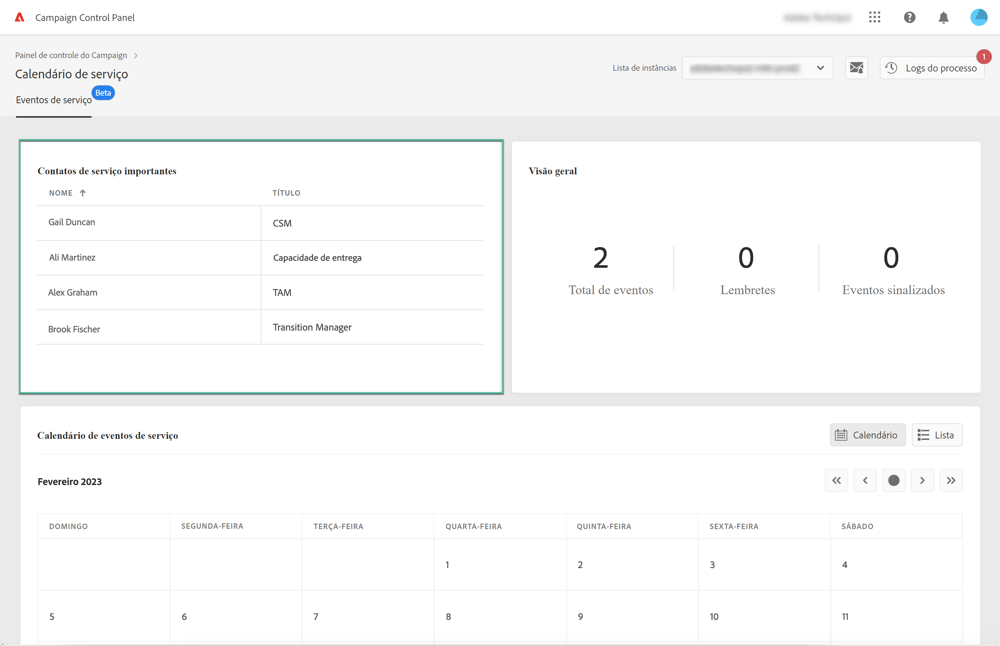
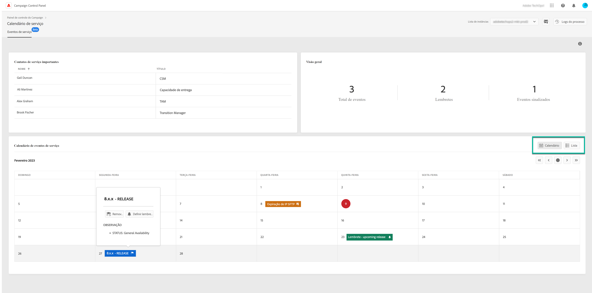
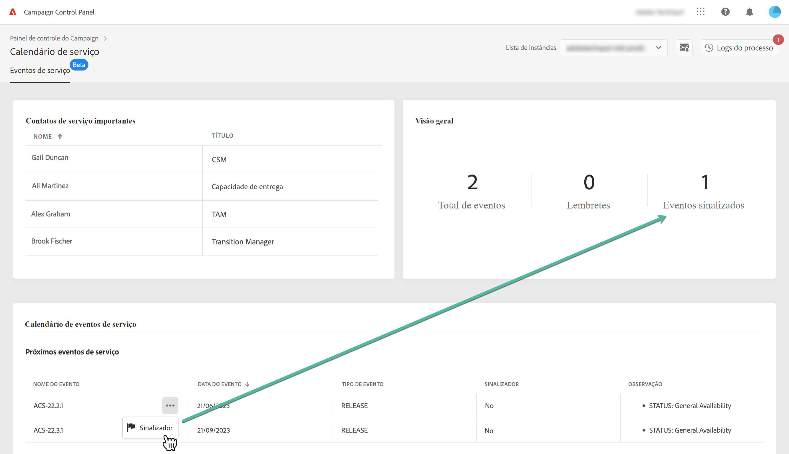
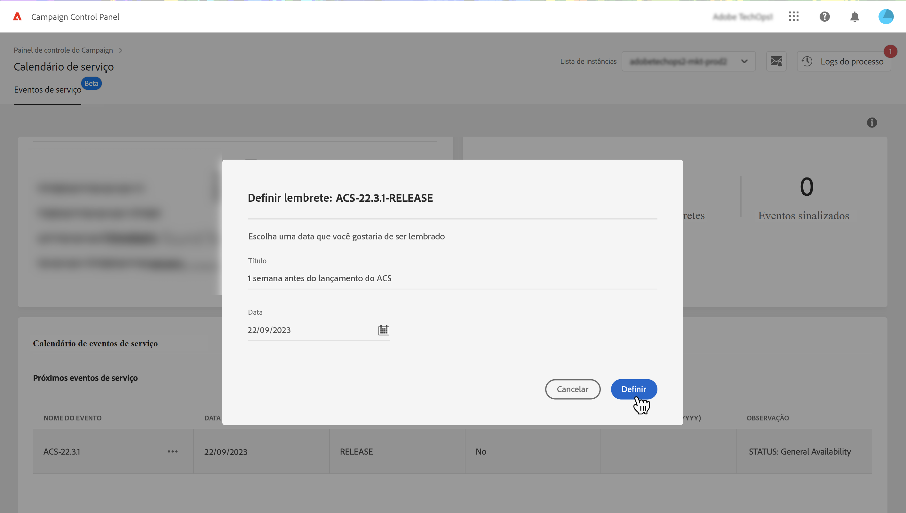
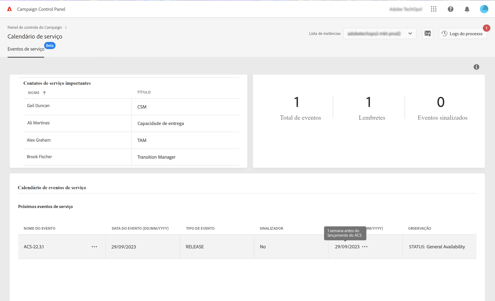

# Identificar contatos importantes e eventos {#keycontacts-events}

>[!CONTEXTUALHELP]
>id="cp_servicecalendar_serviceevents"
>title="Calendário de serviço"
>abstract="A seção Contatos importantes lista as pessoas na Adobe a serem contatadas para qualquer solicitação ou problema em suas instâncias. Na seção Calendário de eventos de serviço, você pode identificar versões e alertas anteriores/futuros para a instância selecionada, bem como configurar lembretes para um determinado evento."

>[!IMPORTANT]
>
>O Calendário de serviço está disponível na versão beta e está sujeito a atualizações e modificações frequentes sem aviso prévio.

Para monitorar com eficiência as instâncias do Campaign, é crucial acompanhar eventos importantes que tenham potencial para afetar sua(s) instância(s). O Painel de controle permite identificar eventos como novas versões, atualizações, correções, correções rápidas etc., e fornece uma lista de contatos importantes da Adobe para qualquer solicitação ou problema.

Essas informações podem ser acessadas no cartão **[!UICONTROL Service Calendar]**, na página inicial do Painel de controle.

## Contatos importantes {#key-contacts}

A seção **[!UICONTROL Key contacts]** lista as pessoas na Adobe que você pode contatar para qualquer solicitação ou problema em suas instâncias.

>[!NOTE]
>
>Esta seção mostra informações apenas para Contas do Managed Services.

Os contatos importantes incluem as seguintes funções:

* **[!UICONTROL TAM]**: gerente técnico de contas,
* **[!UICONTROL CSM]**: gerente de sucesso do cliente,
* **[!UICONTROL Deliverability]**: ponto de contato para operações de capacidade de entrega,
* **[!UICONTROL Transition Manager]**: gerente de transição do Managed Services (somente para contas do Managed Services),
* **[!UICONTROL On-boarding Specialist]**: especialista atribuído à conta para ajudá-lo a começar no Campaign Classic (somente para contas do Managed Services).

## Acompanhe eventos importantes {#events}

A seção **[!UICONTROL Service Event Calendar]** mostra todas as versões anteriores e futuras, bem como alertas em que os usuários se inscreveram nos alertas de email do Painel de controle. Além disso, o Painel de controle permite que os usuários definam lembretes e sinalizem eventos relevantes para a instância selecionada para que eles sejam mais bem organizados e eficientes.

Os eventos são exibidos em um calendário ou em uma lista. Você pode alternar entre as duas exibições usando os botões **[!UICONTROL Calendar]** e **[!UICONTROL List]** no canto superior direito da seção.

<table><tr style="border: 0;">
<td>
</td><td>Na exibição de calendário, os botões de navegação estão disponíveis no canto superior direito para ajudá-lo a navegar pelos eventos. Use as <b>setas duplas</b> para navegar até o primeiro evento presente após/antes do mês selecionado e <b>setas simples</b> para navegar de um mês para outro. Clique em <b>botão de círculo</b> para voltar à exibição de hoje.</td>
</tr></table>

Três tipos de eventos são exibidos:

* **Lembretes** são definidos por usuários para serem notificados antes da ocorrência de um evento. Eles são mostrados em verde na exibição de calendário. [Saiba como definir um lembrete](#reminders)
* **Alertas** são enviados por email pelo Painel de controle para notificar usuários sobre problemas em suas instâncias, como sobrecarga de armazenamento ou expiração de certificado SSL. Eles são exibidos em laranja na exibição de calendário. A descrição do evento especifica se o alerta é enviado para o usuário conectado, dependendo de sua assinatura de alertas de email. [Saiba mais sobre os recursos de alerta por email do Painel de controle](../performance-monitoring/using/email-alerting.md)

* **Versões** indica as implantações anteriores e futuras da instância, mostradas respectivamente em cinza e azul na exibição de calendário. Os detalhes do evento especificam o tipo de versão associado a cada implantação:

   * **[!UICONTROL General availability]**: build estável disponível mais recente.
   * **[!UICONTROL Limited availability]**: implantação somente sob demanda.
   * **[!UICONTROL Release candidate]**: engenharia validada. Aguardando prova de produção.
   * **[!UICONTROL Pre release]**: disponibilidade antecipada para necessidades específicas do cliente.
   * **[!UICONTROL No longer available]**: a build não tem nenhum grande problema, mas uma nova versão está disponível com correções de erros adicionais. É necessária uma atualização.
   * **[!UICONTROL Deprecated]**: a build incorpora regressões conhecidas. A build não tem mais suporte. Uma atualização é obrigatória.

É possível atribuir um sinalizador a um ou vários eventos futuros para rastreá-los. Para fazer isso, clique no botão de reticências ao lado do nome do evento.

## Definir lembretes {#reminders}

Com o Calendário de serviço, você pode definir lembretes para ser notificado por email antes que um evento ocorra.

>[!NOTE]
>
>Para ser notificado sobre eventos futuros, inscreva-se no sistema de alertas de email do Painel de controle. [Saiba mais](../performance-monitoring/using/email-alerting.md)

Para definir um alerta para um evento, siga estas etapas:

1. Passe o mouse sobre o evento do qual você deseja ser lembrado ou clique no botão de reticências na exibição de lista e selecione **[!UICONTROL Set Reminder]**.

1. Forneça um título para o lembrete e selecione a data em que deseja ser notificado antes que o evento ocorra.

   

   >[!NOTE]
   >
   >Se você não se inscreveu nos alertas do Painel de controle, uma mensagem será exibida e permitirá que você se inscreva para receber notificações por email.

1. O lembrete agora está definido para o evento selecionado. Você pode passar o mouse sobre ele a qualquer momento para exibir seu título.

   

   >[!NOTE]
   >
   >Você pode configurar até dois lembretes para o mesmo evento.

1. Na data especificada no lembrete, um email será enviado para notificá-lo sobre o evento futuro, e o lembrete será removido automaticamente da lista **[!UICONTROL Reminders]** do menu Calendário de serviço.
