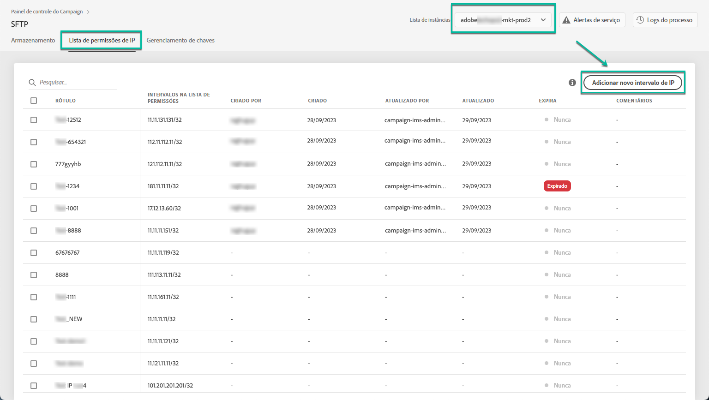
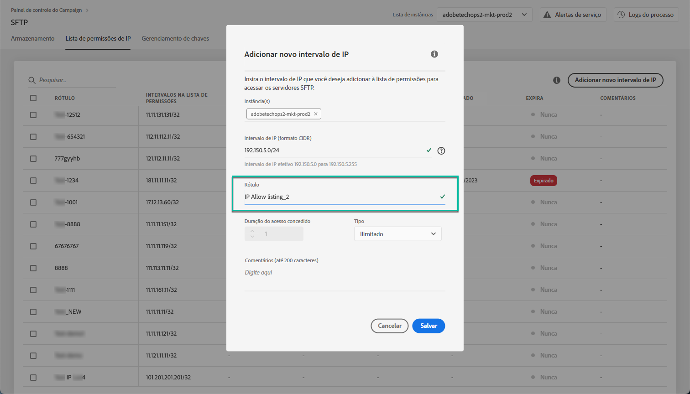
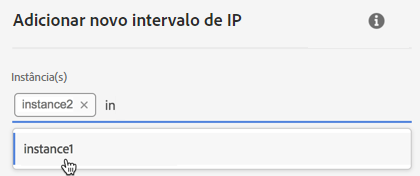

# Lista de permissões de intervalo IP {#ip-range-allow-listing}

>[!CONTEXTUALHELP]
>id="cp_ip_whitelist"
>title="Sobre a lista de permissões de IP"
>abstract="Nessa guia, é possível adicionar intervalos IP à lista de permissões para estabelecer uma conexão com seus servidores SFTP. Somente os servidores SFTP aos quais você tem acesso são mostrados aqui. Entre em contato com o administrador para solicitar acesso a outros servidores SFTP."
>additional-url="https://images-tv.adobe.com/mpcv3/8a977e03-d76c-44d3-853c-95d0b799c870_1560205338.1920x1080at3000_h264.mp4#t=98" text="Assista ao vídeo de demonstração"

Os servidores SFTP estão protegidos. Para poder acessá-los para visualizar arquivos ou gravar novos, é necessário adicionar o endereço IP público do sistema ou cliente que acessa os servidores à lista de permissões.

 Descubra este recurso no vídeo usando o [Campaign Classic](https://experienceleague.adobe.com/docs/campaign-classic-learn/control-panel/sftp-management/adding-ip-range-to-allow-list.html#sftp-management) ou o [Campaign Standard](https://experienceleague.adobe.com/docs/campaign-standard-learn/control-panel/sftp-management/adding-ip-range-to-allow-list.html#sftp-management)

## Sobre o formato CIDR {#about-cidr-format}

CIDR (Roteamento interdomínio sem classe) é o formato aceito ao adicionar intervalos IP com a interface do Painel de controle do Campaign.

A sintaxe consiste em um endereço IP seguido por um caractere &#39;/&#39; e um número decimal. O formato e sua sintaxe são detalhados por completo [neste artigo](https://whatismyipaddress.com/cidr).

Você pode procurar na Internet ferramentas online gratuitas que ajudarão você a converter o intervalo IP disponível para o formato CIDR.

## Práticas recomendadas {#best-practices}

Siga as recomendações e limitações abaixo ao adicionar endereços IP à lista de permissões no Painel de controle do Campaign.

* **Adicione intervalos IP à lista de permissões** em vez de endereços IP únicos. Para adicionar um único endereço IP à lista de permissões, anexe um &#39;/32&#39; a ela para indicar que o intervalo inclui apenas um único IP.
* **Não adicione intervalos muito amplos à lista de permissões**, por exemplo, incluindo > 265 endereços IP. O Painel de controle do Campaign rejeitará qualquer intervalo no formato CIDR que esteja entre /0 e /23.
* Somente **endereços IP públicos** podem ser adicionados à lista de permissões.
* **Exclua regularmente endereços IP** que não são mais necessários na lista de permissões.

## Adicionar endereços IP à lista de permissões {#adding-ip-addresses-allow-list}

>[!CONTEXTUALHELP]
>id="cp_sftp_iprange_add"
>title="Configuração do intervalo IP"
>abstract="Defina os intervalos IP que deseja adicionar à lista de permissões para se conectar aos servidores SFTP."

Para adicionar um intervalo IP à lista de permissões, siga estas etapas:

1. Abra o cartão **[!UICONTROL SFTP]** e selecione a guia **[!UICONTROL IP Allow Listing]**.
1. A lista de endereços IP na lista de permissões é exibida para cada instância. Selecione a instância desejada na lista do lado esquerdo e clique no botão **[!UICONTROL Add new IP range]**.

   

1. Defina o Intervalo IP que deseja incluir na lista de permissões, no formato CIDR, e então o rótulo que será exibido na lista.

   >[!NOTE]
   >
   >Esses caracteres especiais são permitidos no campo Rótulo:
   > `. _ - : / ( ) # , @ [ ] + = & ; { } ! $`

   

   >[!IMPORTANT]
   >
   >Um intervalo IP não pode sobrepor um intervalo existente na lista de permissões. Nesse caso, primeiro exclua o intervalo que contém o IP sobreposto.
   >
   >É possível adicionar um intervalo na lista de permissões para várias instâncias. Para fazer isso, pressione a seta para baixo ou digite as primeiras letras da instância desejada e selecione-a na lista de sugestões.

   

1. Clique no botão **[!UICONTROL Save]**. A adição de IP à lista de permissões será exibida como PENDENTE até que a solicitação seja totalmente processada. Essa ação deve levar apenas alguns segundos.

Para excluir intervalos IP da lista de permissões, selecione-os e clique no botão **[!UICONTROL Delete IP range]**.

>[!NOTE]
>
>No momento, não é possível editar um intervalo na lista de permissões. Para modificar um intervalo IP, exclua-o e crie um outro que corresponda às suas necessidades.

## Monitoramento de alterações {#monitoring-changes}

A **[!UICONTROL Job Logs]** na home page do Painel de controle do Campaign permite monitorar todas as alterações feitas em endereços IP da lista de permissões.

Para obter mais informações sobre a interface do Painel de controle do Campaign, consulte [esta seção](../../discover/using/discovering-the-interface.md).

