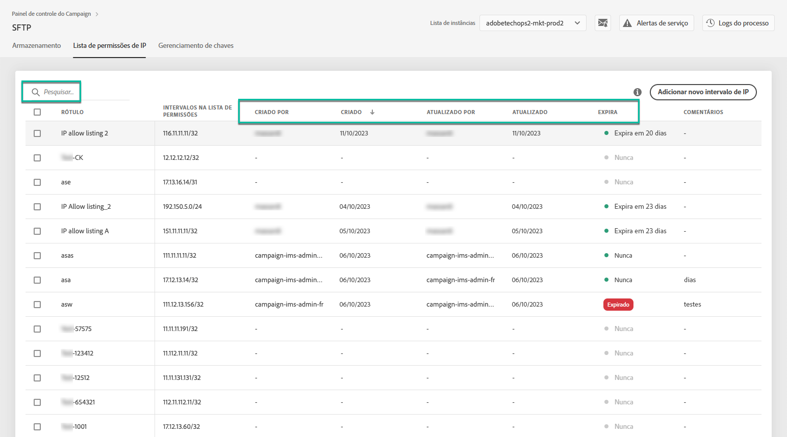

# Lista de permissões de intervalo IP {#ip-range-allow-listing}

>[!CONTEXTUALHELP]
>id="cp_ip_whitelist"
>title="Sobre a lista de permissões de IP"
>abstract="Nessa guia, é possível adicionar intervalos IP à lista de permissões para estabelecer uma conexão com seus servidores SFTP. Somente os servidores SFTP aos quais você tem acesso são mostrados aqui. Entre em contato com o administrador para solicitar acesso a outros servidores SFTP."
>additional-url="https://images-tv.adobe.com/mpcv3/8a977e03-d76c-44d3-853c-95d0b799c870_1560205338.1920x1080at3000_h264.mp4#t=98" text="Assista ao vídeo de demonstração"

Os servidores SFTP estão protegidos. Para poder acessá-los para visualizar arquivos ou gravar novos, é necessário adicionar o endereço IP público do sistema ou cliente que acessa os servidores à lista de permissões.

 Descubra este recurso no vídeo usando o [Campaign Classic](https://experienceleague.adobe.com/docs/campaign-classic-learn/control-panel/sftp-management/adding-ip-range-to-allow-list.html#sftp-management) ou o [Campaign Standard](https://experienceleague.adobe.com/docs/campaign-standard-learn/control-panel/sftp-management/adding-ip-range-to-allow-list.html#sftp-management)

## Sobre o formato CIDR {#about-cidr-format}

CIDR (Roteamento interdomínio sem classe) é o formato aceito ao adicionar intervalos IP com a interface do Painel de controle do Campaign.

A sintaxe consiste em um endereço IP seguido por um caractere &#39;/&#39; e um número decimal. O formato e sua sintaxe são detalhados por completo em [este artigo](https://whatismyipaddress.com/cidr){target=&quot;_blank&quot;}.

Você pode procurar na Internet ferramentas online gratuitas que ajudarão a converter o intervalo IP disponível para o formato CIDR.

## Práticas recomendadas {#best-practices}

Siga as recomendações e limitações abaixo ao adicionar endereços IP à lista de permissões no Painel de controle do Campaign.

* **Adicione intervalos IP à lista de permissões** em vez de endereços IP únicos. Para adicionar um único endereço IP à lista de permissões, anexe um &#39;/32&#39; a ela para indicar que o intervalo inclui apenas um único IP.
* **Não adicione intervalos muito amplos à lista de permissões**, por exemplo, incluindo > 265 endereços IP. O Painel de controle do Campaign rejeitará qualquer intervalo no formato CIDR que esteja entre /0 e /23.
* Somente **endereços IP públicos** podem ser adicionados à lista de permissões.
* Certifique-se de **excluir endereços IP regularmente** que você não precisa mais da lista de permissões.

## Adicionar endereços IP à lista de permissões {#adding-ip-addresses-allow-list}

>[!CONTEXTUALHELP]
>id="cp_sftp_iprange_add"
>title="Configuração do intervalo IP"
>abstract="Defina os intervalos IP que deseja adicionar à lista de permissões para se conectar aos servidores SFTP."

Para adicionar um intervalo IP à lista de permissões, siga estas etapas:

1. Abra o cartão **[!UICONTROL SFTP]** e selecione a guia **[!UICONTROL IP Allow Listing]**.
1. A lista de endereços IP na lista de permissões é exibida para cada instância. Selecione a instância desejada na lista do lado esquerdo e clique no botão **[!UICONTROL Add new IP range]**.

   

1. Defina o intervalo IP que deseja adicionar à lista de permissões. Esse campo aceita apenas intervalos IP no formato CIDR, como *192.150.5.0/24*.

   

   >[!IMPORTANT]
   >
   >Um intervalo IP não pode sobrepor um intervalo existente na lista de permissões. Nesse caso, primeiro exclua o intervalo que contém o IP sobreposto.

1. É possível adicionar um intervalo à lista de permissões para várias instâncias. Para fazer isso, pressione a seta para baixo ou digite as primeiras letras da instância desejada e selecione-a na lista de sugestões.

   

1. Defina o rótulo que será exibido para esse intervalo IP na lista.

   

   >[!NOTE]
   >
   >Os seguintes caracteres especiais são permitidos na variável **[!UICONTROL Label]** campo :
   > `. _ - : / ( ) # , @ [ ] + = & ; { } ! $`

1. Para gerenciar melhor sua lista de permissões IP, você pode definir uma duração para a disponibilidade de cada intervalo IP. Para fazer isso, selecione uma unidade no **[!UICONTROL Type]** lista suspensa e defina uma duração no campo correspondente. Para obter mais informações sobre a expiração do intervalo de IP, consulte [esta seção](#expiry).

   

   >[!NOTE]
   >
   >Por padrão, a variável **[!UICONTROL Type]** estiver definido como **[!UICONTROL Unlimited]**, o que significa que o intervalo IP nunca expira.

1. No **[!UICONTROL Comment]** , é possível indicar um motivo para permitir esse intervalo de IP (por quê, para quem etc.).

1. Clique no botão **[!UICONTROL Save]**. O intervalo IP adicionado à lista de permissões será exibido como **[!UICONTROL Pending]** até que a solicitação seja totalmente processada, o que deve levar apenas alguns segundos.

   

>[!IMPORTANT]
>
>Se você estiver tentando conectar os servidores SFTP a um novo sistema e, portanto, adicionar novos intervalos IP à lista de permissões, talvez seja necessário inserir novas chaves públicas para concluir a conexão. Para obter mais informações, consulte [esta seção](key-management.md).

## Gerenciamento de intervalos IP {#managing-ip-ranges}

Os intervalos IP criados são exibidos na **[!UICONTROL IP Allow Listing]** guia .

Você pode classificar os itens com base na data de criação ou na data de edição, no usuário que a criou ou editou e na expiração do intervalo de IP.

Também é possível pesquisar um intervalo IP começando a digitar um rótulo, um intervalo, um nome ou um comentário.

Para editar um ou mais intervalos IP, consulte [esta seção](#editing-ip-ranges).

Para excluir um ou mais intervalos IP da lista de permissões, selecione-os e clique no botão **[!UICONTROL Delete IP range]** botão.

### Expiração {#expiry}

O **[!UICONTROL Expires]** mostra quantos dias restam até que o intervalo IP expire.

Se você se inscreveu em [alerta por email](../../performance-monitoring/using/email-alerting.md), você receberá notificações por email 10 dias e 5 dias antes de um intervalo de IP expirar e no dia em que ele expirar. Ao receber o alerta, você pode [editar o intervalo IP](#editing-ip-ranges) Prorrogar o seu período de validade, se necessário.

Um intervalo IP expirado será excluído automaticamente após 7 dias. É mostrado como **[!UICONTROL Expired]** no **[!UICONTROL Expires]** coluna. Neste período de 7 dias:

* Um intervalo IP expirado não pode mais ser usado para acessar os servidores SFTP.

* Não é possível criar outro intervalo IP que sobreponha um intervalo expirado. Primeiro, é necessário excluir o intervalo IP expirado antes de criar o novo.

* Você pode [editar](#editing-ip-ranges) um intervalo IP expirado e atualize sua duração para disponibilizá-lo novamente.

* Você pode excluí-lo da lista de permissões.

## Edição de intervalos IP {#editing-ip-ranges}

>[!CONTEXTUALHELP]
>id="cp_sftp_iprange_update"
>title="Atualizar intervalos IP"
>abstract="Atualize os intervalos IP selecionados com permissão para se conectar ao servidor SFTP."

Para editar intervalos IP, siga as etapas abaixo.

>[!NOTE]
>
>Você só pode editar intervalos IP criados desde a versão de outubro de 2021 do Painel de controle do Campaign.

<!--Edition is not available for IP ranges that have been created before the Control Panel October 2021 release.-->

1. Selecione um ou mais intervalos IP no **[!UICONTROL IP Allow Listing]** lista.

1. Clique no botão **[!UICONTROL Update IP range]**.

   

1. Você só pode editar a expiração do intervalo IP e/ou adicionar um novo comentário.

   >[!NOTE]
   >
   >Para modificar o formato CIDR, seu rótulo ou editar a(s) instância(s) relacionada(s), primeiro você deve excluir o intervalo IP e criar um novo que corresponda às suas necessidades.

   

1. Salve as alterações.

## Monitoramento de alterações {#monitoring-changes}

O **[!UICONTROL Job Logs]** na página inicial do Painel de controle do Campaign, é possível rastrear e monitorar todas as alterações feitas em endereços IP na lista de permissões.

Para obter mais informações sobre a interface do Painel de controle do Campaign, consulte [esta seção](../../discover/using/discovering-the-interface.md).

