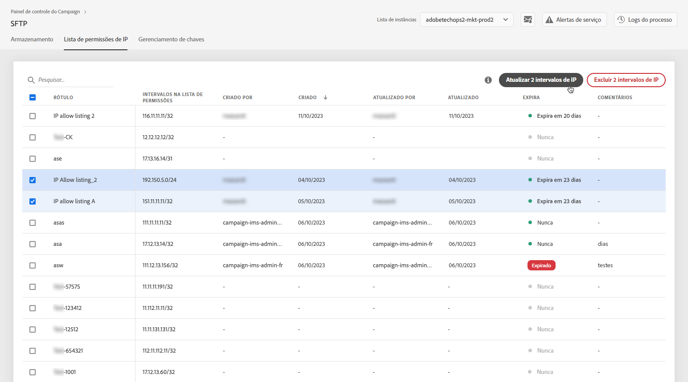

# Lista de permissões de intervalos de IP {#ip-range-allow-listing}

>[!CONTEXTUALHELP]
>id="cp_ip_whitelist"
>title="Sobre a lista de permissões de IP"
>abstract="Nessa guia, é possível adicionar intervalos IP à lista de permissões para estabelecer uma conexão com seus servidores SFTP. Somente os servidores SFTP aos quais você tem acesso são mostrados aqui. Entre em contato com o administrador para solicitar acesso a outros servidores SFTP."
>additional-url="https://images-tv.adobe.com/mpcv3/8a977e03-d76c-44d3-853c-95d0b799c870_1560205338.1920x1080at3000_h264.mp4#t=98" text="Assista ao vídeo de demonstração"

Os servidores SFTP estão protegidos. Para poder acessá-los para visualizar ou gravar novos arquivos, é necessário adicionar o endereço IP público do sistema ou cliente que acessa os servidores da lista de permissões.

 Conheça este recurso no vídeo usando o [Campaign v7/v8](https://experienceleague.adobe.com/docs/campaign-classic-learn/control-panel/sftp-management/adding-ip-range-to-allow-list.html?lang=pt-BR#sftp-management) ou o [Campaign Standard](https://experienceleague.adobe.com/docs/campaign-standard-learn/control-panel/sftp-management/adding-ip-range-to-allow-list.html?lang=pt-BR#sftp-management)

## Sobre o formato CIDR {#about-cidr-format}

CIDR (Roteamento interdomínio sem classe) é o formato aceito ao adicionar intervalos IP com a interface do Painel de controle.

A sintaxe consiste em um endereço IP seguido por um caractere &#39;/&#39; e um número decimal. O formato e sua sintaxe são detalhados por completo [neste artigo](https://whatismyipaddress.com/cidr){target="_blank"}.

É possível procurar na internet ferramentas online gratuitas que ajudarão a converter o intervalo de IP para o formato CIDR.

## Práticas recomendadas {#best-practices}

Siga as recomendações e limitações abaixo ao adicionar endereços IP à lista de permissões no Painel de controle.

* **Adicione intervalos IP à lista de permissões** em vez de endereços IP únicos. Para adicionar um único endereço IP à lista de permissões, anexe um &#39;/32&#39; a ela para indicar que o intervalo inclui apenas um único IP.
* **Não adicione intervalos muito amplos à lista de permissões**, por exemplo, incluindo > 265 endereços IP. O Painel de controle rejeitará qualquer intervalo no formato CIDR que esteja entre /0 e /23.
* Somente **endereços IP públicos** podem ser adicionados à lista de permissões.
* Certifique-se de **excluir regularmente endereços IP** que não são mais necessários na lista de permissões.

## Adição de endereços IP à lista de permissões {#adding-ip-addresses-allow-list}

>[!CONTEXTUALHELP]
>id="cp_sftp_iprange_add"
>title="Configuração do intervalo IP"
>abstract="Defina os intervalos IP que deseja adicionar à lista de permissões para se conectar aos servidores SFTP."

Para adicionar um intervalo IP à lista de permissões, siga estas etapas:

1. Abra o cartão **[!UICONTROL SFTP]** e selecione a guia **[!UICONTROL Lista de permissões de IP]**.
1. Os endereços IP na lista de permissões serão exibidos para cada instância. Selecione a instância desejada na lista do lado esquerdo e clique no botão **[!UICONTROL Adicionar novo intervalo de IP]**.

   

1. Defina o intervalo de IP que deseja adicionar à lista de permissões. Este campo aceita apenas intervalos de IP no formato CIDR, como *192.150.5.0/24*.

   

   >[!IMPORTANT]
   >
   >Um intervalo IP não pode sobrepor um intervalo existente na lista de permissões. Nesse caso, primeiro exclua o intervalo que contém o IP sobreposto.

1. É possível adicionar um intervalo na lista de permissões para várias instâncias. Para fazer isso, pressione a seta para baixo ou digite as primeiras letras da instância desejada e selecione-a na lista de sugestões.

   

1. Defina o rótulo que será exibido para este intervalo de IP na lista.

   

   >[!NOTE]
   >
   >Os caracteres especiais a seguir são permitidos no campo **[!UICONTROL Rótulo]**:
   > `. _ - : / ( ) # , @ [ ] + = & ; { } ! $`

1. Para gerenciar melhor sua lista de permissões de IP, você pode definir uma duração para a disponibilidade de cada intervalo de IP. Para isso, selecione uma unidade na lista suspensa **[!UICONTROL Tipo]** e defina uma duração no campo correspondente. Para obter mais informações sobre expiração de intervalo de IP, consulte [esta seção](#expiry).

   

   >[!NOTE]
   >
   >Por padrão, o campo **[!UICONTROL Tipo]** é definido como **[!UICONTROL Ilimitado]**, o que significa que o intervalo de IP nunca expira.

1. No campo **[!UICONTROL Comentário]** é possível indicar um motivo para permitir esse intervalo de IP (por quê, para quem etc.).

1. Clique no botão **[!UICONTROL Save]**. A adição do intervalo de IP à lista de permissões será exibida como **[!UICONTROL Pendente]** até que a solicitação seja totalmente processada, o que deve levar apenas alguns segundos.

   

>[!IMPORTANT]
>
>Se estiver tentando conectar os servidores SFTP a um novo sistema e, portanto, adicionando novos intervalos de IP à lista de permissões, talvez seja necessário inserir novas chaves públicas para concluir a conexão. Para obter mais informações, consulte [esta seção](key-management.md).

## Gerenciamento de intervalos de IP {#managing-ip-ranges}

Os intervalos de IP criados são exibidos na guia **[!UICONTROL Lista de permissões de IP]**.

É possível classificar os itens com base na data de criação ou de edição, no usuário que os criou ou editou e na expiração do intervalo de IP.

Você também pode pesquisar por um intervalo de IP digitando as primeiras letras do rótulo, intervalo, nome ou comentário.

Para editar um ou mais intervalos de IP, consulte [esta seção](#editing-ip-ranges).

Para excluir um ou mais intervalos de IP da lista de permissões, selecione-os e clique no botão **[!UICONTROL Excluir intervalo de IP]**.

### Expiração {#expiry}

A coluna **[!UICONTROL Expira]** mostra quantos dias restam até que o intervalo de IP expire.

Se você se inscreveu para [alertas por email](../../performance-monitoring/using/email-alerting.md), você receberá notificações por email 10 e 5 dias antes que um intervalo de IP expire e no dia em que ele for expirar. Ao receber o alerta, é possível [editar o intervalo de IP](#editing-ip-ranges) para prorrogar o período de validade, se necessário.

Os intervalos de IP expirados serão excluídos automaticamente após 7 dias. Eles serão exibidos como **[!UICONTROL Expirado]** na coluna **[!UICONTROL Expira]**. Nesse período de 7 dias:

* Um intervalo de IP expirado não pode mais ser usado para acessar os servidores SFTP.

* Não é possível criar outro intervalo de IP que se sobreponha a um intervalo expirado. Primeiro, é necessário excluir o intervalo de IP expirado antes de criar o novo.

* É possível [editar](#editing-ip-ranges) um intervalo de IP expirado e atualizar sua duração para torná-lo disponível novamente.

* Você pode excluí-lo da lista de permissões.

## Edição dos intervalos de IP {#editing-ip-ranges}

>[!CONTEXTUALHELP]
>id="cp_sftp_iprange_update"
>title="Atualizar intervalos IP"
>abstract="Atualize os intervalos IP selecionados com permissão para se conectar ao servidor SFTP."

Para editar intervalos de IP, siga as etapas abaixo.

>[!NOTE]
>
>Só é possível editar intervalos de IP que foram criados a partir da versão de outubro de 2021 do Painel de controle.

<!--Edition is not available for IP ranges that have been created before the Control Panel October 2021 release.-->

1. Selecione um ou mais intervalos de IP na **[!UICONTROL Lista de permissões de IP]**.

1. Clique no botão **[!UICONTROL Atualizar intervalo de IP]**.

   

1. Só será possível editar a expiração do intervalo de IP e/ou adicionar um novo comentário.

   >[!NOTE]
   >
   >Para modificar o formato CIDR, seu rótulo ou editar a(s) instância(s) relacionada(s), primeiro exclua o intervalo de IP e crie um novo que corresponda às suas necessidades.

   

1. Salve as alterações.

## Monitoramento de alterações {#monitoring-changes}

A opção **[!UICONTROL Logs de processos]** na página inicial do painel de controle permite rastrear e monitorar todas as alterações feitas nos endereços IP contidos na lista de permissões.

Para obter mais informações sobre a interface do Painel de controle, consulte [esta seção](../../discover/using/discovering-the-interface.md).

