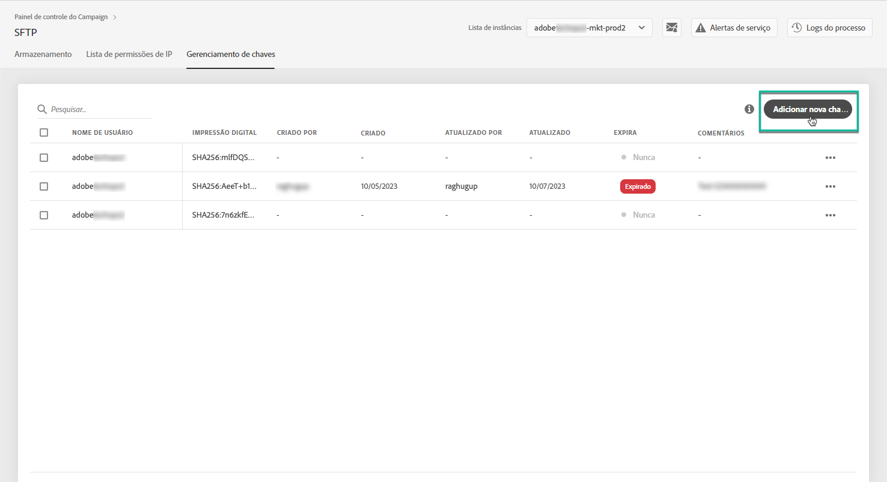
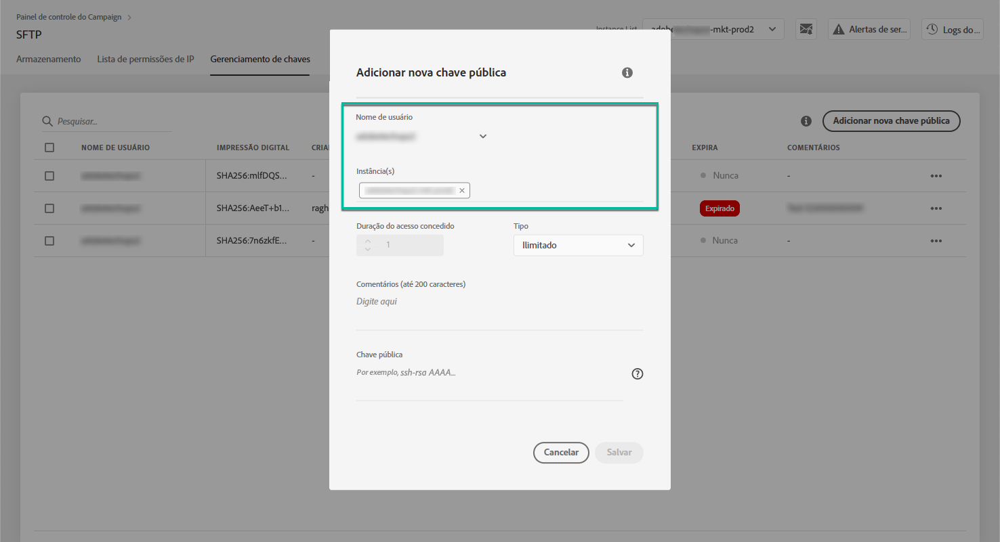
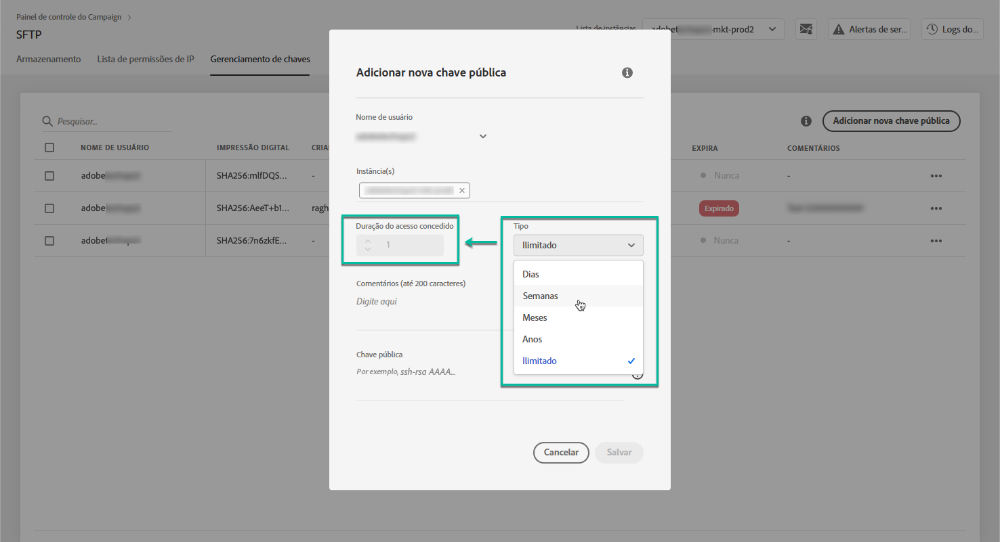
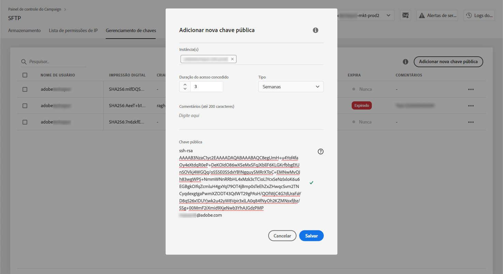
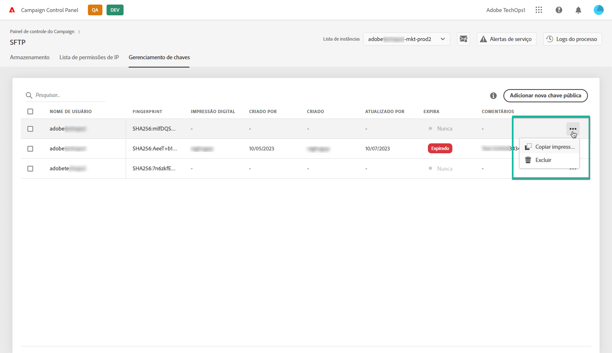
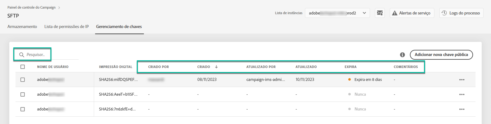
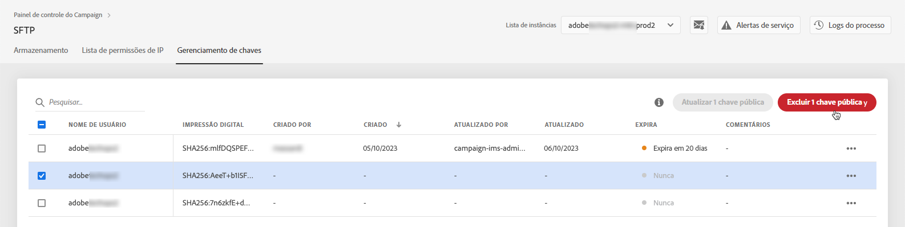
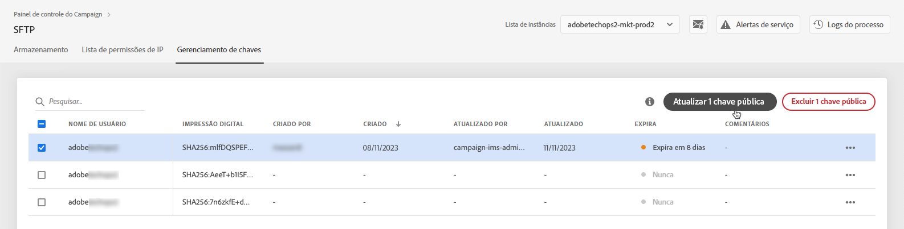

# Gerenciamento de chaves {#key-management}

>[!CONTEXTUALHELP]
>id="cp_key_management"
>title="Sobre o gerenciamento de chaves públicas"
>abstract="Nesta guia, crie, gerencie e edite suas chaves públicas."
>additional-url="https://images-tv.adobe.com/mpcv3/8a977e03-d76c-44d3-853c-95d0b799c870_1560205338.1920x1080at3000_h264.mp4#t=166" text="Assista ao vídeo de demonstração"

A Adobe recomenda que todos os clientes estabeleçam conexão com os servidores SFTP usando um **par de chaves públicas e privadas**.

As etapas para gerar uma chave SSH pública e adicioná-la ao servidor SFTP são descritas abaixo, bem como recomendações relacionadas à autenticação.

Quando o acesso ao servidor estiver configurado, lembre-se de **adicionar os endereços IP que exigirão acesso ao servidor para a lista de permissões** para que você possa se conectar a ele. Para obter mais informações, consulte [esta seção](../../instances-settings/using/ip-allow-listing-instance-access.md).

 Descubra este recurso no vídeo usando o [Campaign v7/v8](https://experienceleague.adobe.com/docs/campaign-classic-learn/control-panel/sftp-management/generate-ssh-key.html#sftp-management) ou o [Campaign Standard](https://experienceleague.adobe.com/docs/campaign-standard-learn/control-panel/sftp-management/generate-ssh-key.html#sftp-management)

## Práticas recomendadas {#best-practices}

**Sobre a chave pública SSH**

Use sempre a mesma autenticação para se conectar ao servidor e use um formato compatível para a chave.

**Integração da API com nome de usuário e senha**

Em casos muito raros, a autenticação baseada em senha é ativada em alguns servidores SFTP. A Adobe recomenda a utilização da autenticação baseada em chave, pois esse método é mais eficiente e seguro. Você pode solicitar a autenticação com chave entrando em contato com o Atendimento ao cliente.

>[!IMPORTANT]
>
>Se a senha expirar, mesmo se houver chaves instaladas no sistema, você não poderá fazer login em suas contas SFTP.

## Instalação da chave SSH {#installing-ssh-key}

>[!CONTEXTUALHELP]
>id="cp_sftp_publickey_add"
>title="Adição de chave pública"
>abstract="Gere uma chave SSH pública para uma instância e adicione-a ao Painel de controle do Campaign para acessar o servidor SFTP."

>[!IMPORTANT]
>
>Você deve sempre seguir as diretrizes da organização em relação às chaves SSH. As etapas abaixo são apenas um exemplo de como a criação da chave SSH pode ser feita e podem servir como um ponto de referência útil para informar os requisitos à sua equipe ou grupo de rede interno.

1. Navegue até a guia **[!UICONTROL Key Management]** e clique no botão **[!UICONTROL Add new public key]**.

   

1. Na caixa de diálogo que é exibida, selecione o nome de usuário para o qual deseja criar a chave pública e o servidor para o qual deseja ativar a chave.

   

   >[!NOTE]
   >
   >O Painel de controle do Campaign verificará se um determinado nome de usuário está ativo em uma determinada instância e permitirá que você ative a chave em uma ou várias instâncias.
   >
   >Uma ou mais chaves SSH públicas podem ser adicionadas para cada usuário.

1. Para gerenciar melhor suas chaves públicas, você pode definir uma duração para a disponibilidade de cada chave. Para fazer isso, selecione uma unidade na caixa **[!UICONTROL Type]** e defina uma duração no campo correspondente. Para obter mais informações sobre a expiração da chave pública, consulte [nesta seção](#expiry).

   

   >[!NOTE]
   >
   >Por padrão, a variável **[!UICONTROL Type]** o campo está definido como **[!UICONTROL Unlimited]**, o que significa que a chave pública nunca expira.

1. No **[!UICONTROL Comment]** você pode indicar um motivo para adicionar essa chave pública (por quê, para quem etc.).

1. Para poder preencher a variável **[!UICONTROL Public Key]** , é necessário gerar uma chave SSH pública. Siga as etapas abaixo de acordo com seu sistema operacional.

   **Linux e Mac:**

   Use o Terminal para gerar um par de chaves públicas e privadas:
   1. Digite este comando: `ssh-keygen -m pem -t rsa -b 2048 -C "your_email@example.com"`.
   1. Quando solicitado, forneça um nome para a chave. Se o diretório .ssh não existir, o sistema criará um para você.
   1. Digite, e em seguida insira novamente, uma senha quando solicitado. Esse campo também pode ser deixado em branco.
   1. Um par de chaves &quot;name&quot; e &quot;name.pub&quot; é criado pelo sistema. Procure o arquivo &quot;name.pub&quot; e abra-o. Ele deve ter uma sequência alfanumérica terminando com o endereço de email especificado.

   **Windows:**

   Talvez seja necessário instalar uma ferramenta de terceiros que ajudará você a gerar um par de chaves privadas/públicas no mesmo formato &quot;name.pub&quot;.

1. Abra o arquivo .pub e copie e cole a sequência inteira começando por &quot;ssh...&quot; no Painel de controle.

   

   >[!NOTE]
   >
   >A variável **[!UICONTROL Public Key]** O campo aceita apenas o formato OpenSSH. O tamanho da chave pública SSH deve ser de **2048 bits**.

1. Clique no botão **[!UICONTROL Save]** para criar a chave. O Painel de controle do Campaign salva a chave pública e sua impressão digital associada, criptografada com o formato SHA256.

>[!IMPORTANT]
>
>Se a chave criada for usada para estabelecer uma conexão com um sistema que nunca foi conectado ao servidor SFTP selecionado antes, será necessário adicionar um IP público desse sistema ao lista de permissões antes de usar esse sistema com o servidor SFTP. Consulte [esta seção](ip-range-allow-listing.md).

Você pode usar impressões digitais para corresponder às chaves privadas salvas no computador com as chaves públicas correspondentes salvas no Painel de controle do Campaign.

O botão &quot;**...**&quot; permite excluir uma chave existente ou copiar sua impressão digital associada na área de transferência.

## Gerenciamento de chaves públicas {#managing-public-keys}

As chaves públicas criadas são exibidas na variável **[!UICONTROL Key Management]** guia.

Você pode classificar os itens com base na data de criação ou data de edição, no usuário que os criou ou editou e na expiração do intervalo de IP.

Você também pode pesquisar uma chave pública começando a digitar um nome ou um comentário.

Para editar um ou mais intervalos IP, consulte [nesta seção](#editing-public-keys).

Para excluir uma ou mais chaves públicas da lista, selecione-as e clique no link **[!UICONTROL Delete public key]** botão.

### Expiração {#expiry}

A variável **[!UICONTROL Expires]** mostra quantos dias permanecem até que a chave pública expire.

Se você se inscreveu no [alerta por email](../../performance-monitoring/using/email-alerting.md), você receberá notificações por email 10 dias e 5 dias antes que uma chave pública expire e no dia em que ela expirar. Ao receber o alerta, você pode [editar a chave pública](#editing-public-keys) prorrogar o seu período de validade, se necessário.

Uma chave pública expirada será excluída automaticamente após 7 dias. É mostrado como **[!UICONTROL Expired]** no **[!UICONTROL Expires]** coluna. Neste período de 7 dias:

* Uma chave pública expirada não pode mais ser usada para se conectar ao servidor SFTP.

* Você pode [editar](#editing-public-keys) uma chave pública expirada e atualize sua duração para torná-la disponível novamente.

* Você pode excluí-lo da lista.

## Edição de chaves públicas {#editing-public-keys}

>[!CONTEXTUALHELP]
>id="cp_sftp_publickey_update"
>title="Editar chaves públicas"
>abstract="Atualize as chaves públicas selecionadas para acessar o servidor SFTP."

Para editar chaves públicas, siga as etapas abaixo.

>[!NOTE]
>
>Você só pode editar chaves públicas que foram criadas desde a versão de outubro de 2021 do Painel de controle do Campaign.

1. Selecione um ou mais itens na lista **[!UICONTROL Key Management]** lista.
1. Clique no botão **[!UICONTROL Update public key]**.

   

1. Você só pode editar a expiração da chave pública e/ou adicionar um novo comentário.

   >[!NOTE]
   >
   >Para modificar o nome de usuário, a instância e a chave pública no formato OpenSSH, exclua a chave pública e crie uma nova que corresponda às suas necessidades.

1. Salve as alterações.
