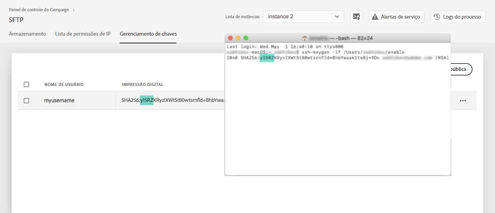

# Gerenciamento de chaves {#key-management}

A Adobe recomenda que todos os clientes estabeleçam conexão com os servidores SFTP usando um **par de chaves públicas e privadas**.

As etapas para gerar uma chave SSH pública e adicioná-la ao servidor SFTP são descritas abaixo, bem como recomendações relacionadas à autenticação.

Quando o acesso ao servidor estiver configurado, lembre-se de **adicionar os endereços** IP que exigirão acesso ao servidor para que você possa se conectar a ele. Para obter mais informações, consulte [esta seção](../../instances-settings/using/ip-whitelisting-instance-access.md).

>[!NOTE]
>
>Atualmente, não é possível excluir uma chave pública SSH.

## Práticas recomendadas {#best-practices}

**Sobre a chave pública SSH**

Certifique-se de usar sempre a mesma autenticação para se conectar ao servidor e de usar um formato compatível para a chave.

**Integração da API com nome de usuário e senha**

Em casos muito raros, a autenticação baseada em senha é ativada em alguns servidores SFTP. A Adobe recomenda usar a autenticação baseada em chave, pois esse método é mais eficiente e seguro. Você pode solicitar alternar para autenticação baseada em chave entrando em contato com o Atendimento ao cliente.

>[!CAUTION]
>
>Se a senha expirar, mesmo se houver chaves instaladas no sistema, você não poderá fazer logon em suas contas SFTP.

## Instalação da chave SSH {#installing-ssh-key}

>[!CAUTION]
>
>As etapas abaixo são apenas um exemplo de criação de chave SSH. Siga as diretrizes da organização em relação às chaves SSH. O exemplo abaixo é apenas um exemplo de como isso pode ser feito e serve como um ponto de referência útil para informar os requisitos à sua equipe ou grupo de rede interno.

1. Navegue até a **[!UICONTROL Key Management]**guia e clique no**[!UICONTROL Add new public key]** botão.

   

1. Na caixa de diálogo que é aberta, selecione o nome de usuário para o qual deseja criar a chave pública e o servidor para o qual deseja ativar a chave.

   >[!NOTE]
   >
   >A interface verificará se um determinado nome de usuário está ativo em uma determinada instância e dará a você a opção de ativar a chave em uma ou várias instâncias.
   >
   >Uma ou mais chaves SSH públicas podem ser adicionadas para cada usuário.

   

1. Copie e cole a chave SSH pública. Para gerar uma chave pública, siga as etapas abaixo correspondentes ao seu sistema operacional:

   >[!NOTE]
   >
   >O tamanho da chave pública SSH deve ser de **2048 bits**.

   **Linux e Mac:**

   Use o Terminal para gerar um par de chaves públicas e privadas:
   1. Digite este comando: `ssh-keygen -t rsa -C <your_email@example.com>`.
   1. Quando solicitado, forneça um nome para a sua chave. Se o diretório .ssh não existir, o sistema criará um para você.
   1. Digite e digite novamente uma senha quando solicitado. Também pode ser deixado em branco.
   1. Um par de chaves &quot;name&quot; e &quot;name.pub&quot; é criado pelo sistema. Procure o arquivo &quot;name.pub&quot; e abra-o. Deve ter uma sequência alfanumérica terminando com o endereço de email especificado.
   **Windows:**

   Talvez seja necessário instalar uma ferramenta de terceiros que o ajudará a gerar um par de chaves privadas/públicas no mesmo formato &quot;name.pub&quot;.

1. Abra o arquivo .pub e copie e cole a string inteira começando com &quot;ssh...&quot; no Painel de controle.

   

1. Clique no **[!UICONTROL Save]**botão para criar a chave. O Painel de controle salva a chave pública e sua impressão digital associada, criptografada com o formato SHA256.

Você pode usar impressões digitais para corresponder às chaves privadas salvas no computador com as chaves públicas correspondentes salvas no Painel de controle.

O &quot;**...**&quot; permite que você exclua uma chave existente ou copie sua impressão digital associada na área de transferência.

