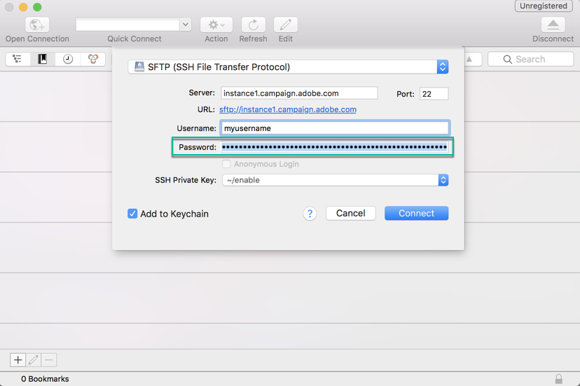

# Fazer logon no servidor SFTP {#logging-into-sft-server}

As etapas abaixo detalham como conectar o servidor SFTP por meio do aplicativo cliente SFTP.

[ Descubra este recurso no vídeo](https://video.tv.adobe.com/v/27263?quality=12)

Antes de fazer logon no servidor, verifique se:

* O servidor SFTP é **hospedado por Adobe**.
* Seu **nome de usuário** foi configurado para o servidor. Você pode verificar essas informações diretamente no Painel de controle, no **Gerenciamento de chaves** do cartão SFTP.
* Você tem um **par de chave privada e pública** para fazer logon no servidor SFTP. Consulte [nesta seção](../../sftp/using/key-management.md) para obter mais informações sobre como adicionar a chave SSH.
* Seu **O endereço IP público foi adicionado à lista de permissões** no servidor SFTP. Caso contrário, consulte [nesta seção](../../sftp/using/ip-range-allow-listing.md) para obter mais informações sobre como adicionar intervalo IP à lista de permissões.
* Você tem acesso a um **Software cliente SFTP**. Você pode consultar o departamento de TI para obter o aplicativo cliente SFTP que eles recomendam usar ou procurar um na Internet, se isso for permitido pelas políticas da sua empresa.

Para se conectar ao servidor SFTP, siga estas etapas:

1. Inicie o Painel de controle e selecione o **[!UICONTROL Key Management]** na guia **[!UICONTROL SFTP]** cartão.

   

1. Inicie o aplicativo cliente SFTP e, em seguida, copie e cole o endereço do servidor no Painel de controle do Campaign, seguido de &quot;campaign.adobe.com&quot; e preencha com seu nome de usuário.

   

1. No **[!UICONTROL SSH Private Key]** selecione o arquivo de chave privada armazenado no computador. Ele corresponde a um arquivo de texto que tem o mesmo nome que sua chave pública, sem a extensão &quot;.pub&quot; (por exemplo, &quot;enable&quot;).

   

   A variável **[!UICONTROL Password]** O campo é preenchido automaticamente com a chave privada do arquivo.

   

   Você pode verificar se a chave que está tentando usar está salva no Painel de controle do Campaign comparando a impressão digital da chave privada ou pública com a impressão digital das chaves que aparecem na guia Gerenciamento de chaves do cartão SFTP.

   

   >[!NOTE]
   >
   >Se estiver usando um computador Mac, você poderá exibir a impressão digital da chave privada armazenada no computador executando este comando:
   >
   >`ssh-keygen -lf <path of the privatekey>`

1. Depois que todas as informações forem preenchidas, clique em **[!UICONTROL Connect]** para fazer logon no servidor SFTP.

   
