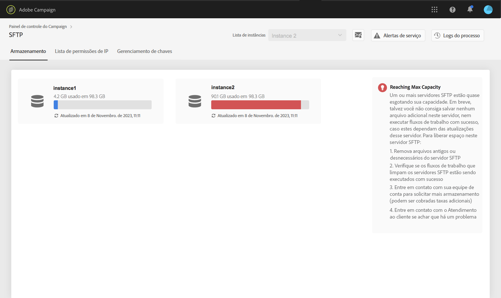

# Gerenciamento de armazenamentos SFTP {#sftp-storage-management}

>[!CONTEXTUALHELP]
>id="cp_storage"
>title="Sobre a capacidade de armazenamento"
>abstract="Nesta guia você pode visualizar as informações de utilização e capacidade do armazenamento para seus servidores SFTP. Somente os servidores SFTP aos quais você tem acesso são mostrados aqui. Entre em contato com o administrador para solicitar acesso a outros servidores SFTP."
>additional-url="https://images-tv.adobe.com/mpcv3/8a977e03-d76c-44d3-853c-95d0b799c870_1560205338.1920x1080at3000_h264.mp4" text="Assista ao vídeo de demonstração"

Você pode ter uma capacidade de armazenamento diferente provisionada no servidor SFTP, dependendo dos termos contratuais.

É essencial monitorar regularmente o espaço disponível para cada um dos servidores SFTP. Caso contrário, talvez você não consiga salvar mais arquivos no servidor ou executar com êxito workflows que dependam das atualizações deste servidor.

 Descubra este recurso no vídeo usando o  [Campaign ](https://experienceleague.adobe.com/docs/campaign-classic-learn/control-panel/sftp-management/monitoring-server-capacity.html?lang=en#sftp-management) Classic ou o  [Campaign Standard](https://experienceleague.adobe.com/docs/campaign-standard-learn/control-panel/sftp-management/monitoring-server-capacity.html?lang=en#sftp-management)

## Acessar informações de capacidade de armazenamento {#accessing-storage-capacity-information}

As informações sobre o espaço usado por todas as instâncias às quais você tem acesso estão disponíveis na guia **[!UICONTROL Storage]** do cartão SFTP. Ele é atualizado em cada atualização de página.

Para cada instância, um alerta visual informa quando o armazenamento ultrapassa a capacidade:

* **Laranja**: a instância superou 80% da capacidade,
* **Vermelho**: a instância superou 90% da capacidade.

Outras dicas também estão disponíveis para ajudar você a saber como proceder à medida que o servidor se aproximar da capacidade.

## Práticas recomendadas quando a capacidade de armazenamento for esgotada {#best-practices-when-capacity-runs-out}

1. **Apague arquivos antigos ou desnecessários do servidor SFTP**. Para obter mais informações sobre como acessar a pasta do servidor SFTP, consulte [esta seção](../../sftp/using/logging-into-sftp-server.md).
1. Verifique se os **workflows** que limpam os servidores SFTP foram executados com êxito. Para obter mais informações sobre workflows técnicos no Adobe Campaign, consulte as documentações específicas do [Campaign Classic](https://experienceleague.adobe.com/docs/campaign-classic/using/automating-with-workflows/advanced-management/about-technical-workflows.html) e [Campaign Standard](https://experienceleague.adobe.com/docs/campaign-standard/using/administrating/application-settings/technical-workflows.html).
1. Entre em contato com a equipe de conta para **solicitar mais armazenamento** (podem ser aplicadas taxas adicionais).
1. Entre em contato com o **Atendimento ao cliente** se achar que existe um problema.
