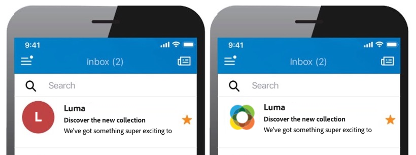
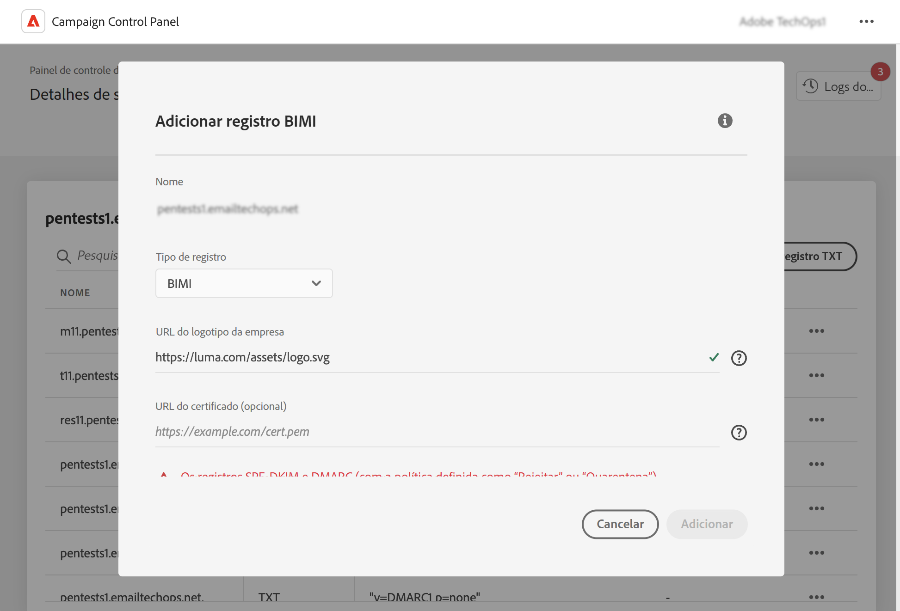

# Adicionar registros BIMI {#dmarc}

## Sobre registros BIMI {#about}

O BIMI (Brand Indicators for Message Identification) é um padrão do setor que permite a exibição de um logotipo aprovado ao lado do email de um remetente nas caixas de entrada dos provedores, a fim de aumentar o reconhecimento e a confiança da marca. Ele ajuda a impedir o spoofing e phishing de emails confirmando a identidade do remetente por meio da autenticação DMARC, o que dificulta a falsificação de marcas legítimas em emails de pessoas mal-intencionadas.

Informações detalhadas sobre a implementação do BIMI estão disponíveis no [Manual de práticas recomendadas de capacidade de entrega da Adobe](https://experienceleague.adobe.com/docs/deliverability-learn/deliverability-best-practice-guide/additional-resources/technotes/implement-bimi.html?lang=pt-BR)

{width="70%" align="center"}

## Limitações e pré-requisitos {#limitations}

* Os registros SPF, DKIM e DMARC são pré-requisitos para a criação de registros BIMI.
* Os registros BIMI só podem ser adicionados a subdomínios que utilizam a delegação de subdomínio completa. [Saiba mais sobre os métodos de configuração de subdomínios](subdomains-branding.md#subdomain-delegation-methods)
* Pré-requisitos do registro DMARC:

   * O tipo de política de registro do subdomínio deve estar definido como “Quarentena” ou “Rejeitar”. A criação do registro BIMI não está disponível quando o tipo de política DMARC está definido como “Nenhum”.
   * A porcentagem de emails aos quais a política DMARC é aplicada deve ser 100%. O BIMI não será compatível com políticas DMARC se essa porcentagem estiver definida com um valor inferior a 100%.

[Saiba como configurar registros DMARC](dmarc.md)

## Adicionar um registro BIMI a um subdomínio {#add}

Para adicionar um registro BIMI a um subdomínio, siga estas etapas:

1. Na lista de subdomínios, clique no botão de reticências ao lado do subdomínio desejado e selecione **[!UICONTROL Subdomain details]**.

1. Clique no botão **[!UICONTROL Add TXT record]** e escolha **[!UICONTROL BIMI]** na lista suspensa **[!UICONTROL Record type]**.

   

1. No **[!UICONTROL Company Logo URL]**, especifique o URL do arquivo SVG que contém o logotipo.

1. Embora o **[!UICONTROL Certificate URL]** seja opcional, ele é necessário para alguns provedores de caixa de entrada, como Gmail e Apple, que representam 80% desse mercado. Portanto, recomendamos obter um certificado de marca verificada (VMC, na sigla em inglês) para realmente aproveitar o BIMI.

   +++Como obtenho um VMC?

   Estão são as principais etapas para se obter um VMC:

   1. Registre o logotipo da sua marca em uma agência de propriedade intelectual reconhecida por emissores de VMC. Caso possua uma equipe jurídica, recomendamos que solicite o auxílio dela para registrar seu logotipo ou confirmar se ele já está registrado.

   1. Depois de confirmar o registro do seu logotipo, entre em contato com uma autoridade de certificação, como a DigiCert ou Entrust, para solicitar um VMC.

   1. Quando o VMC for aprovado, você receberá um arquivo PEM (Privacy Enhanced Mail) referente ao certificado de entidade. Anexe todos os certificados intermediários obtidos da autoridade de certificação a este arquivo PEM. Faça upload do arquivo PEM (juntamente com os arquivos anexados) para o servidor público na Web e anote o URL do arquivo PEM. Você usará o URL em seu registro TXT do BIMI.

   1. Quando o registro BIMI estiver visível na página de detalhes de um subdomínio específico, você poderá usar o BIMI Inspector (disponível [aqui](https://bimigroup.org/bimi-generator/)) para verificar se o registro BIMI está funcionando corretamente.

   Informações detalhadas sobre a implementação do BIMI estão disponíveis na [Documentação padrão do BIMI](https://bimigroup.org/implementation-guide/)
+++

1. Clique em **[!UICONTROL Add]** para confirmar a criação do registro BIMI.

Depois que a criação do registro BIMI for processada (o que leva aproximadamente 5 minutos), ele será exibido na tela de detalhes dos subdomínios. [Saiba como monitorar registros TXT de seus subdomínios](gs-txt-records.md#monitor)
