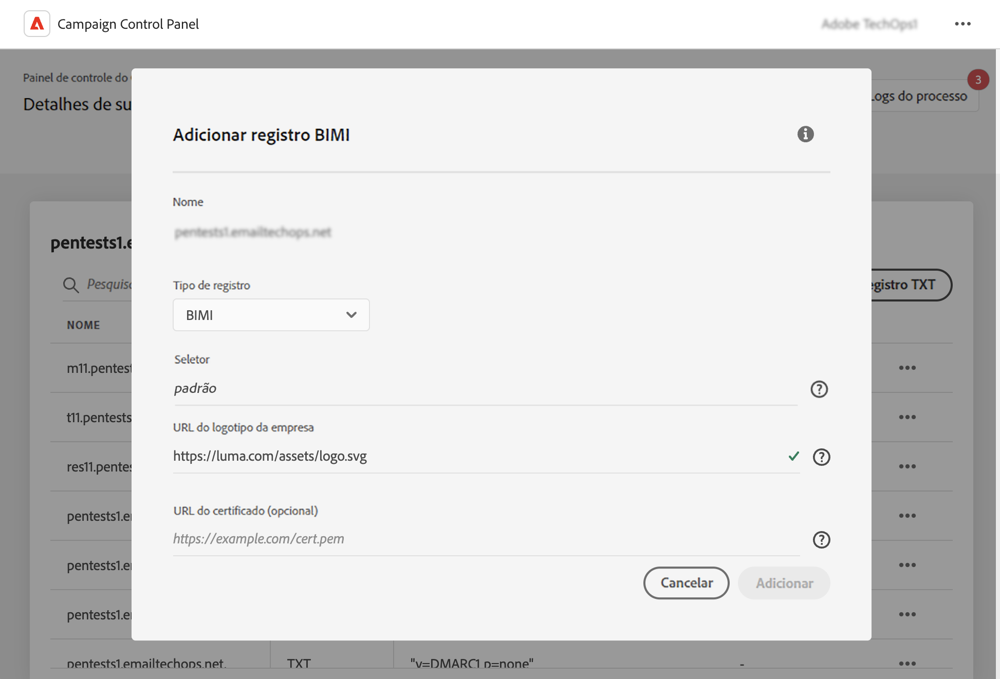

# Adicionar registros BIMI {#dmarc}

## Sobre registros BIMI {#about}

Brand Indicators for Message Identification (BIMI) é um padrão do setor que permite que um logotipo aprovado apareça ao lado do email de um remetente nas caixas de entrada dos provedores de caixa de correio para aprimorar o reconhecimento e a confiança da marca.

Informações detalhadas sobre a implementação do BIMI estão disponíveis no [Manual de práticas recomendadas de capacidade de entrega da Adobe](https://experienceleague.adobe.com/docs/deliverability-learn/deliverability-best-practice-guide/additional-resources/technotes/implement-bimi.html?lang=pt-BR)

{width="70%" align="center"}

## Limitações e pré-requisitos {#limitations}

* Os registros SPF, DKIM e DMARC são pré-requisitos para a criação de registros BIMI.

* O registro BIMI precisa ser publicado no DNS. Para um domínio totalmente delegado, isso é possível por meio do Painel de controle do Campaign. [Saiba mais sobre os métodos de configuração de subdomínios](subdomains-branding.md#subdomain-delegation-methods)

* Pré-requisitos do registro DMARC:

   * O tipo de política de registro para o domínio organizacional deve ser definido como &quot;Quarentena&quot; ou &quot;Rejeitar&quot;. A criação do registro BIMI não está disponível quando o tipo de política DMARC está definido como “Nenhum”.
   * A porcentagem de emails aos quais a política DMARC é aplicada deve ser 100%. O BIMI não será compatível com políticas DMARC se essa porcentagem estiver definida com um valor inferior a 100%.

[Saiba como configurar registros DMARC](dmarc.md)

## Adicionar um registro BIMI a um subdomínio {#add}

Para adicionar um registro BIMI a um subdomínio, siga estas etapas:

1. Na lista de subdomínios, clique no botão de reticências ao lado do subdomínio desejado e selecione **[!UICONTROL Detalhes do subdomínio]**.

1. Clique em **[!UICONTROL Adicionar registro em TXT]** e escolha **[!UICONTROL BIMI]** na lista suspensa **[!UICONTROL Tipo de registro]**.

   

1. O campo **[!UICONTROL Seletor]** permite especificar um seletor de BIMI para o registro. Um seletor de BIMI é um identificador exclusivo que pode ser atribuído a um registro de BIMI. Isso permite definir vários logotipos para um determinado subdomínio. No momento, os provedores de caixa de correio não oferecem suporte para isso.

1. Em **[!UICONTROL URL do logotipo da empresa]**, especifique o URL do arquivo SVG que contém o seu logotipo.

1. Embora a **[!UICONTROL URL de Certificado]** seja opcional, ela é necessária para alguns provedores de caixa de correio, como Gmail e Apple. Portanto, recomendamos obter um certificado de marca verificada (VMC, na sigla em inglês) para realmente aproveitar o BIMI.

   +++Como obtenho um VMC?

   Estão são as principais etapas para se obter um VMC:

   1. Registre o logotipo da sua marca em uma agência de propriedade intelectual reconhecida por emissores de VMC. Caso possua uma equipe jurídica, recomendamos que solicite o auxílio dela para registrar seu logotipo ou confirmar se ele já está registrado.

   1. Depois de confirmar o registro do seu logotipo, entre em contato com uma autoridade de certificação, como a DigiCert ou Entrust, para solicitar um VMC.

   1. Quando o VMC for aprovado, você receberá um arquivo PEM (Privacy Enhanced Mail) referente ao certificado de entidade. Anexe todos os certificados intermediários obtidos da autoridade de certificação a este arquivo PEM. Faça upload do arquivo PEM (juntamente com os arquivos anexados) para o servidor público na Web e anote o URL do arquivo PEM. Você usará o URL em seu registro TXT do BIMI.

   1. Quando o registro BIMI estiver visível na página de detalhes de um subdomínio específico, você poderá usar o BIMI Inspector (disponível [aqui](https://bimigroup.org/bimi-generator/)) para verificar se o registro BIMI está funcionando corretamente.

   Informações detalhadas sobre a implementação do BIMI estão disponíveis na [Documentação padrão do BIMI](https://bimigroup.org/implementation-guide/)
+++

1. Clique em **[!UICONTROL Adicionar]** para confirmar a criação do registro BIMI.

Depois que a criação do registro BIMI for processada (o que leva aproximadamente 5 minutos), ele será exibido na tela de detalhes dos subdomínios. [Saiba como monitorar registros TXT de seus subdomínios](gs-txt-records.md#monitor)
