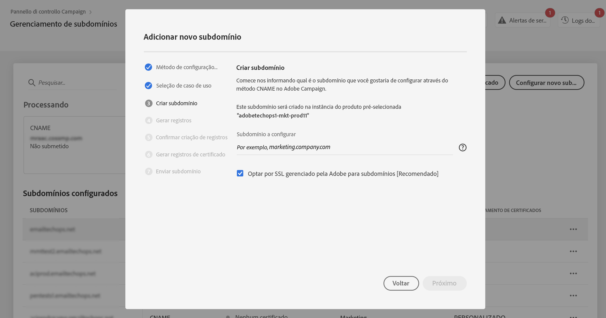

# Delegação de certificados SSL de subdomínios para a Adobe {#delegate-ssl-certificates}

>[!CONTEXTUALHELP]
>id="cp_managed_ssl"
>title="Delegação de certificados SSL de subdomínios para a Adobe"
>abstract="O Painel de controle permite que os certificados SSL de subdomínios sejam gerenciados pela Adobe. Se estiver usando CNAMEs para configurar o subdomínio, os registros de certificados serão gerados e fornecidos automaticamente para gerar um certificado na sua solução de hospedagem de domínio."

É altamente recomendado delegar seus certificados SSL de subdomínios para a Adobe, pois ela criará automaticamente o certificado e o renovará todos os anos antes da expiração.

Se estiver usando CNAMEs para configurar uma delegação de subdomínio, a Adobe fornecerá registros de certificado para usar em sua solução de hospedagem de domínio e gerar seu certificado.

A delegação de certificados SSL para a Adobe pode ser executada ao configurar um novo subdomínio ou em subdomínios já delegados.

>[!NOTE]
>
>O SSL gerenciado pela Adobe é um recurso gratuito que está disponível para usuários. Delegar o certificado de um subdomínio à Adobe é um processo transparente e não afeta suas campanhas e a capacidade de entrega. [Saiba mais sobre o gerenciamento de certificados SSL](monitoring-ssl-certificates.md#management)

## Delegação de novos certificados SSL de subdomínios {#new}

Para delegar certificados SSL ao configurar um novo subdomínio, habilite a opção **[!UICONTROL Opt for Adobe managed SSL for sub-domains]** do assistente de configuração de subdomínio. Os registros de certificados a serem copiados para sua solução de hospedagem serão fornecidos posteriormente no assistente de configuração. As etapas detalhadas estão documentadas [nesta seção](setting-up-new-subdomain.md).

{width="70%" align="left"}

## Delegação de certificados SSL para subdomínios já delegados {#delegated}

Para delegar certificados SSL para um subdomínio já delegado, clique no botão de reticências ao lado do subdomínio desejado e clique em **[!UICONTROL Switch to Managed SSL]**.

{width="70%" align="left"}

Uma caixa de diálogo será exibida com os registros de certificado que foram gerados automaticamente pela Adobe. Copie esses registros um por um ou baixando um arquivo CSV e navegue até a sua solução de hospedagem de domínio para gerar o certificado correspondente.

Certifique-se de que todos os registros de certificado tenham sido gerados em sua solução de hospedagem de domínio. Se tudo estiver configurado corretamente, confirme a criação dos registros e clique em **[!UICONTROL Submit]**.

{width="70%" align="left"}
