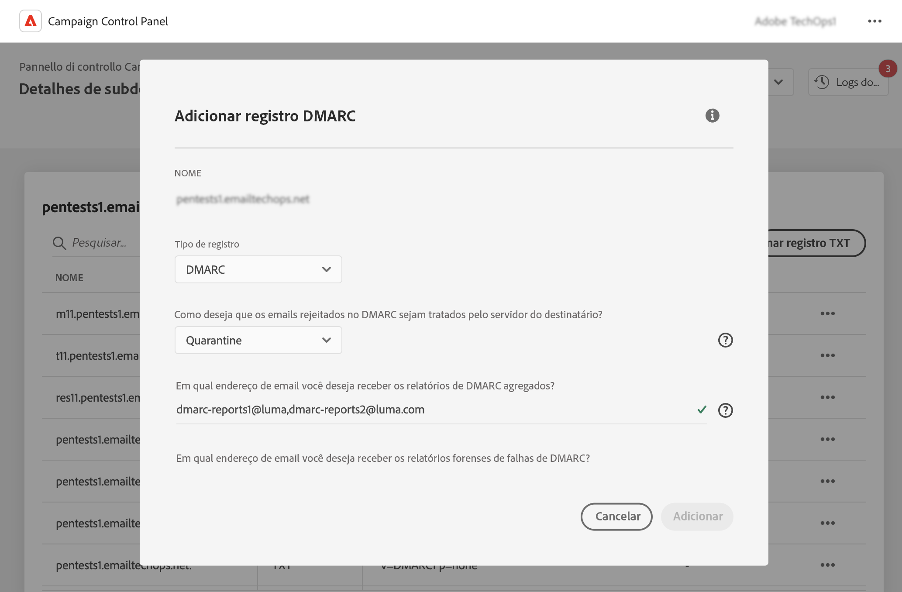
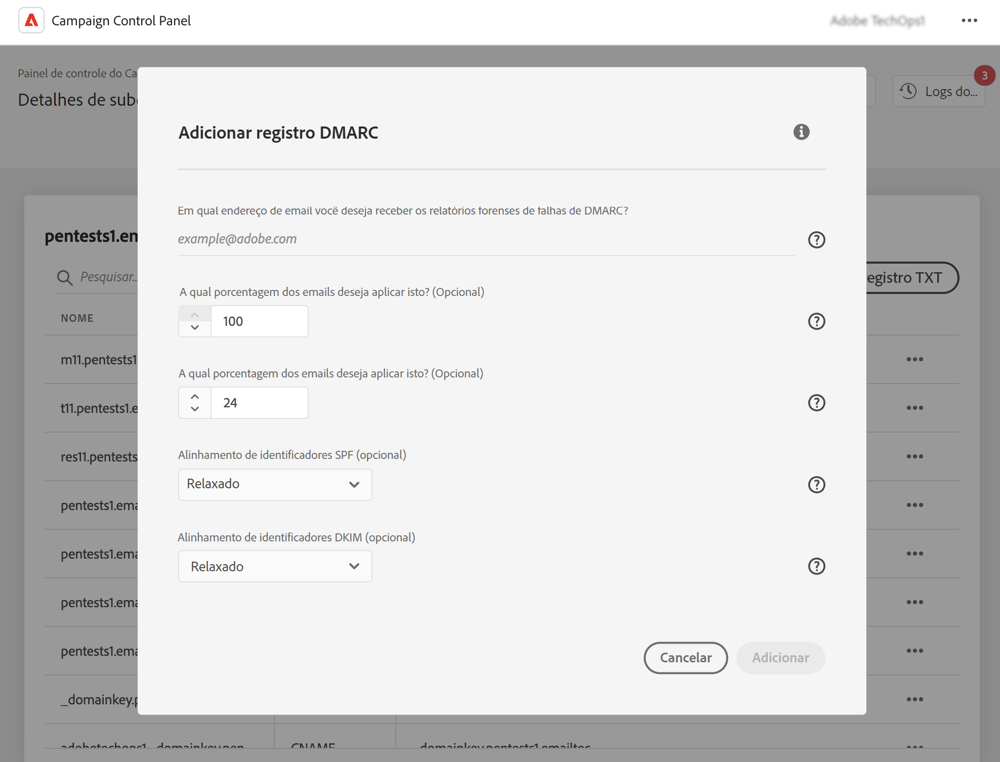

# Adicionar registros DMARC {#dmarc}

## Sobre registros DMARC {#about}

O DMARC (Domain based Message Authentication, Reporting and Conformance) é um protocolo padrão de autenticação de email que ajuda as organizações a proteger seus domínios de email contra ataques de phishing e spoofing. Ele permite decidir como um provedor de caixa de entrada deve lidar com emails não aprovados nas verificações de SPF e DKIM, fornecendo uma maneira de autenticar o domínio do remetente e impedir o uso não autorizado do domínio para fins mal-intencionados.

Informações detalhadas sobre a implementação do DMARC estão disponíveis no [Manual de práticas recomendadas de capacidade de entrega da Adobe](https://experienceleague.adobe.com/docs/deliverability-learn/deliverability-best-practice-guide/additional-resources/technotes/implement-dmarc.html?lang=pt-BR)

## Limitações e pré-requisitos {#limitations}

* Os registros SPF e DKIM são pré-requisitos para a criação de registros DMARC.
* Os registros DMARC só podem ser adicionados a subdomínios que utilizam a delegação de subdomínio completa. [Saiba mais sobre os métodos de configuração de subdomínios](subdomains-branding.md#subdomain-delegation-methods)
* Se houver registros DMARC e BIMI para um subdomínio:
   * Os registros DMARC não podem ser excluídos. Se quiser excluir um registro DMARC, primeiro exclua o registro BIMI.
   * Os registros DMARC podem ser editados, mas o downgrade da política DMARC para &quot;Nenhum&quot; não é permitido e o valor percentual deve ser definido como &quot;100&quot;.

## Adicionar um registro DMARC a um subdomínio {#add}

Para adicionar um registro DMARC a um subdomínio, siga estas etapas:

1. Na lista de subdomínios, clique no botão de reticências ao lado do subdomínio desejado e selecione **[!UICONTROL Subdomain details]**.

1. Clique no botão **[!UICONTROL Add TXT record]** e escolha **[!UICONTROL DMARC]** na lista suspensa **[!UICONTROL Record Type]**.

   

1. Escolha o **[!UICONTROL Policy Type]** que o servidor do destinatário deve seguir quando um de seus emails falhar. Os tipos de política disponíveis são:

   * **[!UICONTROL None]**,
   * **[!UICONTROL Quarantine]** (inserção na pasta de spam),
   * **[!UICONTROL Reject]** (bloqueio de emails).

   A prática recomendada é o uso de uma implantação lenta do DMARC com uma progressão de políticas (de “Nenhum” para “Quarentena” e, por fim, “Rejeitar”) à medida que você compreende os possíveis impactos do DMARC.

   * **Etapa 1:** analise o feedback recebido ao utilizar a política “Nenhum”, que instrui o destinatário a não executar nenhuma ação em relação às mensagens que falharam na autenticação, mas ainda recomenda o envio de relatórios de email ao remetente. Além disso, revise e corrija problemas com o SPF/DKIM se as mensagens legítimas estiverem falhando na autenticação.

   * **Etapa 2:** determine se o SPF e o DKIM estão alinhados e autenticando todos os emails legítimos e, em seguida, comece a utilizar a política de “Quarentena”, que instrui o servidor de email do destinatário a colocar em quarentena os emails que falharam na autenticação (o que geralmente os envia à pasta de spam). Se a política estiver definida como “Quarentena”, é recomendado começar com uma pequena porcentagem de emails.

   * **Etapa 3:** defina a política como “Rejeitar”. NOTA: use essa política com cuidado e determine se ela é apropriada para sua organização. A política “Rejeitar” instrui o destinatário a bloquear completamente (rejeitar) qualquer email de um domínio que falhou na autenticação. Após habilitar essa política, somente os emails 100% autenticados pelo seu domínio serão enviados à caixa de entrada.

   >[!NOTE]
   >
   > A criação do registro BIMI não está disponível se o tipo de política de registro DMARC estiver definido como “Nenhum”.

1. Preencha os endereços de email que devem receber os relatórios DMARC. Você pode adicionar vários endereços de email, separados por vírgulas. Quando um de seus emails falhar, os relatórios DMARC serão enviados automaticamente para o endereço de email de sua escolha:

   * Os relatórios DMARC agregados fornecem informações de alto nível, como o número de emails que falharam em um determinado período.
   * Os relatórios de análise de falha do DMARC fornecem informações detalhadas, como o endereço IP do qual o email com falha se originou.

1. Se a política DMARC estiver definida como “Nenhum”, insira uma porcentagem que se aplique a 100% dos emails.

   Se a política estiver definida como “Rejeitar” ou “Quarentena”, é recomendado começar com uma pequena porcentagem de emails. Aumente a porcentagem de seus registros lentamente à medida que mais emails do domínio sejam aprovados na autenticação de servidores receptores.

   >[!NOTE]
   >
   >Se o domínio usar o BIMI, a política DMARC deverá ter uma porcentagem igual a 100%. O BIMI não é compatível com políticas DMARC nas quais esses valores são inferiores a 100%.

   

1. Os relatórios DMARC são enviados a cada 24 horas. É possível alterar a frequência de envio dos relatórios no campo **[!UICONTROL Reporting Interval]**. O intervalo mínimo autorizado é de 1 hora, enquanto o valor máximo é de 2190 horas (ou seja, 3 meses).

1. Nos campos **SPF** e **[!UICONTROL DKIM Identifier Alignment]**, especifique a rigidez com a qual os servidores receptores devem verificar autenticações SPF e DKIM para um email.

   * Modo **[!UICONTROL Relaxed]**: o servidor aceita a autenticação mesmo que o email seja enviado de um subdomínio,
   * o modo **[!UICONTROL Strict]** aceita a autenticação somente quando o domínio remetente corresponde exatamente a um domínio SPF e DKIM.

   Suponha que estejamos trabalhando com o domínio `http://www.luma.com`. No modo “Flexível”, os emails provenientes do subdomínio `marketing.luma.com` serão autorizados pelo servidor, mas serão rejeitados ao utilizar o modo “Rígido”.

1. Clique em **[!UICONTROL Add]** para confirmar a criação do registro DMARC.

Depois que a criação do registro DMARC é processada (o que leva aproximadamente 5 minutos), ela é exibida na tela de detalhes dos subdomínios. [Saiba como monitorar registros TXT de seus subdomínios](gs-txt-records.md#monitor)
