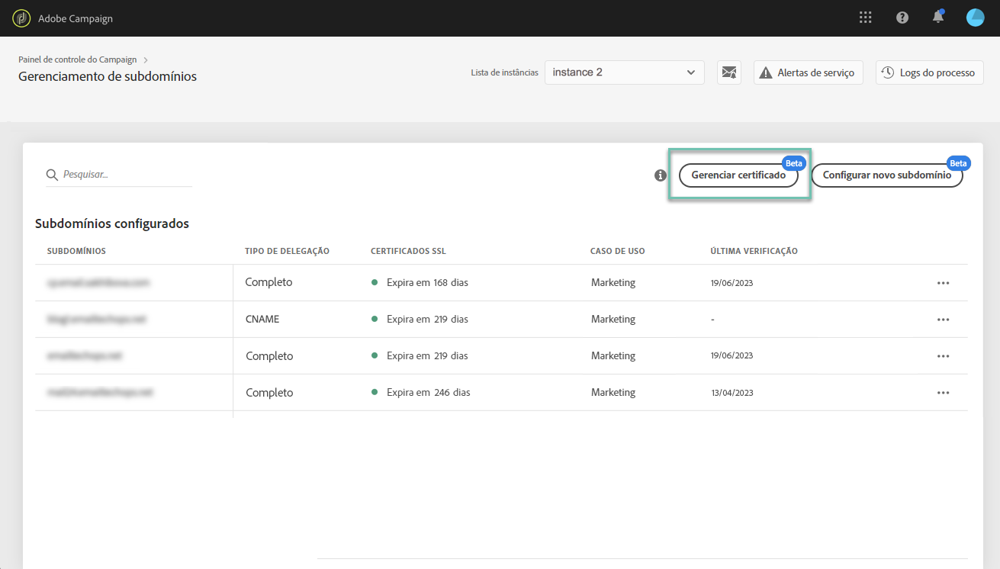
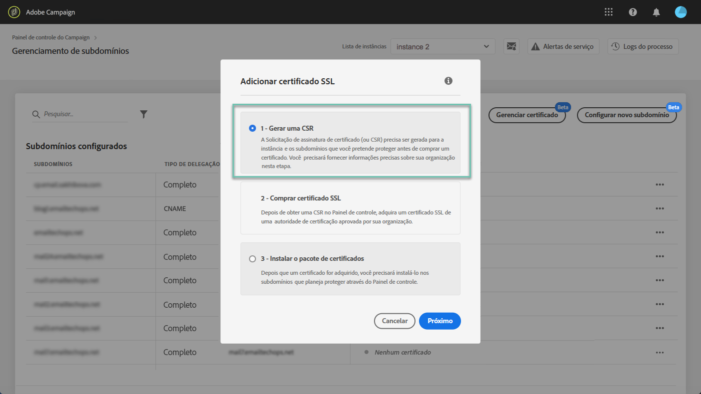
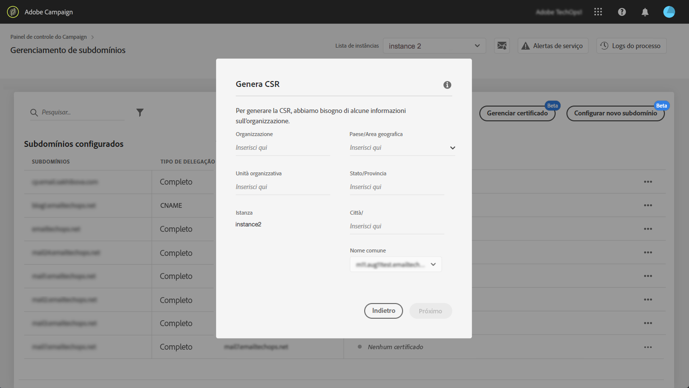
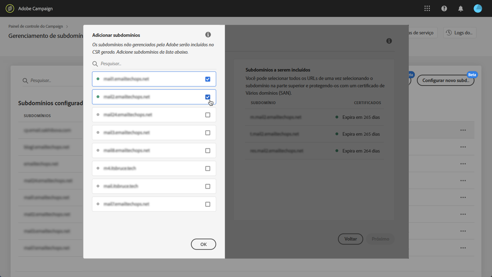
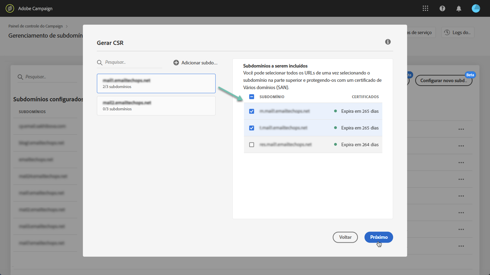
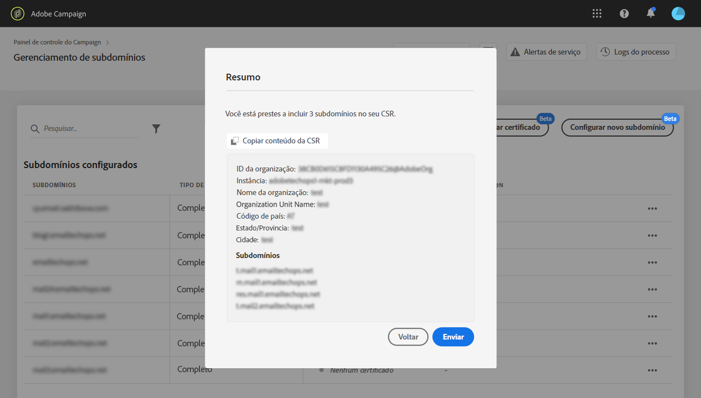
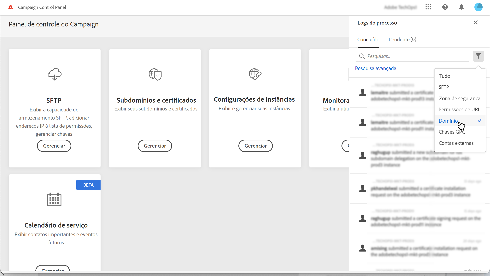
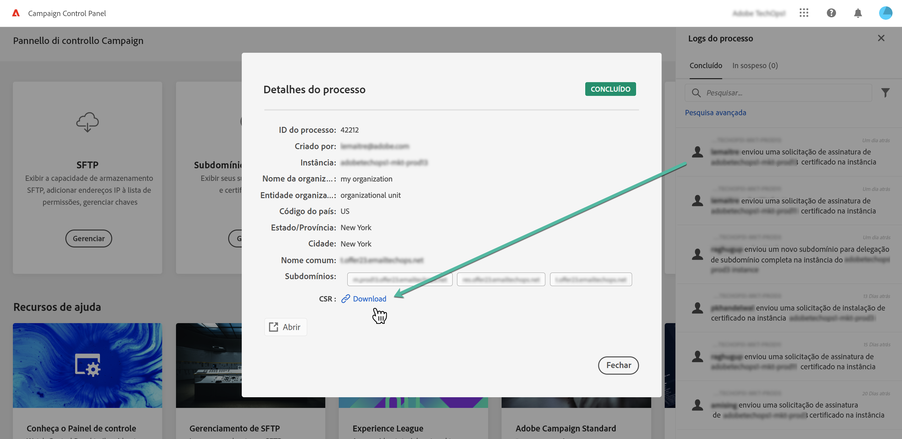

# Gerar uma CSR {#generating-csr}

>[!CONTEXTUALHELP]
>id="cp_generate_csr"
>title="Geração de CSR"
>abstract="A Solicitação de assinatura de certificado deve ser gerada para a instância e os subdomínios que você pretende proteger antes de adquirir um certificado."

>[!CONTEXTUALHELP]
>id="cp_select_subdomains"
>title="Selecione os subdomínios para sua CSR"
>abstract="Você pode optar por incluir todos ou somente subdomínios específicos na solicitação de assinatura de certificado. Somente os subdomínios selecionados serão certificados por meio do certificado SSL adquirido."
>additional-url="https://experienceleague.adobe.com/docs/control-panel/using/subdomains-and-certificates/subdomains-branding.html?lang=pt-BR" text="Sobre a marca de subdomínios"

## Gerar a CSR {#generate}

Para gerar uma Solicitação de assinatura de certificado (CSR), siga estas etapas:

1. No cartão **[!UICONTROL Subdomains & Certificates]**, selecione a instância desejada e clique no botão **[!UICONTROL Manage Certificate]**.

   

1. Selecione **[!UICONTROL 1 - Generate a CSR]** e clique em **[!UICONTROL Next]** para iniciar o assistente que guiará você pelo processo de geração de CSR.

   

1. Um formulário é exibido com todos os detalhes necessários para gerar a CSR.

   Preencha as informações solicitadas completamente e com precisão, caso contrário, o certificado pode não ser renovado (entre em contato com a equipe interna, as equipes de segurança e de TI, se necessário) e clique em **[!UICONTROL Next]**.

   * **[!UICONTROL Organization]**: nome oficial da organização.
   * **[!UICONTROL Organization Unit]**: unidade vinculada ao subdomínio (por exemplo: Marketing, TI).
   * **[!UICONTROL Instance]** (pré-preenchido): URL da instância do Campaign associado ao subdomínio.
   * **[!UICONTROL Common name]**: o nome comum é selecionado por padrão. Você pode selecionar um dos subdomínios se necessário.

   

1. Selecione os subdomínios que serão incluídos na CSR e clique em **[!UICONTROL OK]**.

   

1. Os subdomínios selecionados são exibidos na lista. Para cada um deles, selecione os subdomínios que serão incluídos e clique em **[!UICONTROL Next]**.

   

1. Um resumo dos subdomínios que serão incluídos na CSR é exibido. Clique em **[!UICONTROL Submit]** para confirmar a solicitação.

   

   >[!NOTE]
   >
   >A variável **[!UICONTROL Copy CSR content]** O botão permite copiar todas as informações relacionadas à CSR (ID da organização, instância, nome da organização, nome comum, subdomínios incluídos etc.)

1. O arquivo .csr correspondente à seleção é gerado e baixado automaticamente. Agora você pode usá-lo para adquirir o certificado SSL da Autoridade de certificação que sua empresa aprovar. Se precisar baixar a CSR novamente, siga as etapas detalhadas em [nesta seção](#download).

Depois que a CSR for gerada e baixada, você poderá usá-la para comprar um certificado SSL de uma autoridade de certificação aprovada pela organização.

Depois que o certificado SSL for comprado, você poderá instalá-lo em sua instância para proteger seu subdomínio. [Saiba mais](install-ssl-certificate.md)

## Baixar a CSR {#download}

Para comprar um certificado SSL, primeiro é necessário baixar a Solicitação de assinatura de certificado. O CSR é baixado automaticamente após ser gerado. Também é possível baixá-lo novamente a qualquer momento em Logs de trabalho:

1. No **[!UICONTROL Job Logs]**, selecione o **[!UICONTROL Finished]** e filtre a lista para exibir tarefas relacionadas ao gerenciamento de subdomínios.

   

1. Abra o job correspondente à geração da CSR e clique no link **[!UICONTROL Downbload]** link para obter o arquivo .csr.

   
