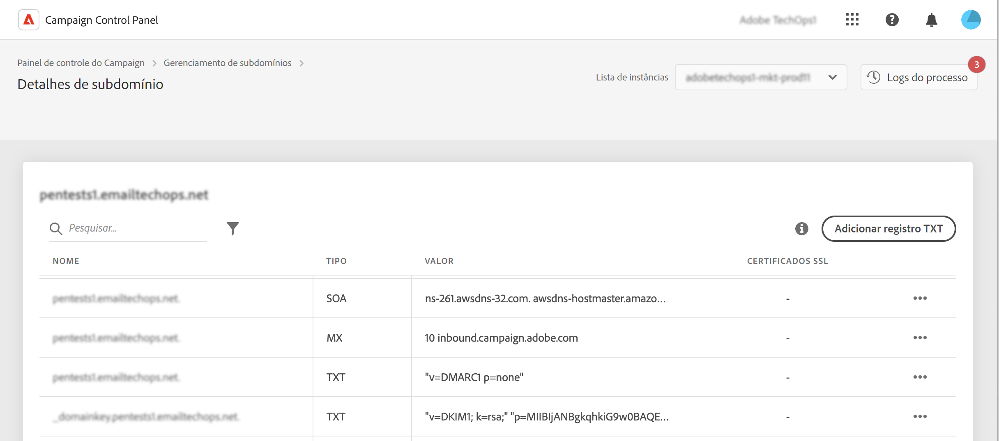

# Introdução a registros TXT {#managing-txt-records}

>[!CONTEXTUALHELP]
>id="cp_siteverification_add"
>title="Gerenciamento de registros TXT"
>abstract="Os registros TXT são um tipo de registro DNS usado para fornecer informações de texto sobre um domínio, que pode ser lido por fontes externas. O Painel de controle do Campaign permite adicionar três tipos de registros aos subdomínios: Verificação de site do Google, DMARC e registros BIMI."

## Sobre registros TXT {#about}

Os registros TXT são um tipo de registro DNS usado para fornecer informações de texto sobre um domínio, que pode ser lido por fontes externas. O Painel de controle do Campaign permite adicionar três tipos de registros aos subdomínios:

* **Registros TXT do Google** O permite atestar que você é o proprietário do domínio, garantindo altas taxas de caixa de entrada e baixas taxas de spam para seus emails. [Saiba como adicionar registros TXT do Google](managing-txt-records.md)
* **Registros DMARC** fornecer uma maneira de autenticar o domínio do remetente e impedir o uso não autorizado do domínio para fins mal-intencionados. [Saiba como adicionar registros DMARC](dmarc.md)
* **Registros BIMI** permite exibir um logotipo aprovado ao lado de seus emails nas caixas de entrada dos provedores de caixa de correio para aprimorar o reconhecimento e a confiança da marca. [Saiba como adicionar registros BIMI](bimi.md)

## Monitorar os registros dos subdomínios {#monitor}

É possível monitorar todos os registros TXT que foram adicionados para cada subdomínio acessando os detalhes dos subdomínios.

Nesta tela, todos os registros do tipo TXT para o subdomínio selecionado são exibidos, com informações na coluna &quot;Valor&quot; em suas configurações. Para excluir um registro TXT, DMARC ou BIMI do Google, clique no botão de reticências e selecione Excluir. Também é possível editar registros DMARC e BIMI, se necessário.

