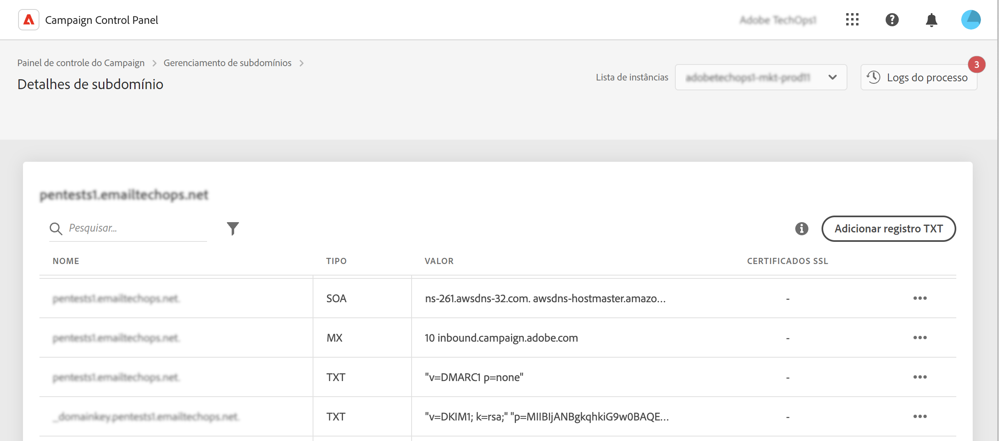

# Introdução a registros TXT {#managing-txt-records}

>[!CONTEXTUALHELP]
>id="cp_siteverification_add"
>title="Gerenciamento de registros TXT"
>abstract="Os registros TXT são um tipo de registro DNS usado para fornecer informações de texto sobre um domínio, que pode ser lido por fontes externas. O Painel de controle do Campaign permite adicionar três tipos de registros aos subdomínios: verificações de site do Google e registros DMARC e BIMI."

## Sobre registros TXT {#about}

Os registros TXT são um tipo de registro DNS usado para fornecer informações de texto sobre um domínio, que pode ser lido por fontes externas. O painel de controle permite adicionar três tipos de registros aos subdomínios:

* Os **registros TXT do Google** permitem atestar sua propriedade do domínio, garantindo altas taxas de entregabilidade e diminuindo a probabilidade de seus emails serem enviados à pasta de spam. [Saiba como adicionar registros TXT do Google](managing-txt-records.md)
* **Registros DMARC** fornecem uma maneira de autenticar o domínio do remetente e impedir o uso não autorizado do domínio para fins mal-intencionados. [Saiba como adicionar registros DMARC](dmarc.md)
* **Registros BIMI** permitem exibir um logotipo aprovado ao lado de seus emails nas caixas de entrada dos provedores para aumentar o reconhecimento e a confiança da marca. [Saiba como adicionar registros BIMI](bimi.md)

## Monitorar os registros dos subdomínios {#monitor}

É possível monitorar todos os registros TXT adicionados em cada subdomínio acessando os detalhes dos subdomínios.

Todos os registros de formato TXT do subdomínio selecionado são exibidos nessa tela, com as informações na coluna “Valor” das configurações. Para excluir um registro DMARC, BIMI ou TXT do Google, clique no botão de reticências e selecione Excluir. Também é possível editar registros DMARC e BIMI, se necessário.

