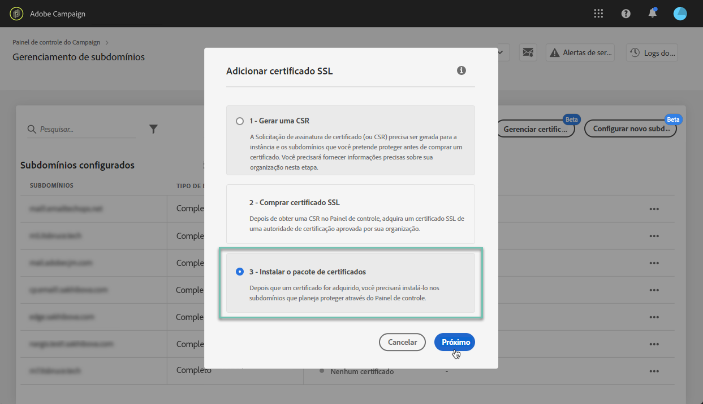
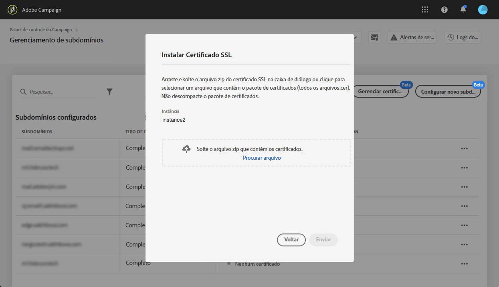

# Instalar o certificado SSL {#installing-ssl-certificate}

>[!CONTEXTUALHELP]
>id="cp_install_ssl_certificate"
>title="Instalação do certificado SSL"
>abstract="Instale o Certificado SSL adquirido da autoridade de certificação aprovada pela sua organização."
>additional-url="https://experienceleague.adobe.com/docs/control-panel/using/subdomains-and-certificates/subdomains-branding.html?lang=pt-BR" text="Sobre a marca de subdomínios"

Depois que um certificado SSL for adquirido, você poderá instalá-lo em sua instância. Antes de continuar, verifique os pré-requisitos abaixo:

* A Solicitação de assinatura de certificado (CSR) deve ter sido gerada pelo Painel de controle. Caso contrário, você não poderá instalar o certificado pelo Painel de controle.
* A Solicitação de assinatura de certificado (CSR) deve corresponder ao subdomínio que foi configurado para funcionar com o Adobe. Por exemplo, ele não pode conter mais subdomínios do que o que foi configurado.
* O certificado deve ter uma data atual. Não é possível instalar certificados com datas futuras e eles não devem estar expirados (ou seja, datas de início e término devem ser válidas).
* O certificado deve ser emitido por uma autoridade de certificação (CA) confiável, como Comodo, DigiCert, Goaddy, etc.
* O tamanho do certificado deve ser de 2048 bits e o algoritmo deve ser RSA.
* O certificado deve estar no formato X.509 PEM.
* Os certificados SAN são compatíveis.
* Certificados curinga não são compatíveis.
* O arquivo ZIP ou o certificado não deve ser protegido por senha.
* De preferência, o arquivo ZIP deve conter apenas o seguinte em arquivos individuais:
   * Certificado de entidade final.
   * Cadeia intermediária de certificados (ordenada na ordem correta).
   * Certificado raiz (opcional).

Para instalar o certificado, siga estas etapas:

1. No cartão **[!UICONTROL Subdomains & Certificates]**, selecione a instância desejada e clique no botão **[!UICONTROL Manage Certificate]**.

   

1. Selecione **[!UICONTROL 3 - Install Certificate Bundle]** e clique em **[!UICONTROL Next]** para iniciar o assistente que guiará você pelo processo de instalação do certificado.

   

1. Selecione o arquivo .zip que contém o certificado que será instalado e clique em **[!UICONTROL Submit]**.

   

>[!NOTE]
>
>O certificado será instalado em todos os domínios/subdomínios incluídos na CSR. Nenhum domínio/subdomínio adicional presente no certificado será considerado.

Depois que o certificado SSL é instalado, a data de expiração e o ícone de status do certificado são devidamente atualizados.
