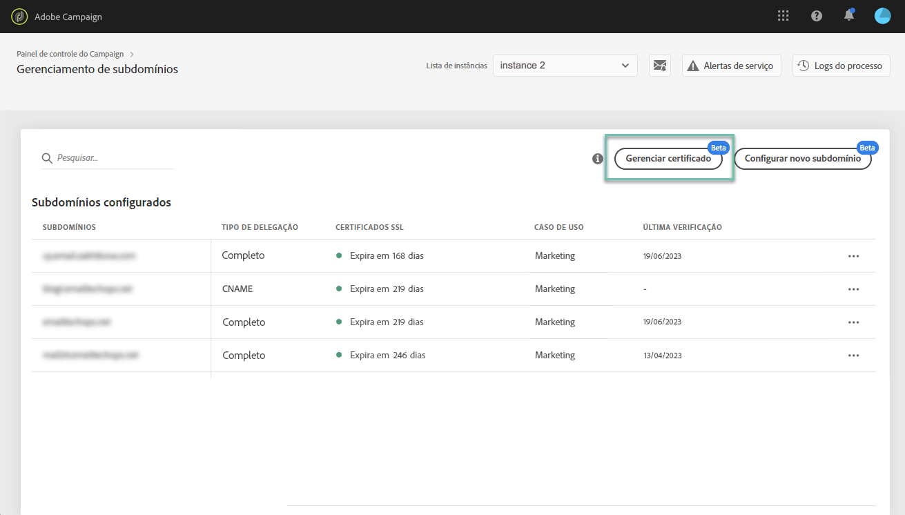

# Gerenciar certificados SSL de subdomínios {#managing-subdomains-ssl-certificates}

O **[!UICONTROL Subdomains and Certificates]**cartão permite que você veja quais subdomínios e subdomínios associados hospedam suas páginas iniciais e recursos com certificados SSL instalados neles. Você também pode ver facilmente quais subdomínios têm certificados de expiração, para que você possa antecipar sua expiração.

Se um certificado estiver prestes a expirar, você poderá iniciar uma solicitação de Atendimento ao cliente com todas as informações necessárias para renovar o certificado e garantir o funcionamento correto da sua instância.

>[!NOTE]
>
>A Adobe recomenda que você renove um certificado SSL dos subdomínios associados **quando estiver próximo da data de expiração**. A renovação do certificado pode levar alguns dias, dependendo de sua organização, recomendamos que você atribua o tempo apropriado para esse processo.

## Monitorando certificados SSL {#monitoring-ssl-certificates}

A lista de subdomínios para cada uma de suas instâncias pode ser acessada diretamente ao selecionar o **[!UICONTROL Subdomains & Certificates]**cartão.

Os subdomínios são organizados pela data de expiração mais próxima do certificado SSL, com informações visuais sobre a expiração, em dias:

* **Verde**: o subdomínio não tem certificado que expira nos próximos 60 dias.
* **Laranja**: um ou mais subdomínios têm um certificado que expirará nos próximos 60 dias.
* **Vermelho**: um ou mais subdomínios têm um certificado que expirará nos próximos 30 dias.

To get more details on a subdomain&#39;s certificates, click the **[!UICONTROL Certificate Details]**button.

A lista de todos os subdomínios relacionados será exibida em seus certificados. Normalmente, inclui subdomínios de páginas iniciais, páginas de recursos etc.

Se necessário, você pode iniciar uma solicitação de renovação de certificado desta janela. Para obter mais informações, consulte a seção abaixo.

## Iniciando renovação de certificados SSL {#initiating-ssl-certificate-renewal}

>[!NOTE]
>
>O Painel de controle não gerencia automaticamente a renovação do certificado. Isso permite que você **inicie o processo** de renovação preparando a solicitação para ser enviada ao Atendimento ao cliente do Adobe Campaign.

O processo de renovação do certificado SSL inclui 3 etapas:

1. **Geração da Solicitação de assinatura de certificado (CSR)O Atendimento ao cliente da** Adobe gera um CSR para você, mediante solicitação feita pelo portal de Atendimento ao cliente. Será necessário fornecer algumas informações necessárias para gerar o CSR (como Nome comum, Nome da organização e endereço, etc.). No Painel de controle, você pode ver a lista dos itens necessários ao iniciar o processo de renovação. Para obter mais informações, consulte a seção abaixo.
1. **Compra do certificado** SSL Depois que o Atendimento ao cliente gera o CSR, você pode baixá-lo e comprar o certificado SSL junto à autoridade de certificação que sua empresa aprovar.
1. **Instalação do certificado** SSL Depois de adquirir o certificado SSL, é necessário fornecê-lo ao Atendimento ao cliente da Adobe. O certificado será instalado e você verá as datas de expiração atualizadas dos certificados no Painel de controle.

Para iniciar a renovação dos certificados SSL no Painel de controle, siga estas etapas:

1. Abra o **[!UICONTROL Subdomains & Certificates]**cartão e clique no**[!UICONTROL Certificate details]** ícone do subdomínio com certificados que expiram.

   

1. A lista de subdomínios relacionados é exibida. Geralmente inclui subdomínios de páginas de aterrissagem, páginas de recursos, etc.
Click the **[!UICONTROL Ticket Details]**button to initiate the certificates renewal process.

   

1. Um formulário é exibido, com todos os detalhes necessários para renovar seu certificado SSL. Certifique-se de preencher as informações solicitadas de forma completa e precisa (entre em contato com sua equipe interna, equipes de segurança e TI, se necessário). Caso contrário, uma Solicitação de assinatura de certificado não poderá ser gerada e você não poderá renovar o certificado.

   * **[!UICONTROL IMS Org]**: ID da sua organização.
   * **[!UICONTROL Instance]**: URL da instância Campaign associada ao subdomínio.
   * **[!UICONTROL Common name]**: Normalmente, é um URL de subdomínio de rastreamento, associado ao subdomínio com o certificado que expira.
   * **[!UICONTROL Subdomains]**: Subdomínios vinculados ao subdomínio com um certificado que expira. Se quiser aplicar um único certificado SSL a outros subdomínios, adicione-os a essa lista. Nesse caso, verifique se esses subdomínios estão associados à mesma Organização IMS e URL de instância.
   >[!CAUTION]
   >
   >The **[!UICONTROL IMS Org]**and**[!UICONTROL Instance]** fields are filled in automatically by the Control Panel and should not be modified.

   

1. Quando o formulário for preenchido, clique no **[!UICONTROL Copy Details]**botão para salvar as informações na área de transferência.

   >[!NOTE]
   >
   >Se você não limpar o histórico do navegador, as informações inseridas serão salvas, permitindo que você as use para renovar o certificado mais tarde.

1. Clique no botão **[!UICONTROL Log new ticket]**. Você é redirecionado automaticamente para a página de logon do Atendimento ao cliente do Adobe Campaign.

   

1. Faça logon e crie um novo ticket de suporte com o assunto &quot;Solicitação de certificado SSL CSR&quot;.
Cole todas as informações copiadas anteriormente no corpo do ticket e clique em Enviar.

   >[!NOTE]
   >
   >Se você não tiver privilégios para arquivar casos de suporte à sua organização, passe todas as informações copiadas para a Área de transferência para o seu Contato de suporte e peça que abram um novo ticket de Atendimento ao cliente para você.

**Tópicos relacionados:**

* [Vídeo tutorial do Campaign Standard](https://docs.adobe.com/content/help/en/campaign-learn/campaign-standard-tutorials/administrating/control-panel/managing-ssl-certificates.html)
* [Vídeo tutorial do Campaign Classic](https://docs.adobe.com/content/help/en/campaign-learn/campaign-classic-tutorials/administrating/control-panel-acc/managing-ssl-certificates.html)
