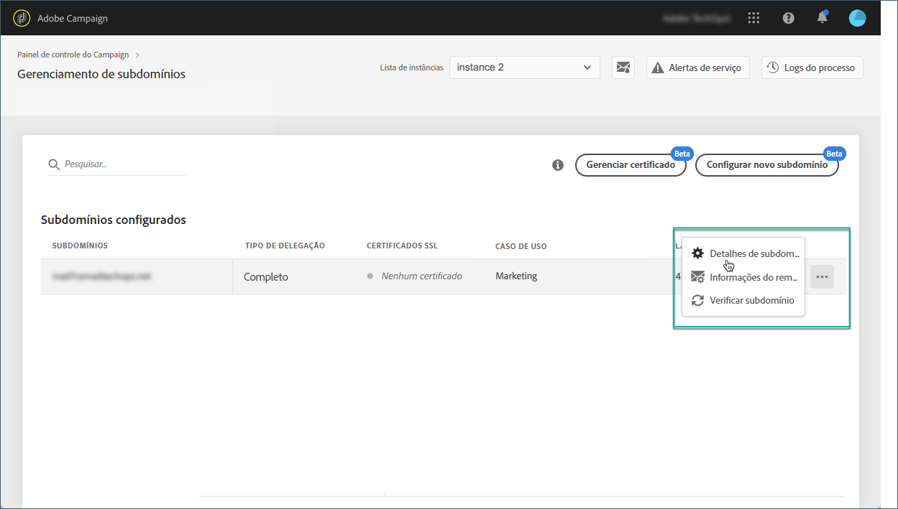

# Gerenciamento de registros TXT {#managing-txt-records}

>[!CONTEXTUALHELP]
>id="cp_siteverification_add"
>title="Gerenciamento de registros TXT"
>abstract="Alguns serviços como o Google exigem a adição de um registro TXT às configurações de domínio para verificar se você é o proprietário do domínio."
>additional-url="https://experienceleague.adobe.com/docs/control-panel/using/subdomains-and-certificates/setting-up-new-subdomain.html?lang=pt-BR" text="Configurar um novo subdomínio"

## Sobre registros TXT {#about-txt-records}

Os registros TXT são um tipo de registro DNS usado para fornecer informações de texto sobre um domínio, que pode ser lido por fontes externas.

Para garantir altas taxas de caixa de entrada e baixas taxas de spam, alguns serviços como o Google exigem a adição de um registro TXT às configurações de domínio para verificar se você é o proprietário do domínio.

Atualmente, o Gmail está entre os provedores de endereços de email mais usados. Para garantir um bom delivery de emails para endereços Gmail, o Adobe Campaign permite adicionar registros especiais TXT de verificação de site do Google aos subdomínios para garantir que eles sejam verificados.

 Descubra este recurso em vídeo usando [Campaign v7/v8](https://experienceleague.adobe.com/docs/campaign-classic-learn/control-panel/subdomains-and-certificates/google-txt-record-management.html#subdomains-and-certificates) ou [Campaign Standard](https://experienceleague.adobe.com/docs/campaign-standard-learn/control-panel/subdomains-and-certificates/google-txt-record-management.html#subdomains-and-certificates)

## Adicionar um registro TXT do Google a um subdomínio {#adding-a-google-txt-record}

Para adicionar um registro TXT do Google ao subdomínio usado para enviar emails para endereços Gmail, siga estas etapas:

1. Navegue até o cartão **[!UICONTROL Subdomain and Certificates]**.

1. Selecione sua instância e abra os detalhes do subdomínio ao qual você deseja adicionar um registro DNS.

   

1. Clique no botão **[!UICONTROL Add TXT record]** e digite o valor gerado nas ferramentas do administrador do G Suite. Para obter mais informações, consulte [Ajuda do administrador do G Suite](https://support.google.com/a/answer/183895).

   

1. Clique no botão **[!UICONTROL Add]** para confirmar.

   

Depois de adicionado, o registro TXT deve ser verificado pelo Google. Para fazer isso, navegue até as ferramentas do administrador do G Suite e inicie a etapa de verificação (consulte [Ajuda do administrador do G Suite](https://support.google.com/a/answer/183895)).

Para excluir um registro, selecione-o na lista de registros e clique no botão remover.

>[!NOTE]
>
>O único registro que pode ser excluído da lista de registros DNS é o que você adicionou anteriormente (nesse caso, o registro TXT do Google).
