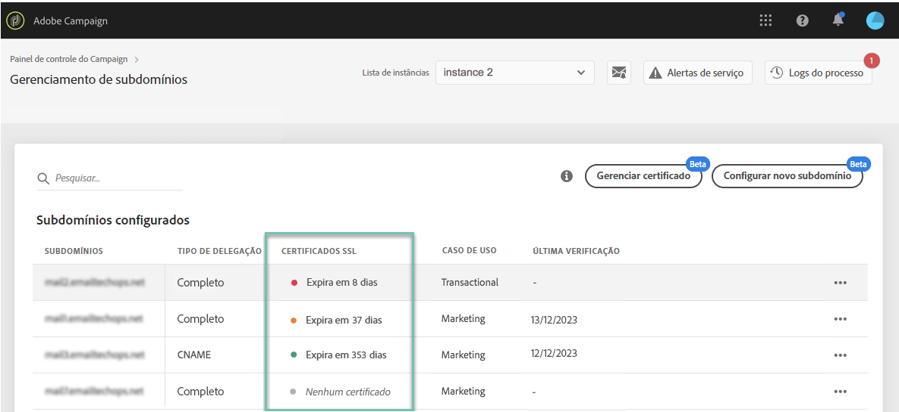

# Monitorar certificados SSL de subdomínios {#monitoring-ssl-certificates}

## Sobre certificados SSL {#about-ssl-certificates}

O Adobe Campaign recomenda proteger os subdomínios que hospedam suas páginas de destino, especialmente aqueles que estão coletando informações confidenciais dos clientes.

A **criptografia SSL (Secure Socket Layer, Camada de Soquete de Segurança)** garante a segurança dos subdomínios configurados para trabalhar com a Adobe. Quando o(a) cliente preenche um formulário web ou visita uma página de destino hospedada pelo Adobe Campaign, as informações são enviadas por protocolo não seguro (HTTP) por padrão. Para garantir ainda mais segurança, proteja as informações enviadas com um protocolo HTTPS. Por exemplo, o endereço de subdomínio &quot;http://info.mywebsite.com/&quot; agora será &quot;https://info.mywebsite.com/&quot;.

**Os certificados SSL não são instalados nos subdomínios configurados em si**. Eles são instalados em subdomínios associados, principalmente aqueles que hospedam páginas de destino, páginas de recursos e outros.

**Os certificados SSL são fornecidos por um período específico** (1 ano, 60 dias, etc.). Depois que um certificado expirar, você poderá enfrentar problemas ao acessar as páginas de destino ou usar recursos do subdomínio. Para evitar isso, o Painel de controle permite monitorar os certificados SSL dos subdomínios e iniciar o processo de renovação.

## Gerenciamento de certificados SSL {#management}

O monitoramento de certificados SSL é fundamental para garantir a segurança dos seus subdomínios. Com o Painel de controle, é possível instalar e renovar os certificados SSL dos seus subdomínios diretamente por conta própria ou delegá-los à Adobe, para que esse processo seja executado automaticamente sem a necessidade de nenhuma ação da sua parte.

É altamente recomendado delegar o gerenciamento dos certificados SSL de seus subdomínios à Adobe, pois ela criará automaticamente o certificado e o renovará todos os anos antes da expiração. Isso reduz o risco de erros que podem ocorrer ao gerenciar certificados manualmente. [Saiba como delegar os certificados SSL dos seus subdomínios à Adobe](delegate-ssl.md)

Abaixo, você encontrará uma lista abrangente dos impactos associados ao gerenciamento manual de certificados, em contraste com delegar essa operação à Adobe:

|       | Certificado gerenciado pelo cliente | Certificado gerenciado pela Adobe |
|  ---  |  ---  |  ---  |
| Provedor de certificados | Autoridades de certificação de terceiros | Adobe por meio dos gerenciadores de certificados da AWS |
| Etapas manuais | Geração de CSR, aquisição e instalação de certificados | nenhuma |
| Processo de renovação | Responsabilidade do cliente | Administrado automaticamente pela Adobe |
| Segurança dos subdomínios | O domínio pode conter subdomínios desprotegidos (rastreamento, espelho e res), a menos que você esteja instalando/renovando certificados. | Todos os subdomínios de novos domínios (se você optar pelo gerenciamento pela Adobe) estarão protegidos por padrão. |
| Custo dos certificados | O cliente arca com o custo dos certificados | Gratuito |

## Monitorar certificados SSL {#monitoring-certificates}

>[!CONTEXTUALHELP]
>id="cp_subdomain_details"
>title="Detalhes do subdomínio"
>abstract="Recupere informações dos certificados SSL dos subdomínios."

O status dos certificados SSL dos seus subdomínios está disponível diretamente na lista de subdomínios ao selecionar o cartão **[!UICONTROL Subdomínios e certificados]**.

Os subdomínios são organizados pela data de expiração mais próxima do certificado SSL, com informações visuais sobre a expiração, em dias:

* **Verde**: o subdomínio não tem certificado que expira nos próximos 60 dias.
* **Laranja**: um ou mais subdomínios têm um certificado que expirará nos próximos 60 dias.
* **Vermelho**: um ou mais subdomínios têm um certificado que expirará nos próximos 30 dias.
* **Cinza**: nenhum certificado foi instalado para o subdomínio.

Para mais detalhes sobre um subdomínio, clique no botão **[!UICONTROL Detalhes do subdomínio]**.
A lista de todos os subdomínios relacionados é exibida. Em geral, a lista inclui subdomínios de páginas de destino, páginas de recursos etc.

A guia **[!UICONTROL Informações do remetente]** fornece informações sobre as caixas de entrada configuradas (remetente, responder para, email de erro).

Se um dos certificados SSL de subdomínio estiver prestes a expirar, você poderá renová-lo diretamente no Painel de controle. Para obter mais informações, consulte esta seção: [Renovar um certificado SSL de subdomínio](../../subdomains-certificates/using/renewing-subdomain-certificate.md).

**Tópicos relacionados:**

* [Renovar um certificado SSL de subdomínio](../../subdomains-certificates/using/renewing-subdomain-certificate.md)
* [Marca de subdomínios](../../subdomains-certificates/using/subdomains-branding.md)
