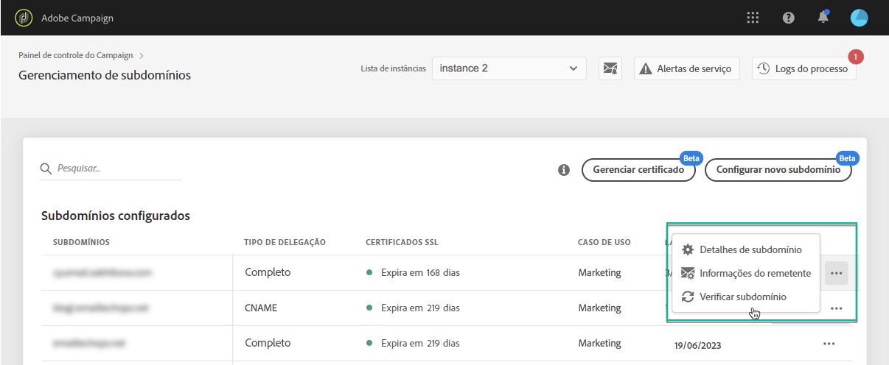

# Monitoramento de seus subdomínios {#monitoring-subdomains}

É essencial monitorar seus subdomínios para garantir que todos estejam configurados corretamente para funcionar com o Adobe Campaign.

A lista de subdomínios para cada uma das instâncias de produção pode ser acessada diretamente ao selecionar o **[!UICONTROL Subdomains & Certificates]**cartão.

A **[!UICONTROL Last verification]**coluna indica quando um subdomínio foi verificado pela última vez.** Você pode iniciar uma verificação a qualquer momento clicando em **... /**[!UICONTROL Verify subdomain]** .

>[!CAUTION]
>
>A Adobe não recomenda o uso de subdomínios sem data de certificado, pois isso pode significar que esses subdomínios podem estar com problemas de entrega.

Ao iniciar uma verificação, várias operações são executadas para verificar se o subdomínio está configurado corretamente (verificação do locatário da instância, teste de envio de email etc.)

Se a verificação do subdomínio falhar, entre em contato com o Atendimento ao cliente da Adobe para obter mais informações.

**Tópicos relacionados:**

* [Adicionar certificados SSL (vídeo tutorial)](https://docs.adobe.com/content/help/en/campaign-learn/campaign-standard-tutorials/administrating/control-panel/adding-ssl-certificates.html)
* [Renovando um certificado SSL de subdomínio](../../subdomains-certificates/using/renewing-subdomain-certificate.md)
* [Marca de subdomínios](../../subdomains-certificates/using/subdomains-branding.md)
