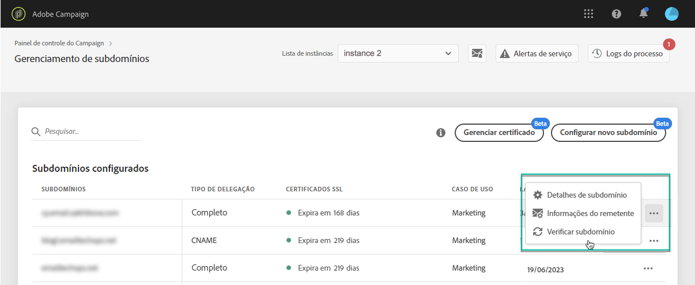

# Monitorar subdomínios {#monitoring-subdomains}

É essencial monitorar os seus subdomínios para garantir que todos estejam configurados corretamente para funcionar com o Adobe Campaign.

A lista de subdomínios para cada uma das suas instâncias de produção pode ser acessada diretamente ao selecionar o cartão **[!UICONTROL Subdomínios e certificados]**.

A coluna **[!UICONTROL Última verificação]** indica quando um subdomínio foi verificado pela última vez. É possível iniciar uma verificação a qualquer momento, clicando-se no botão **...** / **[!UICONTROL Verificar subdomínio]**.

>[!IMPORTANT]
>
>A Adobe não recomenda usar subdomínios sem data de certificado, pois isso pode significar que esses subdomínios podem estar com alguns problemas de capacidade de entrega.

Ao iniciar uma verificação, várias operações são executadas para verificar se o subdomínio está configurado corretamente (verificação de locatário de instância, teste de envio de email etc.) Se a verificação do subdomínio falhar, entre em contato com o Atendimento ao cliente da Adobe para obter mais investigação.

**Tópicos relacionados:**

* [Renovar um certificado SSL de subdomínio](../../subdomains-certificates/using/renewing-subdomain-certificate.md)
* [Marca de subdomínios](../../subdomains-certificates/using/subdomains-branding.md)
